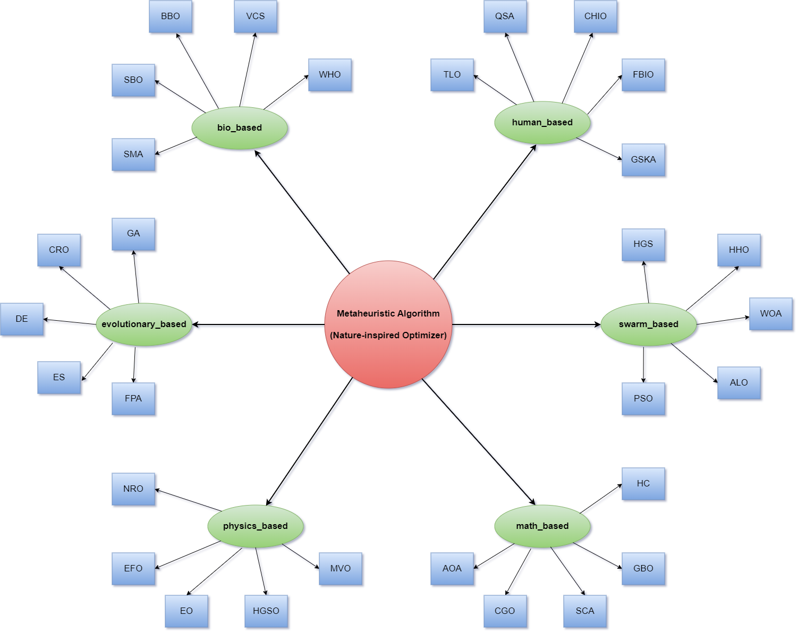

<p align="center">

</p>

---


[](https://github.com/thieu1995/mealpy/releases)
[](https://pypi.python.org/pypi/mealpy) 
[](https://badge.fury.io/py/mealpy)


[](https://pepy.tech/project/mealpy)
[](https://github.com/thieu1995/mealpy/actions/workflows/publish-package.yaml)

[](https://mealpy.readthedocs.io/en/latest/?badge=latest)
[](https://t.me/+fRVCJGuGJg1mNDg1)
[](http://isitmaintained.com/project/thieu1995/mealpy "Average time to resolve an issue")
[](http://isitmaintained.com/project/thieu1995/mealpy "Percentage of issues still open")

[](https://git-scm.com/book/en/v2/GitHub-Contributing-to-a-Project)
[](https://doi.org/10.1016/j.sysarc.2023.102871)
[](https://www.gnu.org/licenses/gpl-3.0)


# Introduction 

MEALPY is the largest python library in the world for most of the cutting-edge meta-heuristic algorithms 
(nature-inspired algorithms, black-box optimization, global search optimizers, iterative learning algorithms, 
continuous optimization, derivative free optimization, gradient free optimization, zeroth order optimization, 
stochastic search optimization, random search optimization). These algorithms belong to population-based algorithms 
(PMA), which are the most popular algorithms in the field of approximate optimization.

* **Free software:** GNU General Public License (GPL) V3 license
* **Total algorithms**: 215 (190 official (original, hybrid, variants), 25 developed)
* **Documentation:** https://mealpy.readthedocs.io/en/latest/
* **Python versions:** >=3.7x
* **Dependencies:** numpy, scipy, pandas, matplotlib





### Citation Request

Please include these citations if you plan to use this library:

```code 
@article{van2023mealpy,
  title={MEALPY: An open-source library for latest meta-heuristic algorithms in Python},
  author={Van Thieu, Nguyen and Mirjalili, Seyedali},
  journal={Journal of Systems Architecture},
  year={2023},
  publisher={Elsevier},
  doi={10.1016/j.sysarc.2023.102871}
}

@article{van2023groundwater,
  title={Groundwater level modeling using Augmented Artificial Ecosystem Optimization},
  author={Van Thieu, Nguyen and Barma, Surajit Deb and Van Lam, To and Kisi, Ozgur and Mahesha, Amai},
  journal={Journal of Hydrology},
  volume={617},
  pages={129034},
  year={2023},
  publisher={Elsevier},
  doi={https://doi.org/10.1016/j.jhydrol.2022.129034}
}

@article{ahmed2021comprehensive,
  title={A comprehensive comparison of recent developed meta-heuristic algorithms for streamflow time series forecasting problem},
  author={Ahmed, Ali Najah and Van Lam, To and Hung, Nguyen Duy and Van Thieu, Nguyen and Kisi, Ozgur and El-Shafie, Ahmed},
  journal={Applied Soft Computing},
  volume={105},
  pages={107282},
  year={2021},
  publisher={Elsevier},
  doi={10.1016/j.asoc.2021.107282}
}

```


# Usage 


<details><summary><h2>Goals</h2></summary>

Our goals are to implement all classical as well as the state-of-the-art nature-inspired algorithms, create a simple interface that helps researchers access optimization algorithms as quickly as possible, and share knowledge of the optimization field with everyone without a fee. What you can do with mealpy:

- Analyse parameters of meta-heuristic algorithms.
- Perform Qualitative and Quantitative Analysis of algorithms.
- Analyse rate of convergence of algorithms.
- Test and Analyse the scalability and the robustness of algorithms.
- Save results in various formats (csv, json, pickle, png, pdf, jpeg)
- Export and import models can also be done with Mealpy.
- **Solve any optimization problem**

</details>


<details><summary><h2>Installation</h2></summary>

* Install the stable (latest) version from [PyPI release](https://pypi.python.org/pypi/mealpy):
```sh
$ pip install mealpy==3.0.1
```

* Install the alpha/beta version from PyPi
```sh
$ pip install mealpy==2.5.4a6
```

* Install the pre-release version directly from the source code:
```sh
$ git clone https://github.com/thieu1995/mealpy.git
$ cd mealpy
$ python setup.py install
```

* In case, you want to install the development version from Github:
```sh
$ pip install git+https://github.com/thieu1995/permetrics 
```

After installation, you can import Mealpy as any other Python module:

```sh
$ python
>>> import mealpy
>>> mealpy.__version__

>>> print(mealpy.get_all_optimizers())
>>> model = mealpy.get_optimizer_by_name("OriginalWOA")(epoch=100, pop_size=50)
```

</details>


## Examples

Before dive into some examples, let me ask you a question. What type of problem are you trying to solve? 
Additionally, what would be the solution for your specific problem? 
Based on the table below, you can select an appropriate type of decision variables to use.


<div align="center">

| Class           | Syntax                                                                                                       | Problem Types               |
|-----------------|--------------------------------------------------------------------------------------------------------------|-----------------------------|
| FloatVar        | `FloatVar(lb=(-10., )*7, ub=(10., )*7, name="delta")`                                                        | Continuous Problem          |
| IntegerVar      | `IntegerVar(lb=(-10., )*7, ub=(10., )*7, name="delta")`                                                      | LP, IP, NLP, QP, MIP        |
| StringVar       | `StringVar(valid_sets=(("auto", "backward", "forward"), ("leaf", "branch", "root")), name="delta")`          | ML, AI-optimize             |
| BinaryVar       | `BinaryVar(n_vars=11, name="delta")`                                                                         | Networks                    |
| BoolVar         | `BoolVar(n_vars=11, name="delta")`                                                                           | ML, AI-optimize             |
| PermutationVar  | `PermutationVar(valid_set=(-10, -4, 10, 6, -2), name="delta")`                                               | Combinatorial Optimization  |
| MixedSetVar     | `MixedSetVar(valid_sets=(("auto", 2, 3, "backward", True), (0, "tournament", "round-robin")), name="delta")` | MIP,  MILP                  |
| TransferBoolVar | `TransferBoolVar(n_vars=11, name="delta", tf_func="sstf_02")`                                                | ML, AI-optimize, Feature    |
|TransferBinaryVar| `TransferBinaryVar(n_vars=11, name="delta", tf_func="vstf_04")`                                              | Networks, Feature Selection |

</div>

Let's go through a basic and advanced example.


### Simple Benchmark Function

**Using Problem dict**

```python
from mealpy import FloatVar, SMA
import numpy as np

def objective_function(solution):
    return np.sum(solution**2)

problem = {
    "obj_func": objective_function,
    "bounds": FloatVar(lb=(-100., )*30, ub=(100., )*30),
    "minmax": "min",
    "log_to": None,
}

## Run the algorithm
model = SMA.OriginalSMA(epoch=100, pop_size=50, pr=0.03)
g_best = model.solve(problem)
print(f"Best solution: {g_best.solution}, Best fitness: {g_best.target.fitness}")
```

**Define a custom Problem class**


**Please note that, there is no more `generate_position`, `amend_solution`, and `fitness_function` in Problem class.**
We take care everything under the DataType Class above. Just choose which one fit for your problem.
**We recommend you define a custom class that inherit `Problem` class if your decision variable is not FloatVar**


```python
from mealpy import Problem, FloatVar, BBO 
import numpy as np

# Our custom problem class
class Squared(Problem):
    def __init__(self, bounds=None, minmax="min", data=None, **kwargs):
        self.data = data 
        super().__init__(bounds, minmax, **kwargs)

    def obj_func(self, solution):
        x = self.decode_solution(solution)["my_var"]
        return np.sum(x ** 2)

## Now, we define an algorithm, and pass an instance of our *Squared* class as the problem argument. 
bound = FloatVar(lb=(-10., )*20, ub=(10., )*20, name="my_var")
problem = Squared(bounds=bound, minmax="min", name="Squared", data="Amazing")
model = BBO.OriginalBBO(epoch=100, pop_size=20)
g_best = model.solve(problem)
```


### Set Seed for Optimizer (So many people asking for this feature)

You can set random seed number for each run of single optimizer.

```python
model = SMA.OriginalSMA(epoch=100, pop_size=50, pr=0.03)
g_best = model.solve(problem=problem, seed=10)  # Default seed=None
```


### Large-Scale Optimization

```python
from mealpy import FloatVar, SHADE
import numpy as np

def objective_function(solution):
    return np.sum(solution**2)

problem = {
    "obj_func": objective_function,
    "bounds": FloatVar(lb=(-1000., )*10000, ub=(1000.,)*10000),     # 10000 dimensions
    "minmax": "min",
    "log_to": "console",
}

## Run the algorithm
optimizer = SHADE.OriginalSHADE(epoch=10000, pop_size=100)
g_best = optimizer.solve(problem)
print(f"Best solution: {g_best.solution}, Best fitness: {g_best.target.fitness}")
```


### Distributed Optimization / Parallelization Optimization

Please read the article titled [MEALPY: An open-source library for latest meta-heuristic algorithms in Python](https://doi.org/10.1016/j.sysarc.2023.102871) to 
gain a clear understanding of the concept of parallelization (distributed 
optimization) in metaheuristics. Not all metaheuristics can be run in parallel.


```python
from mealpy import FloatVar, SMA
import numpy as np


def objective_function(solution):
    return np.sum(solution**2)

problem = {
    "obj_func": objective_function,
    "bounds": FloatVar(lb=(-100., )*100, ub=(100., )*100),
    "minmax": "min",
    "log_to": "console",
}

## Run distributed SMA algorithm using 10 threads
optimizer = SMA.OriginalSMA(epoch=10000, pop_size=100, pr=0.03)
optimizer.solve(problem, mode="thread", n_workers=10)        # Distributed to 10 threads
print(f"Best solution: {optimizer.g_best.solution}, Best fitness: {optimizer.g_best.target.fitness}")

## Run distributed SMA algorithm using 8 CPUs (cores)
optimizer.solve(problem, mode="process", n_workers=8)        # Distributed to 8 cores
print(f"Best solution: {optimizer.g_best.solution}, Best fitness: {optimizer.g_best.target.fitness}")
```


## The Benefit Of Using Custom Problem Class (BEST PRACTICE)

### Optimize Machine Learning model

In this example, we use SMA optimize to optimize the hyper-parameters of SVC model.

```python
from sklearn.svm import SVC
from sklearn.model_selection import train_test_split
from sklearn.preprocessing import StandardScaler
from sklearn import datasets, metrics

from mealpy import FloatVar, StringVar, IntegerVar, BoolVar, MixedSetVar, SMA, Problem


# Load the data set; In this example, the breast cancer dataset is loaded.
X, y = datasets.load_breast_cancer(return_X_y=True)

# Create training and test split
X_train, X_test, y_train, y_test = train_test_split(X, y, test_size=0.3, random_state=1, stratify=y)

sc = StandardScaler()
X_train_std = sc.fit_transform(X_train)
X_test_std = sc.transform(X_test)

data = {
    "X_train": X_train_std,
    "X_test": X_test_std,
    "y_train": y_train,
    "y_test": y_test
}


class SvmOptimizedProblem(Problem):
    def __init__(self, bounds=None, minmax="max", data=None, **kwargs):
        self.data = data
        super().__init__(bounds, minmax, **kwargs)

    def obj_func(self, x):
        x_decoded = self.decode_solution(x)
        C_paras, kernel_paras = x_decoded["C_paras"], x_decoded["kernel_paras"]
        degree, gamma, probability = x_decoded["degree_paras"], x_decoded["gamma_paras"], x_decoded["probability_paras"]

        svc = SVC(C=C_paras, kernel=kernel_paras, degree=degree, 
                  gamma=gamma, probability=probability, random_state=1)
        # Fit the model
        svc.fit(self.data["X_train"], self.data["y_train"])
        # Make the predictions
        y_predict = svc.predict(self.data["X_test"])
        # Measure the performance
        return metrics.accuracy_score(self.data["y_test"], y_predict)

my_bounds = [
    FloatVar(lb=0.01, ub=1000., name="C_paras"),
    StringVar(valid_sets=('linear', 'poly', 'rbf', 'sigmoid'), name="kernel_paras"),
    IntegerVar(lb=1, ub=5, name="degree_paras"),
    MixedSetVar(valid_sets=('scale', 'auto', 0.01, 0.05, 0.1, 0.5, 1.0), name="gamma_paras"),
    BoolVar(n_vars=1, name="probability_paras"),
]
problem = SvmOptimizedProblem(bounds=my_bounds, minmax="max", data=data)
model = SMA.OriginalSMA(epoch=100, pop_size=20)
model.solve(problem)

print(f"Best agent: {model.g_best}")
print(f"Best solution: {model.g_best.solution}")
print(f"Best accuracy: {model.g_best.target.fitness}")
print(f"Best parameters: {model.problem.decode_solution(model.g_best.solution)}")
```


### Solving Combinatorial Problems


**Traveling Salesman Problem (TSP)**

In the context of the Mealpy for the Traveling Salesman Problem (TSP), a solution is a possible route that 
represents a tour of visiting all the cities exactly once and returning to the starting city. The solution is 
typically represented as a permutation of the cities, where each city appears exactly once in the permutation.


For example, let's consider a TSP instance with 5 cities labeled as A, B, C, D, and E. A possible solution could be 
represented as the permutation `[A, B, D, E, C]`, which indicates the order in which the cities are visited. This 
solution suggests that the tour starts at city A, then moves to city B, then D, E, and finally C before returning to city A.


```python
import numpy as np
from mealpy import PermutationVar, WOA, Problem

# Define the positions of the cities
city_positions = np.array([[60, 200], [180, 200], [80, 180], [140, 180], [20, 160],
                           [100, 160], [200, 160], [140, 140], [40, 120], [100, 120],
                           [180, 100], [60, 80], [120, 80], [180, 60], [20, 40],
                           [100, 40], [200, 40], [20, 20], [60, 20], [160, 20]])
num_cities = len(city_positions)
data = {
    "city_positions": city_positions,
    "num_cities": num_cities,
}

class TspProblem(Problem):
    def __init__(self, bounds=None, minmax="min", data=None, **kwargs):
        self.data = data
        super().__init__(bounds, minmax, **kwargs)

    @staticmethod
    def calculate_distance(city_a, city_b):
        # Calculate Euclidean distance between two cities
        return np.linalg.norm(city_a - city_b)

    @staticmethod
    def calculate_total_distance(route, city_positions):
        # Calculate total distance of a route
        total_distance = 0
        num_cities = len(route)
        for idx in range(num_cities):
            current_city = route[idx]
            next_city = route[(idx + 1) % num_cities]  # Wrap around to the first city
            total_distance += TspProblem.calculate_distance(city_positions[current_city], city_positions[next_city])
        return total_distance

    def obj_func(self, x):
        x_decoded = self.decode_solution(x)
        route = x_decoded["per_var"]
        fitness = self.calculate_total_distance(route, self.data["city_positions"])
        return fitness


bounds = PermutationVar(valid_set=list(range(0, num_cities)), name="per_var")
problem = TspProblem(bounds=bounds, minmax="min", data=data)

model = WOA.OriginalWOA(epoch=100, pop_size=20)
model.solve(problem)

print(f"Best agent: {model.g_best}")                    # Encoded solution
print(f"Best solution: {model.g_best.solution}")        # Encoded solution
print(f"Best fitness: {model.g_best.target.fitness}")
print(f"Best real scheduling: {model.problem.decode_solution(model.g_best.solution)}")      # Decoded (Real) solution
```


**Job Shop Scheduling Problem Using Woa Optimizer**

Note that this implementation assumes that the job times and machine times are provided as 2D lists, where 
`job_times[i][j]` represents the processing time of job `i` on machine `j`.

Keep in mind that this is a simplified implementation, and you may need to modify it according to the specific 
 requirements and constraints of your Job Shop Scheduling problem.


```python
import numpy as np
from mealpy import PermutationVar, WOA, Problem


job_times = [[2, 1, 3], [4, 2, 1], [3, 3, 2]]
machine_times = [[3, 2, 1], [1, 4, 2], [2, 3, 2]]

n_jobs = len(job_times)
n_machines = len(machine_times)

data = {
    "job_times": job_times,
    "machine_times": machine_times,
    "n_jobs": n_jobs,
    "n_machines": n_machines
}

class JobShopProblem(Problem):
    def __init__(self, bounds=None, minmax="min", data=None, **kwargs):
        self.data = data
        super().__init__(bounds, minmax, **kwargs)

    def obj_func(self, x):
        x_decoded = self.decode_solution(x)
        x = x_decoded["per_var"]
        makespan = np.zeros((self.data["n_jobs"], self.data["n_machines"]))
        for gene in x:
            job_idx = gene // self.data["n_machines"]
            machine_idx = gene % self.data["n_machines"]
            if job_idx == 0 and machine_idx == 0:
                makespan[job_idx][machine_idx] = job_times[job_idx][machine_idx]
            elif job_idx == 0:
                makespan[job_idx][machine_idx] = makespan[job_idx][machine_idx - 1] + job_times[job_idx][machine_idx]
            elif machine_idx == 0:
                makespan[job_idx][machine_idx] = makespan[job_idx - 1][machine_idx] + job_times[job_idx][machine_idx]
            else:
                makespan[job_idx][machine_idx] = max(makespan[job_idx][machine_idx - 1], makespan[job_idx - 1][machine_idx]) + job_times[job_idx][machine_idx]
        return np.max(makespan)


bounds = PermutationVar(valid_set=list(range(0, n_jobs*n_machines)), name="per_var")
problem = JobShopProblem(bounds=bounds, minmax="min", data=data)

model = WOA.OriginalWOA(epoch=100, pop_size=20)
model.solve(problem)

print(f"Best agent: {model.g_best}")                    # Encoded solution
print(f"Best solution: {model.g_best.solution}")        # Encoded solution
print(f"Best fitness: {model.g_best.target.fitness}")
print(f"Best real scheduling: {model.problem.decode_solution(model.g_best.solution)}")      # Decoded (Real) solution
```


**Shortest Path Problem**

In this example, the graph is represented as a NumPy array where each element represents the cost or distance between two nodes.

Note that this implementation assumes that the graph is represented by a symmetric matrix, where `graph[i,j]` 
represents the distance between nodes `i` and `j`. If your graph representation is different, you may need to modify 
the code accordingly.

Please keep in mind that this implementation is a basic example and may not be optimized for large-scale problems. 
Further modifications and optimizations may be required depending on your specific use case.


```python
import numpy as np
from mealpy import PermutationVar, WOA, Problem

# Define the graph representation
graph = np.array([
    [0, 2, 4, 0, 7, 9],
    [2, 0, 1, 4, 2, 8],
    [4, 1, 0, 1, 3, 0],
    [6, 4, 5, 0, 3, 2],
    [0, 2, 3, 3, 0, 2],
    [9, 0, 4, 2, 2, 0]
])


class ShortestPathProblem(Problem):
    def __init__(self, bounds=None, minmax="min", data=None, **kwargs):
        self.data = data
        self.eps = 1e10         # Penalty function for vertex with 0 connection
        super().__init__(bounds, minmax, **kwargs)

    # Calculate the fitness of an individual
    def obj_func(self, x):
        x_decoded = self.decode_solution(x)
        individual = x_decoded["path"]

        total_distance = 0
        for idx in range(len(individual) - 1):
            start_node = individual[idx]
            end_node = individual[idx + 1]
            weight = self.data[start_node, end_node]
            if weight == 0:
                return self.eps
            total_distance += weight
        return total_distance


num_nodes = len(graph)
bounds = PermutationVar(valid_set=list(range(0, num_nodes)), name="path")
problem = ShortestPathProblem(bounds=bounds, minmax="min", data=graph)

model = WOA.OriginalWOA(epoch=100, pop_size=20)
model.solve(problem)

print(f"Best agent: {model.g_best}")                    # Encoded solution
print(f"Best solution: {model.g_best.solution}")        # Encoded solution
print(f"Best fitness: {model.g_best.target.fitness}")
print(f"Best real scheduling: {model.problem.decode_solution(model.g_best.solution)}")      # Decoded (Real) solution
```


**Location Optimization**


Let's consider an example of location optimization in the context of a retail company that wants to open a certain 
number of new stores in a region to maximize market coverage while minimizing operational costs.

A company wants to open five new stores in a region with several potential locations. The objective is to 
determine the optimal locations for these stores while considering factors such as population density and 
transportation costs. The goal is to maximize market coverage by locating stores in areas with high demand while 
minimizing the overall transportation costs required to serve customers.

By applying location optimization techniques, the retail company can make informed decisions about where to open new 
stores, considering factors such as population density and transportation costs. This approach allows the company to 
maximize market coverage, make efficient use of resources, and ultimately improve customer service and profitability.

Note that this example is a simplified illustration, and in real-world scenarios, location optimization problems can 
involve more complex constraints, additional factors, and larger datasets. However, the general process remains 
similar, involving data analysis, mathematical modeling, and optimization techniques to determine the optimal 
locations for facilities.


```python
import numpy as np
from mealpy import BinaryVar, WOA, Problem

# Define the coordinates of potential store locations
locations = np.array([
    [2, 4],
    [5, 6],
    [9, 3],
    [7, 8],
    [1, 10],
    [3, 2],
    [5, 5],
    [8, 2],
    [7, 6],
    [1, 9]
])
# Define the transportation costs matrix based on the Euclidean distance between locations
distance_matrix = np.linalg.norm(locations[:, np.newaxis] - locations, axis=2)

# Define the number of stores to open
num_stores = 5

# Define the maximum distance a customer should travel to reach a store
max_distance = 10

data = {
    "num_stores": num_stores,
    "max_distance": max_distance,
    "penalty": 1e10
}


class LocationOptProblem(Problem):
    def __init__(self, bounds=None, minmax=None, data=None, **kwargs):
        self.data = data
        self.eps = 1e10
        super().__init__(bounds, minmax, **kwargs)

    # Define the fitness evaluation function
    def obj_func(self, x):
        x_decoded = self.decode_solution(x)
        x = x_decoded["placement_var"]
        total_coverage = np.sum(x)
        total_dist = np.sum(x[:, np.newaxis] * distance_matrix)
        if total_dist == 0:                 # Penalize solutions with fewer stores
            return self.eps
        if total_coverage < self.data["num_stores"]:    # Penalize solutions with fewer stores
            return self.eps
        return total_dist


bounds = BinaryVar(n_vars=len(locations), name="placement_var")
problem = LocationOptProblem(bounds=bounds, minmax="min", data=data)

model = WOA.OriginalWOA(epoch=50, pop_size=20)
model.solve(problem)

print(f"Best agent: {model.g_best}")                    # Encoded solution
print(f"Best solution: {model.g_best.solution}")        # Encoded solution
print(f"Best fitness: {model.g_best.target.fitness}")
print(f"Best real scheduling: {model.problem.decode_solution(model.g_best.solution)}")      # Decoded (Real) solution

```


**Supply Chain Optimization**

Let's assume we have a supply chain network with 5 distribution centers (DC1, DC2, DC3, DC4, DC5) and 10 products 
(P1, P2, P3, ..., P10). Our goal is to determine the optimal allocation of products to the distribution centers in 
a way that minimizes the total transportation cost.

Each solution represents an allocation of products to distribution centers. We can use a binary matrix with 
dimensions `(10, 5)` where each element `(i, j)` represents whether product `i` is allocated to distribution center `j`. 
For example, a chromosome `[1, 0, 1, 0, 1]` would mean that product `1` is allocated to `DC1`, `DC3`, `DC5`.

We can add the maximum capacity of each distribution center, therefor we need penalty term to the fitness 
evaluation function to penalize solutions that violate this constraint. The penalty can be based on the degree of 
violation or a fixed penalty value.


```python
import numpy as np
from mealpy import BinaryVar, WOA, Problem

# Define the problem parameters
num_products = 10
num_distribution_centers = 5

# Define the transportation cost matrix (randomly generated for the example)
transportation_cost = np.random.randint(1, 10, size=(num_products, num_distribution_centers))

data = {
    "num_products": num_products,
    "num_distribution_centers": num_distribution_centers,
    "transportation_cost": transportation_cost,
    "max_capacity": 4,      # Maximum capacity of each distribution center
    "penalty": 1e10         # Define a penalty value for maximum capacity of each distribution center
}


class SupplyChainProblem(Problem):
    def __init__(self, bounds=None, minmax=None, data=None, **kwargs):
        self.data = data
        super().__init__(bounds, minmax, **kwargs)

    def obj_func(self, x):
        x_decoded = self.decode_solution(x)
        x = x_decoded["placement_var"].reshape((self.data["num_products"], self.data["num_distribution_centers"]))

        if np.any(np.all(x==0, axis=1)):    
        # If any row has all 0 value, it indicates that this product is not allocated to any distribution center.
            return 0

        total_cost = np.sum(self.data["transportation_cost"] * x)
        # Penalty for violating maximum capacity constraint
        excess_capacity = np.maximum(np.sum(x, axis=0) - self.data["max_capacity"], 0)
        penalty = np.sum(excess_capacity)
        # Calculate fitness value as the inverse of the total cost plus the penalty
        fitness = 1 / (total_cost + penalty)
        return fitness


bounds = BinaryVar(n_vars=num_products * num_distribution_centers, name="placement_var")
problem = SupplyChainProblem(bounds=bounds, minmax="max", data=data)

model = WOA.OriginalWOA(epoch=50, pop_size=20)
model.solve(problem)

print(f"Best agent: {model.g_best}")                    # Encoded solution
print(f"Best solution: {model.g_best.solution}")        # Encoded solution
print(f"Best fitness: {model.g_best.target.fitness}")
print(f"Best real scheduling: {model.problem.decode_solution(model.g_best.solution)['placement_var'].reshape((num_products, num_distribution_centers))}")
```


**Healthcare Workflow Optimization Problem**

Define a chromosome representation that encodes the allocation of resources and patient flow in the emergency 
department. This could be a binary matrix where each row represents a patient and each column represents a resource 
(room). If the element is 1, it means the patient is assigned to that particular room, and if the element is 0, it 
means the patient is not assigned to that room

Please note that this implementation is a basic template and may require further customization based on the specific 
objectives, constraints, and evaluation criteria of your healthcare workflow optimization problem. You'll need to 
define the specific fitness function and optimization objectives based on the factors you want to optimize, such as 
patient waiting times, resource utilization, and other relevant metrics in the healthcare workflow context.


```python
import numpy as np
from mealpy import BinaryVar, WOA, Problem

# Define the problem parameters
num_patients = 50  # Number of patients
num_resources = 10  # Number of resources (room)

# Define the patient waiting time matrix (randomly generated for the example)
# Why? May be, doctors need time to prepare tools,...
waiting_matrix = np.random.randint(1, 10, size=(num_patients, num_resources))

data = {
    "num_patients": num_patients,
    "num_resources": num_resources,
    "waiting_matrix": waiting_matrix,
    "max_resource_capacity": 10,        # Maximum capacity of each room
    "max_waiting_time": 60,             # Maximum waiting time
    "penalty_value": 1e2,         # Define a penalty value
    "penalty_patient": 1e10
}


class SupplyChainProblem(Problem):
    def __init__(self, bounds=None, minmax=None, data=None, **kwargs):
        self.data = data
        super().__init__(bounds, minmax, **kwargs)

    def obj_func(self, x):
        x_decoded = self.decode_solution(x)
        x = x_decoded["placement_var"].reshape(self.data["num_patients"], self.data["num_resources"])

        # If any row has all 0 value, it indicates that this patient is not allocated to any room.
        # If a patient a assigned to more than 3 room, not allow
        if np.any(np.all(x==0, axis=1)) or np.any(np.sum(x>3, axis=1)):
            return self.data["penalty_patient"]

        # Calculate fitness based on optimization objectives
        room_used = np.sum(x, axis=0)
        wait_time = np.sum(x * self.data["waiting_matrix"], axis=1)
        violated_constraints = np.sum(room_used > self.data["max_resource_capacity"]) + np.sum(wait_time > self.data["max_waiting_time"])

        # Calculate the fitness value based on the objectives
        resource_utilization_fitness = 1 - np.mean(room_used) / self.data["max_resource_capacity"]
        waiting_time_fitness = 1 - np.mean(wait_time) / self.data["max_waiting_time"]

        fitness = resource_utilization_fitness + waiting_time_fitness + self.data['penalty_value'] * violated_constraints
        return fitness


bounds = BinaryVar(n_vars=num_patients * num_resources, name="placement_var")
problem = SupplyChainProblem(bounds=bounds, minmax="min", data=data)

model = WOA.OriginalWOA(epoch=50, pop_size=20)
model.solve(problem)

print(f"Best agent: {model.g_best}")                    # Encoded solution
print(f"Best solution: {model.g_best.solution}")        # Encoded solution
print(f"Best fitness: {model.g_best.target.fitness}")
print(f"Best real scheduling: {model.problem.decode_solution(model.g_best.solution)['placement_var'].reshape((num_patients, num_resources))}")
```


**Production Optimization Problem**

Let's consider a simplified example of production optimization in the context of a manufacturing company that 
produces electronic devices, such as smartphones. The objective is to maximize production output while minimizing 
production costs.

This example uses binary representations for production configurations, assuming each task can be assigned to a 
resource (1) or not (0). You may need to adapt the representation and operators to suit your specific production 
optimization problem.


```python
import numpy as np
from mealpy import BinaryVar, WOA, Problem

# Define the problem parameters
num_tasks = 10
num_resources = 5

# Example task processing times
task_processing_times = np.array([2, 3, 4, 2, 3, 2, 3, 4, 2, 3])

# Example resource capacity
resource_capacity = np.array([10, 8, 6, 12, 15])

# Example production costs and outputs
production_costs = np.array([5, 6, 4, 7, 8, 9, 5, 6, 7, 8])
production_outputs = np.array([20, 18, 16, 22, 25, 24, 20, 18, 19, 21])

# Example maximum total production time
max_total_time = 50

# Example maximum defect rate
max_defect_rate = 0.2

# Penalty for invalid solution
penalty = -1000

data = {
    "num_tasks": num_tasks,
    "num_resources": num_resources,
    "task_processing_times": task_processing_times,
    "resource_capacity": resource_capacity,
    "production_costs": production_costs,
    "production_outputs": production_outputs,
    "max_defect_rate": max_defect_rate,
    "penalty": penalty
}


class SupplyChainProblem(Problem):
    def __init__(self, bounds=None, minmax=None, data=None, **kwargs):
        self.data = data
        super().__init__(bounds, minmax, **kwargs)

    def obj_func(self, x):
        x_decoded = self.decode_solution(x)
        x = x_decoded["placement_var"].reshape((self.data["num_tasks"], self.data["num_resources"]))

        # If any row has all 0 value, it indicates that this task is not allocated to any resource
        if np.any(np.all(x==0, axis=1)) or np.any(np.all(x==0, axis=0)):
            return self.data["penalty"]

        # Check violated constraints
        violated_constraints = 0

        # Calculate resource utilization
        resource_utilization = np.sum(x, axis=0)
        # Resource capacity constraint
        if np.any(resource_utilization > self.data["resource_capacity"]):
            violated_constraints += 1

        # Time constraint
        total_time = np.sum(np.dot(self.data["task_processing_times"].reshape(1, -1), x))
        if total_time > max_total_time:
            violated_constraints += 1

        # Quality constraint
        defect_rate = np.dot(self.data["production_costs"].reshape(1, -1), x) / np.dot(self.data["production_outputs"], x)
        if np.any(defect_rate > max_defect_rate):
            violated_constraints += 1

        # Calculate the fitness value based on the objectives and constraints
        profit = np.sum(np.dot(self.data["production_outputs"].reshape(1, -1), x)) - np.sum(np.dot(self.data["production_costs"].reshape(1, -1), x))
        if violated_constraints > 0:
            return profit + self.data["penalty"] * violated_constraints       # Penalize solutions with violated constraints
        return profit


bounds = BinaryVar(n_vars=num_tasks * num_resources, name="placement_var")
problem = SupplyChainProblem(bounds=bounds, minmax="max", data=data)

model = WOA.OriginalWOA(epoch=50, pop_size=20)
model.solve(problem)

print(f"Best agent: {model.g_best}")                    # Encoded solution
print(f"Best solution: {model.g_best.solution}")        # Encoded solution
print(f"Best fitness: {model.g_best.target.fitness}")
print(f"Best real scheduling: {model.problem.decode_solution(model.g_best.solution)['placement_var'].reshape((num_tasks, num_resources))}")
```


**Employee Rostering Problem Using Woa Optimizer**

The goal is to create an optimal schedule that assigns employees to shifts while satisfying various 
constraints and objectives. Note that this implementation assumes that shift_requirements array 
has dimensions (num_employees, num_shifts), and shift_costs is a 1D array of length num_shifts.

Please keep in mind that this is a simplified implementation, and you may need to modify it according to the 
specific requirements and constraints of your employee rostering problem. Additionally, you might want to 
introduce additional mechanisms or constraints such as fairness, employee preferences, or shift 
dependencies to enhance the model's effectiveness in real-world scenarios.

For example, if you have 5 employees and 3 shifts, a chromosome could be represented as [2, 1, 0, 2, 0], 
where employee 0 is assigned to shift 2, employee 1 is assigned to shift 1, 
employee 2 is assigned to shift 0, and so on.

```python
import numpy as np
from mealpy import IntegerVar, WOA, Problem


shift_requirements = np.array([[2, 1, 3], [4, 2, 1], [3, 3, 2]])
shift_costs = np.array([10, 8, 12])

num_employees = shift_requirements.shape[0]
num_shifts = shift_requirements.shape[1]

data = {
    "shift_requirements": shift_requirements,
    "shift_costs": shift_costs,
    "num_employees": num_employees,
    "num_shifts": num_shifts
}

class EmployeeRosteringProblem(Problem):
    def __init__(self, bounds=None, minmax="min", data=None, **kwargs):
        self.data = data
        super().__init__(bounds, minmax, **kwargs)

    def obj_func(self, x):
        x_decoded = self.decode_solution(x)
        x = x_decoded["shift_var"]

        shifts_covered = np.zeros(self.data["num_shifts"])
        total_cost = 0
        for idx in range(self.data["num_employees"]):
            shift_idx = x[idx]
            shifts_covered[shift_idx] += 1
            total_cost += self.data["shift_costs"][shift_idx]
        coverage_diff = self.data["shift_requirements"] - shifts_covered
        coverage_penalty = np.sum(np.abs(coverage_diff))
        return total_cost + coverage_penalty


bounds = IntegerVar(lb=[0, ]*num_employees, ub=[num_shifts-1, ]*num_employees, name="shift_var")
problem = EmployeeRosteringProblem(bounds=bounds, minmax="min", data=data)

model = WOA.OriginalWOA(epoch=50, pop_size=20)
model.solve(problem)

print(f"Best agent: {model.g_best}")                    # Encoded solution
print(f"Best solution: {model.g_best.solution}")        # Encoded solution
print(f"Best fitness: {model.g_best.target.fitness}")
print(f"Best real scheduling: {model.problem.decode_solution(model.g_best.solution)}")      # Decoded (Real) solution
```

**Maintenance Scheduling**

In maintenance scheduling, the goal is to optimize the schedule for performing maintenance tasks on
various assets or equipment. The objective is to minimize downtime and maximize the utilization of
assets while considering various constraints such as resource availability, task dependencies, and time constraints.

Each element in the solution represents whether a task is assigned to an asset (1) or not (0). The schedule 
specifies when each task should start and which asset it is assigned to, aiming to minimize the total downtime.

By using the Mealpy, you can find an efficient maintenance schedule that minimizes downtime,
maximizes asset utilization, and satisfies various constraints, ultimately optimizing 
the maintenance operations for improved reliability and productivity.

```python

import numpy as np
from mealpy import BinaryVar, WOA, Problem


num_tasks = 10
num_assets = 5
task_durations = np.random.randint(1, 10, size=(num_tasks, num_assets))

data = {
    "num_tasks": num_tasks,
    "num_assets": num_assets,
    "task_durations": task_durations,
    "unassigned_penalty": -100         # Define a penalty value for no task is assigned to asset
}


class MaintenanceSchedulingProblem(Problem):
    def __init__(self, bounds=None, minmax=None, data=None, **kwargs):
        self.data = data
        super().__init__(bounds, minmax, **kwargs)

    def obj_func(self, x):
        x_decoded = self.decode_solution(x)
        x = x_decoded["task_var"]
        downtime = -np.sum(x.reshape((self.data["num_tasks"], self.data["num_assets"])) * self.data["task_durations"])
        if np.sum(x) == 0:
            downtime += self.data["unassigned_penalty"]
        return downtime


bounds = BinaryVar(n_vars=num_tasks * num_assets, name="task_var")
problem = MaintenanceSchedulingProblem(bounds=bounds, minmax="max", data=data)

model = WOA.OriginalWOA(epoch=50, pop_size=20)
model.solve(problem)

print(f"Best agent: {model.g_best}")                    # Encoded solution
print(f"Best solution: {model.g_best.solution}")        # Encoded solution
print(f"Best fitness: {model.g_best.target.fitness}")
print(f"Best real scheduling: {model.problem.decode_solution(model.g_best.solution).reshape((num_tasks, num_assets))}")      # Decoded (Real) solution
```


<details><summary><h3>Constrained Benchmark Function</h3></summary>

```python
from mealpy import FloatVar, SMA
import numpy as np

## Link: https://onlinelibrary.wiley.com/doi/pdf/10.1002/9781119136507.app2
def objective_function(solution):
    def g1(x):
        return 2*x[0] + 2*x[1] + x[9] + x[10] - 10
    def g2(x):
        return 2 * x[0] + 2 * x[2] + x[9] + x[10] - 10
    def g3(x):
        return 2 * x[1] + 2 * x[2] + x[10] + x[11] - 10
    def g4(x):
        return -8*x[0] + x[9]
    def g5(x):
        return -8*x[1] + x[10]
    def g6(x):
        return -8*x[2] + x[11]
    def g7(x):
        return -2*x[3] - x[4] + x[9]
    def g8(x):
        return -2*x[5] - x[6] + x[10]
    def g9(x):
        return -2*x[7] - x[8] + x[11]

    def violate(value):
        return 0 if value <= 0 else value

    fx = 5 * np.sum(solution[:4]) - 5*np.sum(solution[:4]**2) - np.sum(solution[4:13])

    ## Increase the punishment for g1 and g4 to boost the algorithm (You can choice any constraint instead of g1 and g4)
    fx += violate(g1(solution))**2 + violate(g2(solution)) + violate(g3(solution)) + \
            2*violate(g4(solution)) + violate(g5(solution)) + violate(g6(solution))+ \
            violate(g7(solution)) + violate(g8(solution)) + violate(g9(solution))
    return fx

problem = {
    "obj_func": objective_function,
    "bounds": FloatVar(lb=[0, 0, 0, 0, 0, 0, 0, 0, 0, 0, 0, 0, 0], ub=[1, 1, 1, 1, 1, 1, 1, 1, 1, 100, 100, 100, 1]),
    "minmax": "min",
}

## Run the algorithm
optimizer = SMA.OriginalSMA(epoch=100, pop_size=50, pr=0.03)
optimizer.solve(problem)
print(f"Best solution: {optimizer.g_best.solution}, Best fitness: {optimizer.g_best.target.fitness}")
```

</details>


<details><summary><h3>Multi-objective Benchmark Function</h3></summary>

```python
from mealpy import FloatVar, SMA 
import numpy as np


## Link: https://en.wikipedia.org/wiki/Test_functions_for_optimization
def objective_function(solution):

    def booth(x, y):
        return (x + 2*y - 7)**2 + (2*x + y - 5)**2

    def bukin(x, y):
        return 100 * np.sqrt(np.abs(y - 0.01 * x**2)) + 0.01 * np.abs(x + 10)

    def matyas(x, y):
        return 0.26 * (x**2 + y**2) - 0.48 * x * y

    return [booth(solution[0], solution[1]), bukin(solution[0], solution[1]), matyas(solution[0], solution[1])]


problem = {
    "obj_func": objective_function,
    "bounds": FloatVar(lb=(-10, -10), ub=(10, 10)),
    "minmax": "min",
    "obj_weights": [0.4, 0.1, 0.5]               # Define it or default value will be [1, 1, 1]
}

## Run the algorithm
optimizer = SMA.OriginalSMA(epoch=100, pop_size=50, pr=0.03)
optimizer.solve(problem)
print(f"Best solution: {optimizer.g_best.solution}, Best fitness: {optimizer.g_best.target.fitness}")

## You can access all of available figures via object "history" like this:
optimizer.history.save_global_objectives_chart(filename="hello/goc")
optimizer.history.save_local_objectives_chart(filename="hello/loc")
optimizer.history.save_global_best_fitness_chart(filename="hello/gbfc")
optimizer.history.save_local_best_fitness_chart(filename="hello/lbfc")
optimizer.history.save_runtime_chart(filename="hello/rtc")
optimizer.history.save_exploration_exploitation_chart(filename="hello/eec")
optimizer.history.save_diversity_chart(filename="hello/dc")
optimizer.history.save_trajectory_chart(list_agent_idx=[3, 5], selected_dimensions=[2], filename="hello/tc")
```

</details>


<details><summary><h3>Custom Problem </h3></summary>


For our custom problem, we can create a class and inherit from the `Problem` class, named the child class the  
'Squared' class. In the initialization method of the 'Squared' class, we have to set the `bounds`, and `minmax`  
of the problem (bounds: a problem's type, and minmax: a string specifying whether the problem is a 'min' or 'max' problem). 

Afterwards, we have to override the abstract method `obj_func()`, which takes a parameter 'solution' (the solution 
to be evaluated) and returns the function value. The resulting code should look something like the code snippet 
below. 'Name' is an additional parameter we want to include in this class, and you can include any other additional 
parameters you need. But remember to set up all additional parameters before super() called.


```python
from mealpy import Problem, FloatVar, BBO 
import numpy as np

# Our custom problem class
class Squared(Problem):
    def __init__(self, bounds=None, minmax="min", data=None, **kwargs):
        self.data = data 
        super().__init__(bounds, minmax, **kwargs)

    def obj_func(self, solution):
        return np.sum(solution ** 2)

    
## Now, we define an algorithm, and pass an instance of our *Squared* class as the problem argument. 
problem = Squared(bounds=FloatVar(lb=(-10., )*20, ub=(10., )*20), minmax="min", name="Squared", data="Amazing")
model = BBO.OriginalBBO(epoch=10, pop_size=50)
g_best = model.solve(problem)

## Show some attributes
print(g_best.solution)
print(g_best.target.fitness)
print(g_best.target.objectives)
print(g_best)
print(model.get_parameters())
print(model.get_name())
print(model.get_attributes()["g_best"])
print(model.problem.get_name())
print(model.problem.n_dims)
print(model.problem.bounds)
print(model.problem.lb)
print(model.problem.ub)
```

</details>


<details><summary><h3>Tuner class (GridSearchCV/ParameterSearch, Hyper-parameter tuning)</h3></summary>


We build a dedicated class, Tuner, that can help you tune your algorithm's parameters.

```python
from opfunu.cec_based.cec2017 import F52017
from mealpy import FloatVar, BBO, Tuner

## You can define your own problem, here I took the F5 benchmark function in CEC-2017 as an example.
f1 = F52017(30, f_bias=0)

p1 = {
    "bounds": FloatVar(lb=f1.lb, ub=f1.ub),
    "obj_func": f1.evaluate,
    "minmax": "min",
    "name": "F5",
    "log_to": "console",
}

paras_bbo_grid = {
    "epoch": [10, 20, 30, 40],
    "pop_size": [50, 100, 150],
    "n_elites": [2, 3, 4, 5],
    "p_m": [0.01, 0.02, 0.05]
}

term = {
    "max_epoch": 200,
    "max_time": 20,
    "max_fe": 10000
}

if __name__ == "__main__":
    model = BBO.OriginalBBO()
    tuner = Tuner(model, paras_bbo_grid)
    tuner.execute(problem=p1, termination=term, n_trials=5, n_jobs=4, mode="thread", n_workers=4, verbose=True)
    ## Solve this problem 5 times (n_trials) using 5 processes (n_jobs), each process will handle 1 trial. 
    ## The mode to run the solver is thread (mode), distributed to 4 threads 

    print(tuner.best_row)
    print(tuner.best_score)
    print(tuner.best_params)
    print(type(tuner.best_params))
    print(tuner.best_algorithm)
    
    ## Save results to csv file 
    tuner.export_results(save_path="history", file_name="tuning_best_fit.csv")
    tuner.export_figures()
    
    ## Re-solve the best model on your problem 
    g_best = tuner.resolve(mode="thread", n_workers=4, termination=term)
    print(g_best.solution, g_best.target.fitness)
    print(tuner.algorithm.problem.get_name())
    print(tuner.best_algorithm.get_name())
```

</details>


<details><summary><h3>Multitask class (Multitask solver)</h3></summary>


We also build a dedicated class, Multitask, that can help you run several scenarios. For example:

1. Run 1 algorithm with 1 problem, and multiple trials
2. Run 1 algorithm with multiple problems, and multiple trials
3. Run multiple algorithms with 1 problem, and multiple trials
4. Run multiple algorithms with multiple problems, and multiple trials


```python
#### Using multiple algorithm to solve multiple problems with multiple trials

## Import libraries
from opfunu.cec_based.cec2017 import F52017, F102017, F292017
from mealpy import FloatVar
from mealpy import BBO, DE
from mealpy import Multitask

## Define your own problems
f1 = F52017(30, f_bias=0)
f2 = F102017(30, f_bias=0)
f3 = F292017(30, f_bias=0)

p1 = {
    "bounds": FloatVar(lb=f1.lb, ub=f1.ub),
    "obj_func": f1.evaluate,
    "minmax": "min",
    "name": "F5",
    "log_to": "console",
}

p2 = {
    "bounds": FloatVar(lb=f2.lb, ub=f2.ub),
    "obj_func": f2.evaluate,
    "minmax": "min",
    "name": "F10",
    "log_to": "console",
}

p3 = {
    "bounds": FloatVar(lb=f3.lb, ub=f3.ub),
    "obj_func": f3.evaluate,
    "minmax": "min",
    "name": "F29",
    "log_to": "console",
}

## Define models
model1 = BBO.DevBBO(epoch=10000, pop_size=50)
model2 = BBO.OriginalBBO(epoch=10000, pop_size=50)
model3 = DE.OriginalDE(epoch=10000, pop_size=50)
model4 = DE.SAP_DE(epoch=10000, pop_size=50)

## Define termination if needed
term = {
    "max_fe": 3000
}

## Define and run Multitask
if __name__ == "__main__":
    multitask = Multitask(algorithms=(model1, model2, model3, model4), problems=(p1, p2, p3), terminations=(term, ), modes=("thread", ), n_workers=4)
    # default modes = "single", default termination = epoch (as defined in problem dictionary)
    multitask.execute(n_trials=5, n_jobs=None, save_path="history", save_as="csv", save_convergence=True, verbose=False)
    # multitask.execute(n_trials=5, save_path="history", save_as="csv", save_convergence=True, verbose=False)
    
    ## Check the directory: history/, you will see list of .csv result files
```

For more usage examples please look at [examples](/examples) folder.

More advanced examples can also be found in the [Mealpy-examples repository](https://github.com/thieu1995/mealpy_examples).


</details>


<details><summary><h3>Get Visualize Figures</h3></summary>

* [Tutorials](/examples/utils/visualize/all_charts.py)

<p align="center">
</p>

</details>


<details><summary><h3>All Optimizers</h3></summary>

```python


import numpy as np
from opfunu.cec_based.cec2017 import F292017

from mealpy import BBO, PSO, GA, ALO, AO, ARO, AVOA, BA, BBOA, BMO, EOA, IWO
from mealpy import FloatVar
from mealpy import GJO, FOX, FOA, FFO, FFA, FA, ESOA, EHO, DO, DMOA, CSO, CSA, CoatiOA, COA, BSA
from mealpy import HCO, ICA, LCO, WarSO, TOA, TLO, SSDO, SPBO, SARO, QSA, ArchOA, ASO, CDO, EFO, EO, EVO, FLA
from mealpy import HGSO, MVO, NRO, RIME, SA, WDO, TWO, ABC, ACOR, AGTO, BeesA, BES, BFO, ZOA, WOA, WaOA, TSO
from mealpy import PFA, OOA, NGO, NMRA, MSA, MRFO, MPA, MGO, MFO, JA, HHO, HGS, HBA, GWO, GTO, GOA
from mealpy import Problem
from mealpy import SBO, SMA, SOA, SOS, TPO, TSA, VCS, WHO, AOA, CEM, CGO, CircleSA, GBO, HC, INFO, PSS, RUN, SCA
from mealpy import SHIO, TS, HS, AEO, GCO, WCA, CRO, DE, EP, ES, FPA, MA, SHADE, BRO, BSO, CA, CHIO, FBIO, GSKA, HBO
from mealpy import TDO, STO, SSpiderO, SSpiderA, SSO, SSA, SRSR, SLO, SHO, SFO, ServalOA, SeaHO, SCSO, POA
from mealpy import (StringVar, FloatVar, BoolVar, PermutationVar, MixedSetVar, IntegerVar, BinaryVar,
                    TransferBinaryVar, TransferBoolVar)
from mealpy import Tuner, Multitask, Problem, Optimizer, Termination, ParameterGrid
from mealpy import get_all_optimizers, get_optimizer_by_name


if __name__ == "__main__":
    model = BBO.OriginalBBO(epoch=10, pop_size=30, p_m=0.01, n_elites=2)
    model = PSO.OriginalPSO(epoch=100, pop_size=50, c1=2.05, c2=20.5, w=0.4)
    model = PSO.LDW_PSO(epoch=100, pop_size=50, c1=2.05, c2=20.5, w_min=0.4, w_max=0.9)
    model = PSO.AIW_PSO(epoch=100, pop_size=50, c1=2.05, c2=20.5, alpha=0.4)
    model = PSO.P_PSO(epoch=100, pop_size=50)
    model = PSO.HPSO_TVAC(epoch=100, pop_size=50, ci=0.5, cf=0.1)
    model = PSO.C_PSO(epoch=100, pop_size=50, c1=2.05, c2=2.05, w_min=0.4, w_max=0.9)
    model = PSO.CL_PSO(epoch=100, pop_size=50, c_local=1.2, w_min=0.4, w_max=0.9, max_flag=7)
    model = GA.BaseGA(epoch=100, pop_size=50, pc=0.9, pm=0.05, selection="tournament", k_way=0.4, crossover="multi_points", mutation="swap")
    model = GA.SingleGA(epoch=100, pop_size=50, pc=0.9, pm=0.8, selection="tournament", k_way=0.4, crossover="multi_points", mutation="swap")
    model = GA.MultiGA(epoch=100, pop_size=50, pc=0.9, pm=0.8, selection="tournament", k_way=0.4, crossover="multi_points", mutation="swap")
    model = GA.EliteSingleGA(epoch=100, pop_size=50, pc=0.95, pm=0.8, selection="roulette", crossover="uniform", mutation="swap", k_way=0.2, elite_best=0.1,
                             elite_worst=0.3, strategy=0)
    model = GA.EliteMultiGA(epoch=100, pop_size=50, pc=0.95, pm=0.8, selection="roulette", crossover="uniform", mutation="swap", k_way=0.2, elite_best=0.1,
                            elite_worst=0.3, strategy=0)
    model = ABC.OriginalABC(epoch=1000, pop_size=50, n_limits=50)
    model = ACOR.OriginalACOR(epoch=1000, pop_size=50, sample_count=25, intent_factor=0.5, zeta=1.0)
    model = AGTO.OriginalAGTO(epoch=1000, pop_size=50, p1=0.03, p2=0.8, beta=3.0)
    model = AGTO.MGTO(epoch=1000, pop_size=50, pp=0.03)
    model = ALO.OriginalALO(epoch=100, pop_size=50)
    model = ALO.DevALO(epoch=100, pop_size=50)
    model = AO.OriginalAO(epoch=100, pop_size=50)
    model = ARO.OriginalARO(epoch=100, pop_size=50)
    model = ARO.LARO(epoch=100, pop_size=50)
    model = ARO.IARO(epoch=100, pop_size=50)
    model = AVOA.OriginalAVOA(epoch=100, pop_size=50, p1=0.6, p2=0.4, p3=0.6, alpha=0.8, gama=2.5)
    model = BA.OriginalBA(epoch=100, pop_size=50, loudness=0.8, pulse_rate=0.95, pf_min=0.1, pf_max=10.0)
    model = BA.AdaptiveBA(epoch=100, pop_size=50, loudness_min=1.0, loudness_max=2.0, pr_min=-2.5, pr_max=0.85, pf_min=0.1, pf_max=10.)
    model = BA.DevBA(epoch=100, pop_size=50, pulse_rate=0.95, pf_min=0., pf_max=10.)
    model = BBOA.OriginalBBOA(epoch=100, pop_size=50)
    model = BMO.OriginalBMO(epoch=100, pop_size=50, pl=4)
    model = EOA.OriginalEOA(epoch=100, pop_size=50, p_c=0.9, p_m=0.01, n_best=2, alpha=0.98, beta=0.9, gama=0.9)
    model = IWO.OriginalIWO(epoch=100, pop_size=50, seed_min=3, seed_max=9, exponent=3, sigma_start=0.6, sigma_end=0.01)
    model = SBO.DevSBO(epoch=100, pop_size=50, alpha=0.9, p_m=0.05, psw=0.02)
    model = SBO.OriginalSBO(epoch=100, pop_size=50, alpha=0.9, p_m=0.05, psw=0.02)
    model = SMA.OriginalSMA(epoch=100, pop_size=50, p_t=0.03)
    model = SMA.DevSMA(epoch=100, pop_size=50, p_t=0.03)
    model = SOA.OriginalSOA(epoch=100, pop_size=50, fc=2)
    model = SOA.DevSOA(epoch=100, pop_size=50, fc=2)
    model = SOS.OriginalSOS(epoch=100, pop_size=50)
    model = TPO.DevTPO(epoch=100, pop_size=50, alpha=0.3, beta=50., theta=0.9)
    model = TSA.OriginalTSA(epoch=100, pop_size=50)
    model = VCS.OriginalVCS(epoch=100, pop_size=50, lamda=0.5, sigma=0.3)
    model = VCS.DevVCS(epoch=100, pop_size=50, lamda=0.5, sigma=0.3)
    model = WHO.OriginalWHO(epoch=100, pop_size=50, n_explore_step=3, n_exploit_step=3, eta=0.15, p_hi=0.9, local_alpha=0.9, local_beta=0.3, global_alpha=0.2,
                            global_beta=0.8, delta_w=2.0, delta_c=2.0)
    model = AOA.OriginalAOA(epoch=100, pop_size=50, alpha=5, miu=0.5, moa_min=0.2, moa_max=0.9)
    model = CEM.OriginalCEM(epoch=100, pop_size=50, n_best=20, alpha=0.7)
    model = CGO.OriginalCGO(epoch=100, pop_size=50)
    model = CircleSA.OriginalCircleSA(epoch=100, pop_size=50, c_factor=0.8)
    model = GBO.OriginalGBO(epoch=100, pop_size=50, pr=0.5, beta_min=0.2, beta_max=1.2)
    model = HC.OriginalHC(epoch=100, pop_size=50, neighbour_size=50)
    model = HC.SwarmHC(epoch=100, pop_size=50, neighbour_size=10)
    model = INFO.OriginalINFO(epoch=100, pop_size=50)
    model = PSS.OriginalPSS(epoch=100, pop_size=50, acceptance_rate=0.8, sampling_method="LHS")
    model = RUN.OriginalRUN(epoch=100, pop_size=50)
    model = SCA.OriginalSCA(epoch=100, pop_size=50)
    model = SCA.DevSCA(epoch=100, pop_size=50)
    model = SCA.QleSCA(epoch=100, pop_size=50, alpha=0.1, gama=0.9)
    model = SHIO.OriginalSHIO(epoch=100, pop_size=50)
    model = TS.OriginalTS(epoch=100, pop_size=50, tabu_size=5, neighbour_size=20, perturbation_scale=0.05)
    model = HS.OriginalHS(epoch=100, pop_size=50, c_r=0.95, pa_r=0.05)
    model = HS.DevHS(epoch=100, pop_size=50, c_r=0.95, pa_r=0.05)
    model = AEO.OriginalAEO(epoch=100, pop_size=50)
    model = AEO.EnhancedAEO(epoch=100, pop_size=50)
    model = AEO.ModifiedAEO(epoch=100, pop_size=50)
    model = AEO.ImprovedAEO(epoch=100, pop_size=50)
    model = AEO.AugmentedAEO(epoch=100, pop_size=50)
    model = GCO.OriginalGCO(epoch=100, pop_size=50, cr=0.7, wf=1.25)
    model = GCO.DevGCO(epoch=100, pop_size=50, cr=0.7, wf=1.25)
    model = WCA.OriginalWCA(epoch=100, pop_size=50, nsr=4, wc=2.0, dmax=1e-6)
    model = CRO.OriginalCRO(epoch=100, pop_size=50, po=0.4, Fb=0.9, Fa=0.1, Fd=0.1, Pd=0.5, GCR=0.1, gamma_min=0.02, gamma_max=0.2, n_trials=5)
    model = CRO.OCRO(epoch=100, pop_size=50, po=0.4, Fb=0.9, Fa=0.1, Fd=0.1, Pd=0.5, GCR=0.1, gamma_min=0.02, gamma_max=0.2, n_trials=5, restart_count=50)
    model = DE.OriginalDE(epoch=100, pop_size=50, wf=0.7, cr=0.9, strategy=0)
    model = DE.JADE(epoch=100, pop_size=50, miu_f=0.5, miu_cr=0.5, pt=0.1, ap=0.1)
    model = DE.SADE(epoch=100, pop_size=50)
    model = DE.SAP_DE(epoch=100, pop_size=50, branch="ABS")
    model = EP.OriginalEP(epoch=100, pop_size=50, bout_size=0.05)
    model = EP.LevyEP(epoch=100, pop_size=50, bout_size=0.05)
    model = ES.OriginalES(epoch=100, pop_size=50, lamda=0.75)
    model = ES.LevyES(epoch=100, pop_size=50, lamda=0.75)
    model = ES.CMA_ES(epoch=100, pop_size=50)
    model = ES.Simple_CMA_ES(epoch=100, pop_size=50)
    model = FPA.OriginalFPA(epoch=100, pop_size=50, p_s=0.8, levy_multiplier=0.2)
    model = MA.OriginalMA(epoch=100, pop_size=50, pc=0.85, pm=0.15, p_local=0.5, max_local_gens=10, bits_per_param=4)
    model = SHADE.OriginalSHADE(epoch=100, pop_size=50, miu_f=0.5, miu_cr=0.5)
    model = SHADE.L_SHADE(epoch=100, pop_size=50, miu_f=0.5, miu_cr=0.5)
    model = BRO.OriginalBRO(epoch=100, pop_size=50, threshold=3)
    model = BRO.DevBRO(epoch=100, pop_size=50, threshold=3)
    model = BSO.OriginalBSO(epoch=100, pop_size=50, m_clusters=5, p1=0.2, p2=0.8, p3=0.4, p4=0.5, slope=20)
    model = BSO.ImprovedBSO(epoch=100, pop_size=50, m_clusters=5, p1=0.25, p2=0.5, p3=0.75, p4=0.6)
    model = CA.OriginalCA(epoch=100, pop_size=50, accepted_rate=0.15)
    model = CHIO.OriginalCHIO(epoch=100, pop_size=50, brr=0.15, max_age=10)
    model = CHIO.DevCHIO(epoch=100, pop_size=50, brr=0.15, max_age=10)
    model = FBIO.OriginalFBIO(epoch=100, pop_size=50)
    model = FBIO.DevFBIO(epoch=100, pop_size=50)
    model = GSKA.OriginalGSKA(epoch=100, pop_size=50, pb=0.1, kf=0.5, kr=0.9, kg=5)
    model = GSKA.DevGSKA(epoch=100, pop_size=50, pb=0.1, kr=0.9)
    model = HBO.OriginalHBO(epoch=100, pop_size=50, degree=3)
    model = HCO.OriginalHCO(epoch=100, pop_size=50, wfp=0.65, wfv=0.05, c1=1.4, c2=1.4)
    model = ICA.OriginalICA(epoch=100, pop_size=50, empire_count=5, assimilation_coeff=1.5, revolution_prob=0.05, revolution_rate=0.1, revolution_step_size=0.1,
                            zeta=0.1)
    model = LCO.OriginalLCO(epoch=100, pop_size=50, r1=2.35)
    model = LCO.ImprovedLCO(epoch=100, pop_size=50)
    model = LCO.DevLCO(epoch=100, pop_size=50, r1=2.35)
    model = WarSO.OriginalWarSO(epoch=100, pop_size=50, rr=0.1)
    model = TOA.OriginalTOA(epoch=100, pop_size=50)
    model = TLO.OriginalTLO(epoch=100, pop_size=50)
    model = TLO.ImprovedTLO(epoch=100, pop_size=50, n_teachers=5)
    model = TLO.DevTLO(epoch=100, pop_size=50)
    model = SSDO.OriginalSSDO(epoch=100, pop_size=50)
    model = SPBO.OriginalSPBO(epoch=100, pop_size=50)
    model = SPBO.DevSPBO(epoch=100, pop_size=50)
    model = SARO.OriginalSARO(epoch=100, pop_size=50, se=0.5, mu=50)
    model = SARO.DevSARO(epoch=100, pop_size=50, se=0.5, mu=50)
    model = QSA.OriginalQSA(epoch=100, pop_size=50)
    model = QSA.DevQSA(epoch=100, pop_size=50)
    model = QSA.OppoQSA(epoch=100, pop_size=50)
    model = QSA.LevyQSA(epoch=100, pop_size=50)
    model = QSA.ImprovedQSA(epoch=100, pop_size=50)
    model = ArchOA.OriginalArchOA(epoch=100, pop_size=50, c1=2, c2=5, c3=2, c4=0.5, acc_max=0.9, acc_min=0.1)
    model = ASO.OriginalASO(epoch=100, pop_size=50, alpha=50, beta=0.2)
    model = CDO.OriginalCDO(epoch=100, pop_size=50)
    model = EFO.OriginalEFO(epoch=100, pop_size=50, r_rate=0.3, ps_rate=0.85, p_field=0.1, n_field=0.45)
    model = EFO.DevEFO(epoch=100, pop_size=50, r_rate=0.3, ps_rate=0.85, p_field=0.1, n_field=0.45)
    model = EO.OriginalEO(epoch=100, pop_size=50)
    model = EO.AdaptiveEO(epoch=100, pop_size=50)
    model = EO.ModifiedEO(epoch=100, pop_size=50)
    model = EVO.OriginalEVO(epoch=100, pop_size=50)
    model = FLA.OriginalFLA(epoch=100, pop_size=50, C1=0.5, C2=2.0, C3=0.1, C4=0.2, C5=2.0, DD=0.01)
    model = HGSO.OriginalHGSO(epoch=100, pop_size=50, n_clusters=3)
    model = MVO.OriginalMVO(epoch=100, pop_size=50, wep_min=0.2, wep_max=1.0)
    model = MVO.DevMVO(epoch=100, pop_size=50, wep_min=0.2, wep_max=1.0)
    model = NRO.OriginalNRO(epoch=100, pop_size=50)
    model = RIME.OriginalRIME(epoch=100, pop_size=50, sr=5.0)
    model = SA.OriginalSA(epoch=100, pop_size=50, temp_init=100, step_size=0.1)
    model = SA.GaussianSA(epoch=100, pop_size=50, temp_init=100, cooling_rate=0.99, scale=0.1)
    model = SA.SwarmSA(epoch=100, pop_size=50, max_sub_iter=5, t0=1000, t1=1, move_count=5, mutation_rate=0.1, mutation_step_size=0.1,
                       mutation_step_size_damp=0.99)
    model = WDO.OriginalWDO(epoch=100, pop_size=50, RT=3, g_c=0.2, alp=0.4, c_e=0.4, max_v=0.3)
    model = TWO.OriginalTWO(epoch=100, pop_size=50)
    model = TWO.EnhancedTWO(epoch=100, pop_size=50)
    model = TWO.OppoTWO(epoch=100, pop_size=50)
    model = TWO.LevyTWO(epoch=100, pop_size=50)
    model = ABC.OriginalABC(epoch=100, pop_size=50, n_limits=50)
    model = ACOR.OriginalACOR(epoch=100, pop_size=50, sample_count=25, intent_factor=0.5, zeta=1.0)
    model = AGTO.OriginalAGTO(epoch=100, pop_size=50, p1=0.03, p2=0.8, beta=3.0)
    model = AGTO.MGTO(epoch=100, pop_size=50, pp=0.03)
    model = BeesA.OriginalBeesA(epoch=100, pop_size=50, selected_site_ratio=0.5, elite_site_ratio=0.4, selected_site_bee_ratio=0.1, elite_site_bee_ratio=2.0,
                                dance_radius=0.1, dance_reduction=0.99)
    model = BeesA.CleverBookBeesA(epoch=100, pop_size=50, n_elites=16, n_others=4, patch_size=5.0, patch_reduction=0.985, n_sites=3, n_elite_sites=1)
    model = BeesA.ProbBeesA(epoch=100, pop_size=50, recruited_bee_ratio=0.1, dance_radius=0.1, dance_reduction=0.99)
    model = BES.OriginalBES(epoch=100, pop_size=50, a_factor=10, R_factor=1.5, alpha=2.0, c1=2.0, c2=2.0)
    model = BFO.OriginalBFO(epoch=100, pop_size=50, Ci=0.01, Ped=0.25, Nc=5, Ns=4, d_attract=0.1, w_attract=0.2, h_repels=0.1, w_repels=10)
    model = BFO.ABFO(epoch=100, pop_size=50, C_s=0.1, C_e=0.001, Ped=0.01, Ns=4, N_adapt=2, N_split=40)
    model = ZOA.OriginalZOA(epoch=100, pop_size=50)
    model = WOA.OriginalWOA(epoch=100, pop_size=50)
    model = WOA.HI_WOA(epoch=100, pop_size=50, feedback_max=10)
    model = WaOA.OriginalWaOA(epoch=100, pop_size=50)
    model = TSO.OriginalTSO(epoch=100, pop_size=50)
    model = TDO.OriginalTDO(epoch=100, pop_size=50)
    model = STO.OriginalSTO(epoch=100, pop_size=50)
    model = SSpiderO.OriginalSSpiderO(epoch=100, pop_size=50, fp_min=0.65, fp_max=0.9)
    model = SSpiderA.OriginalSSpiderA(epoch=100, pop_size=50, r_a=1.0, p_c=0.7, p_m=0.1)
    model = SSO.OriginalSSO(epoch=100, pop_size=50)
    model = SSA.OriginalSSA(epoch=100, pop_size=50, ST=0.8, PD=0.2, SD=0.1)
    model = SSA.DevSSA(epoch=100, pop_size=50, ST=0.8, PD=0.2, SD=0.1)
    model = SRSR.OriginalSRSR(epoch=100, pop_size=50)
    model = SLO.OriginalSLO(epoch=100, pop_size=50)
    model = SLO.ModifiedSLO(epoch=100, pop_size=50)
    model = SLO.ImprovedSLO(epoch=100, pop_size=50, c1=1.2, c2=1.5)
    model = SHO.OriginalSHO(epoch=100, pop_size=50, h_factor=5.0, n_trials=10)
    model = SFO.OriginalSFO(epoch=100, pop_size=50, pp=0.1, AP=4.0, epsilon=0.0001)
    model = SFO.ImprovedSFO(epoch=100, pop_size=50, pp=0.1)
    model = ServalOA.OriginalServalOA(epoch=100, pop_size=50)
    model = SeaHO.OriginalSeaHO(epoch=100, pop_size=50)
    model = SCSO.OriginalSCSO(epoch=100, pop_size=50)
    model = POA.OriginalPOA(epoch=100, pop_size=50)
    model = PFA.OriginalPFA(epoch=100, pop_size=50)
    model = OOA.OriginalOOA(epoch=100, pop_size=50)
    model = NGO.OriginalNGO(epoch=100, pop_size=50)
    model = NMRA.OriginalNMRA(epoch=100, pop_size=50, pb=0.75)
    model = NMRA.ImprovedNMRA(epoch=100, pop_size=50, pb=0.75, pm=0.01)
    model = MSA.OriginalMSA(epoch=100, pop_size=50, n_best=5, partition=0.5, max_step_size=1.0)
    model = MRFO.OriginalMRFO(epoch=100, pop_size=50, somersault_range=2.0)
    model = MRFO.WMQIMRFO(epoch=100, pop_size=50, somersault_range=2.0, pm=0.5)
    model = MPA.OriginalMPA(epoch=100, pop_size=50)
    model = MGO.OriginalMGO(epoch=100, pop_size=50)
    model = MFO.OriginalMFO(epoch=100, pop_size=50)
    model = JA.OriginalJA(epoch=100, pop_size=50)
    model = JA.LevyJA(epoch=100, pop_size=50)
    model = JA.DevJA(epoch=100, pop_size=50)
    model = HHO.OriginalHHO(epoch=100, pop_size=50)
    model = HGS.OriginalHGS(epoch=100, pop_size=50, PUP=0.08, LH=10000)
    model = HBA.OriginalHBA(epoch=100, pop_size=50)
    model = GWO.OriginalGWO(epoch=100, pop_size=50)
    model = GWO.GWO_WOA(epoch=100, pop_size=50)
    model = GWO.RW_GWO(epoch=100, pop_size=50)
    model = GTO.OriginalGTO(epoch=100, pop_size=50, A=0.4, H=2.0)
    model = GTO.Matlab101GTO(epoch=100, pop_size=50)
    model = GTO.Matlab102GTO(epoch=100, pop_size=50)
    model = GOA.OriginalGOA(epoch=100, pop_size=50, c_min=0.00004, c_max=1.0)
    model = GJO.OriginalGJO(epoch=100, pop_size=50)
    model = FOX.OriginalFOX(epoch=100, pop_size=50, c1=0.18, c2=0.82)
    model = FOA.OriginalFOA(epoch=100, pop_size=50)
    model = FOA.WhaleFOA(epoch=100, pop_size=50)
    model = FOA.DevFOA(epoch=100, pop_size=50)
    model = FFO.OriginalFFO(epoch=100, pop_size=50)
    model = FFA.OriginalFFA(epoch=100, pop_size=50, gamma=0.001, beta_base=2, alpha=0.2, alpha_damp=0.99, delta=0.05, exponent=2)
    model = FA.OriginalFA(epoch=100, pop_size=50, max_sparks=50, p_a=0.04, p_b=0.8, max_ea=40, m_sparks=50)
    model = ESOA.OriginalESOA(epoch=100, pop_size=50)
    model = EHO.OriginalEHO(epoch=100, pop_size=50, alpha=0.5, beta=0.5, n_clans=5)
    model = DO.OriginalDO(epoch=100, pop_size=50)
    model = DMOA.OriginalDMOA(epoch=100, pop_size=50, n_baby_sitter=3, peep=2)
    model = DMOA.DevDMOA(epoch=100, pop_size=50, peep=2)
    model = CSO.OriginalCSO(epoch=100, pop_size=50, mixture_ratio=0.15, smp=5, spc=False, cdc=0.8, srd=0.15, c1=0.4, w_min=0.4, w_max=0.9)
    model = CSA.OriginalCSA(epoch=100, pop_size=50, p_a=0.3)
    model = CoatiOA.OriginalCoatiOA(epoch=100, pop_size=50)
    model = COA.OriginalCOA(epoch=100, pop_size=50, n_coyotes=5)
    model = BSA.OriginalBSA(epoch=100, pop_size=50, ff=10, pff=0.8, c1=1.5, c2=1.5, a1=1.0, a2=1.0, fc=0.5)

```

</details>


<details><summary><h2>Mealpy Application</h2></summary>


### Mealpy + Neural Network (Replace the Gradient Descent Optimizer)

* Time-series Problem:
  * Traditional MLP
    code: [Link](https://github.com/thieu1995/mealpy/tree/master/examples/applications/keras/traditional-mlp-time-series.py)
  * Hybrid code (Mealpy +
    MLP): [Link](https://github.com/thieu1995/mealpy/tree/master/examples/applications/keras/mha-hybrid-mlp-time-series.py)
* Classification Problem:
  * Traditional MLP
    code: [Link](https://github.com/thieu1995/mealpy/blob/master/examples/applications/keras/traditional-mlp-classification.py)
  * Hybrid code (Mealpy +
    MLP): [Link](https://github.com/thieu1995/mealpy/blob/master/examples/applications/keras/mha-hybrid-mlp-classification.py)

### Mealpy + Neural Network (Optimize Neural Network Hyper-parameter)

Code: [Link](https://github.com/thieu1995/mealpy/blob/master/examples/applications/keras/mha-hyper-parameter-mlp-time-series.py)

### Other Applications

* Solving Knapsack Problem (Discrete
  problems): [Link](https://github.com/thieu1995/mealpy/blob/master/examples/applications/discrete-problems/knapsack_problem.ipynb)

* Solving Product Planning Problem (Discrete
  problems): [Link](https://github.com/thieu1995/mealpy/blob/master/examples/applications/discrete-problems/product_planning.ipynb)

* Optimize SVM (SVC)
  model: [Link](https://github.com/thieu1995/mealpy/blob/master/examples/applications/sklearn/svm_classification.py)

* Optimize Linear Regression
  Model: [Link](https://github.com/thieu1995/mealpy/blob/master/examples/applications/pytorch/linear_regression.py)

* Travelling Salesman Problem: https://github.com/thieu1995/MHA-TSP 

* Feature selection problem: https://github.com/thieu1995/MHA-FS

</details>


<details><summary><h3>Get Visualize Figures</h3></summary>

* [Tutorials](/examples/utils/visualize/all_charts.py)

<p align="center">
</p>

</details>


<details><summary><h3>Tutorial Videos</h3></summary>

All tutorial videos: [Link](https://mealpy.readthedocs.io/en/latest/pages/general/video_tutorials.html)

All code examples: [Link](https://github.com/thieu1995/mealpy/tree/master/examples)

All visualization examples: [Link](https://mealpy.readthedocs.io/en/latest/pages/visualization.html)

</details>


# Documents


## Official Channels (questions, problems)

* Official source code repo: https://github.com/thieu1995/mealpy
* Official document: https://mealpy.readthedocs.io/
* Download releases: https://pypi.org/project/mealpy/
* Issue tracker: https://github.com/thieu1995/mealpy/issues
* Notable changes log: https://github.com/thieu1995/mealpy/blob/master/ChangeLog.md
* Examples with different meapy version: https://github.com/thieu1995/mealpy/blob/master/EXAMPLES.md
* Official chat/support group: https://t.me/+fRVCJGuGJg1mNDg1

* This project also related to our another projects which are optimization and machine learning. Check it here:
    * https://github.com/thieu1995/opfunu
    * https://github.com/thieu1995/metaheuristics
    * https://github.com/mafese
    * https://github.com/permetrics
    * https://github.com/pfevaluator
    * https://github.com/MetaCluster
    * https://github.com/enoppy
    * https://github.com/aiir-team


## My Comments

* Meta-heuristic Categories: (Based on this article: [link](https://doi.org/10.1016/j.procs.2020.09.075))
    + Evolutionary-based: Idea from Darwin's law of natural selection, evolutionary computing 
    + Swarm-based: Idea from movement, interaction of birds, organization of social ...
    + Physics-based: Idea from physics law such as Newton's law of universal gravitation, black hole, multiverse 
    + Human-based: Idea from human interaction such as queuing search, teaching learning, ... 
    + Biology-based: Idea from biology creature (or microorganism),...
    + System-based: Idea from eco-system, immune-system, network-system, ...
    + Math-based: Idea from mathematical form or mathematical law such as sin-cosin 
    + Music-based: Idea from music instrument

* Difficulty - Difficulty Level (Personal Opinion): **Objective observation from author**. Depend on the number of 
  parameters, number of equations, the original ideas, time spend for coding, source lines of code (SLOC).
    + Easy: A few paras, few equations, SLOC very short
    + Medium: more equations than Easy level, SLOC longer than Easy level
    + Hard: Lots of equations, SLOC longer than Medium level, the paper hard to read.
    + Hard* - Very hard: Lots of equations, SLOC too long, the paper is very hard to read.
    
** For newbie, we recommend to read the paper of algorithms which difficulty is "easy" or "medium" difficulty level.


<table><thead><tr><th>Group</th><th>Name</th><th>Module</th><th>Class</th><th>Year</th><th>Paras</th><th>Difficulty</th></tr></thead><tbody><tr><th>Evolutionary</th><td>Evolutionary Programming</td><td>EP</td><td>OriginalEP</td><td>1964</td><td>3</td><td>easy</td></tr><tr><th>Evolutionary</th><td>*</td><td>*</td><td>LevyEP</td><td>*</td><td>3</td><td>easy</td></tr><tr><th>Evolutionary</th><td>Evolution Strategies</td><td>ES</td><td>OriginalES</td><td>1971</td><td>3</td><td>easy</td></tr><tr><th>Evolutionary</th><td>*</td><td>*</td><td>LevyES</td><td>*</td><td>3</td><td>easy</td></tr><tr><th>Evolutionary</th><td>*</td><td>*</td><td>CMA_ES</td><td>2003</td><td>2</td><td>hard</td></tr><tr><th>Evolutionary</th><td>*</td><td>*</td><td>Simple_CMA_ES</td><td>2023</td><td>2</td><td>medium</td></tr><tr><th>Evolutionary</th><td>Memetic Algorithm</td><td>MA</td><td>OriginalMA</td><td>1989</td><td>7</td><td>easy</td></tr><tr><th>Evolutionary</th><td>Genetic Algorithm</td><td>GA</td><td>BaseGA</td><td>1992</td><td>4</td><td>easy</td></tr><tr><th>Evolutionary</th><td>*</td><td>*</td><td>SingleGA</td><td>*</td><td>7</td><td>easy</td></tr><tr><th>Evolutionary</th><td>*</td><td>*</td><td>MultiGA</td><td>*</td><td>7</td><td>easy</td></tr><tr><th>Evolutionary</th><td>*</td><td>*</td><td>EliteSingleGA</td><td>*</td><td>10</td><td>easy</td></tr><tr><th>Evolutionary</th><td>*</td><td>*</td><td>EliteMultiGA</td><td>*</td><td>10</td><td>easy</td></tr><tr><th>Evolutionary</th><td>Differential Evolution</td><td>DE</td><td>BaseDE</td><td>1997</td><td>5</td><td>easy</td></tr><tr><th>Evolutionary</th><td>*</td><td>*</td><td>JADE</td><td>2009</td><td>6</td><td>medium</td></tr><tr><th>Evolutionary</th><td>*</td><td>*</td><td>SADE</td><td>2005</td><td>2</td><td>medium</td></tr><tr><th>Evolutionary</th><td>*</td><td>*</td><td>SAP_DE</td><td>2006</td><td>3</td><td>medium</td></tr><tr><th>Evolutionary</th><td>Success-History Adaptation Differential Evolution</td><td>SHADE</td><td>OriginalSHADE</td><td>2013</td><td>4</td><td>medium</td></tr><tr><th>Evolutionary</th><td>*</td><td>*</td><td>L_SHADE</td><td>2014</td><td>4</td><td>medium</td></tr><tr><th>Evolutionary</th><td>Flower Pollination Algorithm</td><td>FPA</td><td>OriginalFPA</td><td>2014</td><td>4</td><td>medium</td></tr><tr><th>Evolutionary</th><td>Coral Reefs Optimization</td><td>CRO</td><td>OriginalCRO</td><td>2014</td><td>11</td><td>medium</td></tr><tr><th>Evolutionary</th><td>*</td><td>*</td><td>OCRO</td><td>2019</td><td>12</td><td>medium</td></tr><tr><th>***</th><td>***</td><td>***</td><td>***</td><td>***</td><td>***</td><td>***</td></tr><tr><th>Swarm</th><td>Particle Swarm Optimization</td><td>PSO</td><td>OriginalPSO</td><td>1995</td><td>6</td><td>easy</td></tr><tr><th>Swarm</th><td>*</td><td>*</td><td>PPSO</td><td>2019</td><td>2</td><td>medium</td></tr><tr><th>Swarm</th><td>*</td><td>*</td><td>HPSO_TVAC</td><td>2017</td><td>4</td><td>medium</td></tr><tr><th>Swarm</th><td>*</td><td>*</td><td>C_PSO</td><td>2015</td><td>6</td><td>medium</td></tr><tr><th>Swarm</th><td>*</td><td>*</td><td>CL_PSO</td><td>2006</td><td>6</td><td>medium</td></tr><tr><th>Swarm</th><td>Bacterial Foraging Optimization</td><td>BFO</td><td>OriginalBFO</td><td>2002</td><td>10</td><td>hard</td></tr><tr><th>Swarm</th><td>*</td><td>*</td><td>ABFO</td><td>2019</td><td>8</td><td>medium</td></tr><tr><th>Swarm</th><td>Bees Algorithm</td><td>BeesA</td><td>OriginalBeesA</td><td>2005</td><td>8</td><td>medium</td></tr><tr><th>Swarm</th><td>*</td><td>*</td><td>ProbBeesA</td><td>2015</td><td>5</td><td>medium</td></tr><tr><th>Swarm</th><td>*</td><td>*</td><td>CleverBookBeesA</td><td>2006</td><td>8</td><td>medium</td></tr><tr><th>Swarm</th><td>Cat Swarm Optimization</td><td>CSO</td><td>OriginalCSO</td><td>2006</td><td>11</td><td>hard</td></tr><tr><th>Swarm</th><td>Artificial Bee Colony</td><td>ABC</td><td>OriginalABC</td><td>2007</td><td>8</td><td>medium</td></tr><tr><th>Swarm</th><td>Ant Colony Optimization</td><td>ACOR</td><td>OriginalACOR</td><td>2008</td><td>5</td><td>easy</td></tr><tr><th>Swarm</th><td>Cuckoo Search Algorithm</td><td>CSA</td><td>OriginalCSA</td><td>2009</td><td>3</td><td>medium</td></tr><tr><th>Swarm</th><td>Firefly Algorithm </td><td>FFA</td><td>OriginalFFA</td><td>2009</td><td>8</td><td>easy</td></tr><tr><th>Swarm</th><td>Fireworks Algorithm</td><td>FA</td><td>OriginalFA</td><td>2010</td><td>7</td><td>medium</td></tr><tr><th>Swarm</th><td>Bat Algorithm</td><td>BA</td><td>OriginalBA</td><td>2010</td><td>6</td><td>medium</td></tr><tr><th>Swarm</th><td>*</td><td>*</td><td>AdaptiveBA</td><td>2010</td><td>8</td><td>medium</td></tr><tr><th>Swarm</th><td>*</td><td>*</td><td>ModifiedBA</td><td>*</td><td>5</td><td>medium</td></tr><tr><th>Swarm</th><td>Fruit-fly Optimization Algorithm</td><td>FOA</td><td>OriginalFOA</td><td>2012</td><td>2</td><td>easy</td></tr><tr><th>Swarm</th><td>*</td><td>*</td><td>BaseFOA</td><td>*</td><td>2</td><td>easy</td></tr><tr><th>Swarm</th><td>*</td><td>*</td><td>WhaleFOA</td><td>2020</td><td>2</td><td>medium</td></tr><tr><th>Swarm</th><td>Social Spider Optimization</td><td>SSpiderO</td><td>OriginalSSpiderO</td><td>2018</td><td>4</td><td>hard*</td></tr><tr><th>Swarm</th><td>Grey Wolf Optimizer</td><td>GWO</td><td>OriginalGWO</td><td>2014</td><td>2</td><td>easy</td></tr><tr><th>Swarm</th><td>*</td><td>*</td><td>RW_GWO</td><td>2019</td><td>2</td><td>easy</td></tr><tr><th>Swarm</th><td>Social Spider Algorithm</td><td>SSpiderA</td><td>OriginalSSpiderA</td><td>2015</td><td>5</td><td>medium</td></tr><tr><th>Swarm</th><td>Ant Lion Optimizer</td><td>ALO</td><td>OriginalALO</td><td>2015</td><td>2</td><td>easy</td></tr><tr><th>Swarm</th><td>*</td><td>*</td><td>BaseALO</td><td>*</td><td>2</td><td>easy</td></tr><tr><th>Swarm</th><td>Moth Flame Optimization</td><td>MFO</td><td>OriginalMFO</td><td>2015</td><td>2</td><td>easy</td></tr><tr><th>Swarm</th><td>*</td><td>*</td><td>BaseMFO</td><td>*</td><td>2</td><td>easy</td></tr><tr><th>Swarm</th><td>Elephant Herding Optimization</td><td>EHO</td><td>OriginalEHO</td><td>2015</td><td>5</td><td>easy</td></tr><tr><th>Swarm</th><td>Jaya Algorithm</td><td>JA</td><td>OriginalJA</td><td>2016</td><td>2</td><td>easy</td></tr><tr><th>Swarm</th><td>*</td><td>*</td><td>BaseJA</td><td>*</td><td>2</td><td>easy</td></tr><tr><th>Swarm</th><td>*</td><td>*</td><td>LevyJA</td><td>2021</td><td>2</td><td>easy</td></tr><tr><th>Swarm</th><td>Whale Optimization Algorithm</td><td>WOA</td><td>OriginalWOA</td><td>2016</td><td>2</td><td>medium</td></tr><tr><th>Swarm</th><td>*</td><td>*</td><td>HI_WOA</td><td>2019</td><td>3</td><td>medium</td></tr><tr><th>Swarm</th><td>Dragonfly Optimization</td><td>DO</td><td>OriginalDO</td><td>2016</td><td>2</td><td>medium</td></tr><tr><th>Swarm</th><td>Bird Swarm Algorithm</td><td>BSA</td><td>OriginalBSA</td><td>2016</td><td>9</td><td>medium</td></tr><tr><th>Swarm</th><td>Spotted Hyena Optimizer</td><td>SHO</td><td>OriginalSHO</td><td>2017</td><td>4</td><td>medium</td></tr><tr><th>Swarm</th><td>Salp Swarm Optimization</td><td>SSO</td><td>OriginalSSO</td><td>2017</td><td>2</td><td>easy</td></tr><tr><th>Swarm</th><td>Swarm Robotics Search And Rescue</td><td>SRSR</td><td>OriginalSRSR</td><td>2017</td><td>2</td><td>hard*</td></tr><tr><th>Swarm</th><td>Grasshopper Optimisation Algorithm</td><td>GOA</td><td>OriginalGOA</td><td>2017</td><td>4</td><td>easy</td></tr><tr><th>Swarm</th><td>Coyote Optimization Algorithm</td><td>COA</td><td>OriginalCOA</td><td>2018</td><td>3</td><td>medium</td></tr><tr><th>Swarm</th><td>Moth Search Algorithm</td><td>MSA</td><td>OriginalMSA</td><td>2018</td><td>5</td><td>easy</td></tr><tr><th>Swarm</th><td>Sea Lion Optimization</td><td>SLO</td><td>OriginalSLO</td><td>2019</td><td>2</td><td>medium</td></tr><tr><th>Swarm</th><td>*</td><td>*</td><td>ModifiedSLO</td><td>*</td><td>2</td><td>medium</td></tr><tr><th>Swarm</th><td>*</td><td>*</td><td>ImprovedSLO</td><td>2022</td><td>4</td><td>medium</td></tr><tr><th>Swarm</th><td>Nake Mole*Rat Algorithm</td><td>NMRA</td><td>OriginalNMRA</td><td>2019</td><td>3</td><td>easy</td></tr><tr><th>Swarm</th><td>*</td><td>*</td><td>ImprovedNMRA</td><td>*</td><td>4</td><td>medium</td></tr><tr><th>Swarm</th><td>Pathfinder Algorithm</td><td>PFA</td><td>OriginalPFA</td><td>2019</td><td>2</td><td>medium</td></tr><tr><th>Swarm</th><td>Sailfish Optimizer</td><td>SFO</td><td>OriginalSFO</td><td>2019</td><td>5</td><td>easy</td></tr><tr><th>Swarm</th><td>*</td><td>*</td><td>ImprovedSFO</td><td>*</td><td>3</td><td>medium</td></tr><tr><th>Swarm</th><td>Harris Hawks Optimization</td><td>HHO</td><td>OriginalHHO</td><td>2019</td><td>2</td><td>medium</td></tr><tr><th>Swarm</th><td>Manta Ray Foraging Optimization</td><td>MRFO</td><td>OriginalMRFO</td><td>2020</td><td>3</td><td>medium</td></tr><tr><th>Swarm</th><td>Bald Eagle Search</td><td>BES</td><td>OriginalBES</td><td>2020</td><td>7</td><td>easy</td></tr><tr><th>Swarm</th><td>Sparrow Search Algorithm</td><td>SSA</td><td>OriginalSSA</td><td>2020</td><td>5</td><td>medium</td></tr><tr><th>Swarm</th><td>*</td><td>*</td><td>BaseSSA</td><td>*</td><td>5</td><td>medium</td></tr><tr><th>Swarm</th><td>Hunger Games Search</td><td>HGS</td><td>OriginalHGS</td><td>2021</td><td>4</td><td>medium</td></tr><tr><th>Swarm</th><td>Aquila Optimizer</td><td>AO</td><td>OriginalAO</td><td>2021</td><td>2</td><td>easy</td></tr><tr><th>Swarm</th><td>Hybrid Grey Wolf * Whale Optimization Algorithm</td><td>GWO</td><td>GWO_WOA</td><td>2022</td><td>2</td><td>easy</td></tr><tr><th>Swarm</th><td>Marine Predators Algorithm</td><td>MPA</td><td>OriginalMPA</td><td>2020</td><td>2</td><td>medium</td></tr><tr><th>Swarm</th><td>Honey Badger Algorithm</td><td>HBA</td><td>OriginalHBA</td><td>2022</td><td>2</td><td>easy</td></tr><tr><th>Swarm</th><td>Sand Cat Swarm Optimization</td><td>SCSO</td><td>OriginalSCSO</td><td>2022</td><td>2</td><td>easy</td></tr><tr><th>Swarm</th><td>Tuna Swarm Optimization</td><td>TSO</td><td>OriginalTSO</td><td>2021</td><td>2</td><td>medium</td></tr><tr><th>Swarm</th><td>African Vultures Optimization Algorithm</td><td>AVOA</td><td>OriginalAVOA</td><td>2022</td><td>7</td><td>medium</td></tr><tr><th>Swarm</th><td>Artificial Gorilla Troops Optimization</td><td>AGTO</td><td>OriginalAGTO</td><td>2021</td><td>5</td><td>medium</td></tr><tr><th>Swarm</th><td>*</td><td>*</td><td>MGTO</td><td>2023</td><td>3</td><td>medium</td></tr><tr><th>Swarm</th><td>Artificial Rabbits Optimization</td><td>ARO</td><td>OriginalARO</td><td>2022</td><td>2</td><td>easy</td></tr><tr><th>Swarm</th><td>*</td><td>*</td><td>LARO</td><td>2022</td><td>2</td><td>easy</td></tr><tr><th>Swarm</th><td>*</td><td>*</td><td>IARO</td><td>2022</td><td>2</td><td>easy</td></tr><tr><th>Swarm</th><td>Egret Swarm Optimization Algorithm</td><td>ESOA</td><td>OriginalESOA</td><td>2022</td><td>2</td><td>medium</td></tr><tr><th>Swarm</th><td>Fox Optimizer</td><td>FOX</td><td>OriginalFOX</td><td>2023</td><td>4</td><td>easy</td></tr><tr><th>Swarm</th><td>Golden Jackal Optimization</td><td>GJO</td><td>OriginalGJO</td><td>2022</td><td>2</td><td>easy</td></tr><tr><th>Swarm</th><td>Giant Trevally Optimization</td><td>GTO</td><td>OriginalGTO</td><td>2022</td><td>4</td><td>medium</td></tr><tr><th>Swarm</th><td>*</td><td>*</td><td>Matlab101GTO</td><td>2022</td><td>2</td><td>medium</td></tr><tr><th>Swarm</th><td>*</td><td>*</td><td>Matlab102GTO</td><td>2023</td><td>2</td><td>hard</td></tr><tr><th>Swarm</th><td>Mountain Gazelle Optimizer</td><td>MGO</td><td>OriginalMGO</td><td>2022</td><td>2</td><td>easy</td></tr><tr><th>Swarm</th><td>Sea-Horse Optimization</td><td>SeaHO</td><td>OriginalSeaHO</td><td>2022</td><td>2</td><td>medium</td></tr><tr><th>***</th><td>***</td><td>***</td><td>***</td><td>***</td><td>***</td><td>***</td></tr><tr><th>Physics</th><td>Simulated Annealling</td><td>SA</td><td>OriginalSA</td><td>1983</td><td>9</td><td>medium</td></tr><tr><th>Physics</th><td>*</td><td>*</td><td>GaussianSA</td><td>*</td><td>5</td><td>medium</td></tr><tr><th>Physics</th><td>*</td><td>*</td><td>SwarmSA</td><td>1987</td><td>9</td><td>medium</td></tr><tr><th>Physics</th><td>Wind Driven Optimization</td><td>WDO</td><td>OriginalWDO</td><td>2013</td><td>7</td><td>easy</td></tr><tr><th>Physics</th><td>Multi*Verse Optimizer</td><td>MVO</td><td>OriginalMVO</td><td>2016</td><td>4</td><td>easy</td></tr><tr><th>Physics</th><td>*</td><td>*</td><td>BaseMVO</td><td>*</td><td>4</td><td>easy</td></tr><tr><th>Physics</th><td>Tug of War Optimization</td><td>TWO</td><td>OriginalTWO</td><td>2016</td><td>2</td><td>easy</td></tr><tr><th>Physics</th><td>*</td><td>*</td><td>OppoTWO</td><td>*</td><td>2</td><td>medium</td></tr><tr><th>Physics</th><td>*</td><td>*</td><td>LevyTWO</td><td>*</td><td>2</td><td>medium</td></tr><tr><th>Physics</th><td>*</td><td>*</td><td>EnhancedTWO</td><td>2020</td><td>2</td><td>medium</td></tr><tr><th>Physics</th><td>Electromagnetic Field Optimization</td><td>EFO</td><td>OriginalEFO</td><td>2016</td><td>6</td><td>easy</td></tr><tr><th>Physics</th><td>*</td><td>*</td><td>BaseEFO</td><td>*</td><td>6</td><td>medium</td></tr><tr><th>Physics</th><td>Nuclear Reaction Optimization</td><td>NRO</td><td>OriginalNRO</td><td>2019</td><td>2</td><td>hard*</td></tr><tr><th>Physics</th><td>Henry Gas Solubility Optimization</td><td>HGSO</td><td>OriginalHGSO</td><td>2019</td><td>3</td><td>medium</td></tr><tr><th>Physics</th><td>Atom Search Optimization</td><td>ASO</td><td>OriginalASO</td><td>2019</td><td>4</td><td>medium</td></tr><tr><th>Physics</th><td>Equilibrium Optimizer</td><td>EO</td><td>OriginalEO</td><td>2019</td><td>2</td><td>easy</td></tr><tr><th>Physics</th><td>*</td><td>*</td><td>ModifiedEO</td><td>2020</td><td>2</td><td>medium</td></tr><tr><th>Physics</th><td>*</td><td>*</td><td>AdaptiveEO</td><td>2020</td><td>2</td><td>medium</td></tr><tr><th>Physics</th><td>Archimedes Optimization Algorithm</td><td>ArchOA</td><td>OriginalArchOA</td><td>2021</td><td>8</td><td>medium</td></tr><tr><th>Physics</th><td>Chernobyl Disaster Optimization</td><td>CDO</td><td>OriginalCDO</td><td>2023</td><td>2</td><td>easy</td></tr><tr><th>Physics</th><td>Energy Valley Optimization</td><td>EVO</td><td>OriginalEVO</td><td>2023</td><td>2</td><td>medium</td></tr><tr><th>Physics</th><td>Fick&#39;s Law Algorithm</td><td>FLA</td><td>OriginalFLA</td><td>2023</td><td>8</td><td>hard</td></tr><tr><th>Physics</th><td>Physical Phenomenon of RIME-ice</td><td>RIME</td><td>OriginalRIME</td><td>2023</td><td>3</td><td>easy</td></tr><tr><th>***</th><td>***</td><td>***</td><td>***</td><td>***</td><td>***</td><td>***</td></tr><tr><th>Human</th><td>Culture Algorithm</td><td>CA</td><td>OriginalCA</td><td>1994</td><td>3</td><td>easy</td></tr><tr><th>Human</th><td>Imperialist Competitive Algorithm</td><td>ICA</td><td>OriginalICA</td><td>2007</td><td>8</td><td>hard*</td></tr><tr><th>Human</th><td>Teaching Learning*based Optimization</td><td>TLO</td><td>OriginalTLO</td><td>2011</td><td>2</td><td>easy</td></tr><tr><th>Human</th><td>*</td><td>*</td><td>BaseTLO</td><td>2012</td><td>2</td><td>easy</td></tr><tr><th>Human</th><td>*</td><td>*</td><td>ITLO</td><td>2013</td><td>3</td><td>medium</td></tr><tr><th>Human</th><td>Brain Storm Optimization</td><td>BSO</td><td>OriginalBSO</td><td>2011</td><td>8</td><td>medium</td></tr><tr><th>Human</th><td>*</td><td>*</td><td>ImprovedBSO</td><td>2017</td><td>7</td><td>medium</td></tr><tr><th>Human</th><td>Queuing Search Algorithm</td><td>QSA</td><td>OriginalQSA</td><td>2019</td><td>2</td><td>hard</td></tr><tr><th>Human</th><td>*</td><td>*</td><td>BaseQSA</td><td>*</td><td>2</td><td>hard</td></tr><tr><th>Human</th><td>*</td><td>*</td><td>OppoQSA</td><td>*</td><td>2</td><td>hard</td></tr><tr><th>Human</th><td>*</td><td>*</td><td>LevyQSA</td><td>*</td><td>2</td><td>hard</td></tr><tr><th>Human</th><td>*</td><td>*</td><td>ImprovedQSA</td><td>2021</td><td>2</td><td>hard</td></tr><tr><th>Human</th><td>Search And Rescue Optimization</td><td>SARO</td><td>OriginalSARO</td><td>2019</td><td>4</td><td>medium</td></tr><tr><th>Human</th><td>*</td><td>*</td><td>BaseSARO</td><td>*</td><td>4</td><td>medium</td></tr><tr><th>Human</th><td>Life Choice*Based Optimization </td><td>LCO</td><td>OriginalLCO</td><td>2019</td><td>3</td><td>easy</td></tr><tr><th>Human</th><td>*</td><td>*</td><td>BaseLCO</td><td>*</td><td>3</td><td>easy</td></tr><tr><th>Human</th><td>*</td><td>*</td><td>ImprovedLCO</td><td>*</td><td>2</td><td>easy</td></tr><tr><th>Human</th><td>Social Ski*Driver Optimization</td><td>SSDO</td><td>OriginalSSDO</td><td>2019</td><td>2</td><td>easy</td></tr><tr><th>Human</th><td>Gaining Sharing Knowledge*based Algorithm</td><td>GSKA</td><td>OriginalGSKA</td><td>2019</td><td>6</td><td>medium</td></tr><tr><th>Human</th><td>*</td><td>*</td><td>BaseGSKA</td><td>*</td><td>4</td><td>medium</td></tr><tr><th>Human</th><td>Coronavirus Herd Immunity Optimization</td><td>CHIO</td><td>OriginalCHIO</td><td>2020</td><td>4</td><td>medium</td></tr><tr><th>Human</th><td>*</td><td>*</td><td>BaseCHIO</td><td>*</td><td>4</td><td>medium</td></tr><tr><th>Human</th><td>Forensic*Based Investigation Optimization</td><td>FBIO</td><td>OriginalFBIO</td><td>2020</td><td>2</td><td>medium</td></tr><tr><th>Human</th><td>*</td><td>*</td><td>BaseFBIO</td><td>*</td><td>2</td><td>medium</td></tr><tr><th>Human</th><td>Battle Royale Optimization</td><td>BRO</td><td>OriginalBRO</td><td>2020</td><td>3</td><td>medium</td></tr><tr><th>Human</th><td>*</td><td>*</td><td>BaseBRO</td><td>*</td><td>3</td><td>medium</td></tr><tr><th>Human</th><td>Student Psychology Based Optimization</td><td>SPBO</td><td>OriginalSPBO</td><td>2020</td><td>2</td><td>medium</td></tr><tr><th>Human</th><td>*</td><td>*</td><td>DevSPBO</td><td>*</td><td>2</td><td>medium</td></tr><tr><th>Human</th><td>Heap-based Optimization</td><td>HBO</td><td>OriginalHBO</td><td>2020</td><td>3</td><td>medium</td></tr><tr><th>Human</th><td>Human Conception Optimization</td><td>HCO</td><td>OriginalHCO</td><td>2022</td><td>6</td><td>medium</td></tr><tr><th>Human</th><td>Dwarf Mongoose Optimization Algorithm</td><td>DMOA</td><td>OriginalDMOA</td><td>2022</td><td>4</td><td>medium</td></tr><tr><th>Human</th><td>*</td><td>*</td><td>DevDMOA</td><td>*</td><td>3</td><td>medium</td></tr><tr><th>Human</th><td>War Strategy Optimization</td><td>WarSO</td><td>OriginalWarSO</td><td>2022</td><td>3</td><td>easy</td></tr><tr><th>***</th><td>***</td><td>***</td><td>***</td><td>***</td><td>***</td><td>***</td></tr><tr><th>Bio</th><td>Invasive Weed Optimization</td><td>IWO</td><td>OriginalIWO</td><td>2006</td><td>7</td><td>easy</td></tr><tr><th>Bio</th><td>Biogeography*Based Optimization</td><td>BBO</td><td>OriginalBBO</td><td>2008</td><td>4</td><td>easy</td></tr><tr><th>Bio</th><td>*</td><td>*</td><td>BaseBBO</td><td>*</td><td>4</td><td>easy</td></tr><tr><th>Bio</th><td>Virus Colony Search</td><td>VCS</td><td>OriginalVCS</td><td>2016</td><td>4</td><td>hard*</td></tr><tr><th>Bio</th><td>*</td><td>*</td><td>BaseVCS</td><td>*</td><td>4</td><td>hard*</td></tr><tr><th>Bio</th><td>Satin Bowerbird Optimizer</td><td>SBO</td><td>OriginalSBO</td><td>2017</td><td>5</td><td>easy</td></tr><tr><th>Bio</th><td>*</td><td>*</td><td>BaseSBO</td><td>*</td><td>5</td><td>easy</td></tr><tr><th>Bio</th><td>Earthworm Optimisation Algorithm</td><td>EOA</td><td>OriginalEOA</td><td>2018</td><td>8</td><td>medium</td></tr><tr><th>Bio</th><td>Wildebeest Herd Optimization</td><td>WHO</td><td>OriginalWHO</td><td>2019</td><td>12</td><td>hard</td></tr><tr><th>Bio</th><td>Slime Mould Algorithm</td><td>SMA</td><td>OriginalSMA</td><td>2020</td><td>3</td><td>easy</td></tr><tr><th>Bio</th><td>*</td><td>*</td><td>BaseSMA</td><td>*</td><td>3</td><td>easy</td></tr><tr><th>Bio</th><td>Barnacles Mating Optimizer</td><td>BMO</td><td>OriginalBMO</td><td>2018</td><td>3</td><td>easy</td></tr><tr><th>Bio</th><td>Tunicate Swarm Algorithm</td><td>TSA</td><td>OriginalTSA</td><td>2020</td><td>2</td><td>easy</td></tr><tr><th>Bio</th><td>Symbiotic Organisms Search</td><td>SOS</td><td>OriginalSOS</td><td>2014</td><td>2</td><td>medium</td></tr><tr><th>Bio</th><td>Seagull Optimization Algorithm</td><td>SOA</td><td>OriginalSOA</td><td>2019</td><td>3</td><td>easy</td></tr><tr><th>Bio</th><td>*</td><td>*</td><td>DevSOA</td><td>*</td><td>3</td><td>easy</td></tr><tr><th>Bio</th><td>Brown-Bear Optimization Algorithm</td><td>BBOA</td><td>OriginalBBOA</td><td>2023</td><td>2</td><td>medium</td></tr><tr><th>Bio</th><td>Tree Physiology Optimization</td><td>TPO</td><td>OriginalTPO</td><td>2017</td><td>5</td><td>medium</td></tr><tr><th>***</th><td>***</td><td>***</td><td>***</td><td>***</td><td>***</td><td>***</td></tr><tr><th>System</th><td>Germinal Center Optimization</td><td>GCO</td><td>OriginalGCO</td><td>2018</td><td>4</td><td>medium</td></tr><tr><th>System</th><td>*</td><td>*</td><td>BaseGCO</td><td>*</td><td>4</td><td>medium</td></tr><tr><th>System</th><td>Water Cycle Algorithm</td><td>WCA</td><td>OriginalWCA</td><td>2012</td><td>5</td><td>medium</td></tr><tr><th>System</th><td>Artificial Ecosystem*based Optimization</td><td>AEO</td><td>OriginalAEO</td><td>2019</td><td>2</td><td>easy</td></tr><tr><th>System</th><td>*</td><td>*</td><td>EnhancedAEO</td><td>2020</td><td>2</td><td>medium</td></tr><tr><th>System</th><td>*</td><td>*</td><td>ModifiedAEO</td><td>2020</td><td>2</td><td>medium</td></tr><tr><th>System</th><td>*</td><td>*</td><td>ImprovedAEO</td><td>2021</td><td>2</td><td>medium</td></tr><tr><th>System</th><td>*</td><td>*</td><td>AugmentedAEO</td><td>2022</td><td>2</td><td>medium</td></tr><tr><th>***</th><td>***</td><td>***</td><td>***</td><td>***</td><td>***</td><td>***</td></tr><tr><th>Math</th><td>Hill Climbing</td><td>HC</td><td>OriginalHC</td><td>1993</td><td>3</td><td>easy</td></tr><tr><th>Math</th><td>*</td><td>*</td><td>SwarmHC</td><td>*</td><td>3</td><td>easy</td></tr><tr><th>Math</th><td>Cross-Entropy Method </td><td>CEM</td><td>OriginalCEM</td><td>1997</td><td>4</td><td>easy</td></tr><tr><th>Math</th><td>Tabu Search</td><td>TS</td><td>OriginalTS</td><td>2004</td><td>5</td><td>easy</td></tr><tr><th>Math</th><td>Sine Cosine Algorithm</td><td>SCA</td><td>OriginalSCA</td><td>2016</td><td>2</td><td>easy</td></tr><tr><th>Math</th><td>*</td><td>*</td><td>BaseSCA</td><td>*</td><td>2</td><td>easy</td></tr><tr><th>Math</th><td>*</td><td>*</td><td>QLE-SCA</td><td>2022</td><td>4</td><td>hard</td></tr><tr><th>Math</th><td>Gradient-Based Optimizer</td><td>GBO</td><td>OriginalGBO</td><td>2020</td><td>5</td><td>medium</td></tr><tr><th>Math</th><td>Arithmetic Optimization Algorithm</td><td>AOA</td><td>OrginalAOA</td><td>2021</td><td>6</td><td>easy</td></tr><tr><th>Math</th><td>Chaos Game Optimization</td><td>CGO</td><td>OriginalCGO</td><td>2021</td><td>2</td><td>easy</td></tr><tr><th>Math</th><td>Pareto-like Sequential Sampling</td><td>PSS</td><td>OriginalPSS</td><td>2021</td><td>4</td><td>medium</td></tr><tr><th>Math</th><td>weIghted meaN oF vectOrs</td><td>INFO</td><td>OriginalINFO</td><td>2022</td><td>2</td><td>medium</td></tr><tr><th>Math</th><td>RUNge Kutta optimizer</td><td>RUN</td><td>OriginalRUN</td><td>2021</td><td>2</td><td>hard</td></tr><tr><th>Math</th><td>Circle Search Algorithm</td><td>CircleSA</td><td>OriginalCircleSA</td><td>2022</td><td>3</td><td>easy</td></tr><tr><th>Math</th><td>Success History Intelligent Optimization</td><td>SHIO</td><td>OriginalSHIO</td><td>2022</td><td>2</td><td>easy</td></tr><tr><th>***</th><td>***</td><td>***</td><td>***</td><td>***</td><td>***</td><td>***</td></tr><tr><th>Music</th><td>Harmony Search</td><td>HS</td><td>OriginalHS</td><td>2001</td><td>4</td><td>easy</td></tr><tr><th>Music</th><td>*</td><td>*</td><td>BaseHS</td><td>*</td><td>4</td><td>easy</td></tr><tr><th>+++</th><td>+++</td><td>+++</td><td>+++</td><td>+++</td><td>+++</td><td>+++</td></tr><tr><th>WARNING</th><td>PLEASE CHECK PLAGIARISM BEFORE USING BELOW ALGORITHMS</td><td>*</td><td>*</td><td>*</td><td>*</td><td>*</td></tr><tr><th>Swarm</th><td>Coati Optimization Algorithm</td><td>CoatiOA</td><td>OriginalCoatiOA</td><td>2023</td><td>2</td><td>easy </td></tr><tr><th>Swarm</th><td>Fennec For Optimization</td><td>FFO</td><td>OriginalFFO</td><td>2022</td><td>2</td><td>easy </td></tr><tr><th>Swarm</th><td>Northern Goshawk Optimization</td><td>NGO</td><td>OriginalNGO</td><td>2021</td><td>2</td><td>easy </td></tr><tr><th>Swarm</th><td>Osprey Optimization Algorithm</td><td>OOA</td><td>OriginalOOA</td><td>2023</td><td>2</td><td>easy </td></tr><tr><th>Swarm</th><td>Pelican Optimization Algorithm </td><td>POA</td><td>OriginalPOA</td><td>2023</td><td>2</td><td>easy </td></tr><tr><th>Swarm</th><td>Serval Optimization Algorithm</td><td>ServalOA</td><td>OriginalServalOA</td><td>2022</td><td>2</td><td>easy </td></tr><tr><th>Swarm</th><td>Siberian Tiger Optimization</td><td>STO</td><td>OriginalSTO</td><td>2022</td><td>2</td><td>easy </td></tr><tr><th>Swarm</th><td>Tasmanian Devil Optimization</td><td>TDO</td><td>OriginalTDO</td><td>2022</td><td>2</td><td>easy </td></tr><tr><th>Swarm</th><td>Walrus Optimization Algorithm</td><td>WaOA</td><td>OriginalWaOA</td><td>2022</td><td>2</td><td>easy </td></tr><tr><th>Swarm</th><td>Zebra Optimization Algorithm </td><td>ZOA</td><td>OriginalZOA</td><td>2022</td><td>2</td><td>easy </td></tr><tr><th>Human</th><td>Teamwork Optimization Algorithm</td><td>TOA</td><td>OriginalTOA</td><td>2021</td><td>2</td><td>easy</td></tr></tbody></table>


<details><summary><h1>References</h1></summary>

### A

* **ABC - Artificial Bee Colony**
  * **OriginalABC**: Karaboga, D. (2005). An idea based on honey bee swarm for numerical optimization (Vol. 200, pp. 1-10). Technical report-tr06, Erciyes university, engineering faculty, computer engineering department.

* **ACOR - Ant Colony Optimization**. 
  * **OriginalACOR**: Socha, K., & Dorigo, M. (2008). Ant colony optimization for continuous domains. European journal of operational research, 185(3), 1155-1173.

* **ALO - Ant Lion Optimizer** 
  * **OriginalALO**: Mirjalili S (2015). “The Ant Lion Optimizer.” Advances in Engineering Software, 83, 80-98. doi: [10.1016/j.advengsoft.2015.01.010](https://doi.org/10.1016/j.advengsoft.2015.01.010)
  * **BaseALO**: The developed version

* **AEO - Artificial Ecosystem-based Optimization** 
  * **OriginalAEO**: Zhao, W., Wang, L., & Zhang, Z. (2019). Artificial ecosystem-based optimization: a novel nature-inspired meta-heuristic algorithm. Neural Computing and Applications, 1-43.
  * **AugmentedAEO**: Van Thieu, N., Barma, S. D., Van Lam, T., Kisi, O., & Mahesha, A. (2022). Groundwater level modeling using Augmented Artificial Ecosystem Optimization. Journal of Hydrology, 129034.
  * **ImprovedAEO**: Rizk-Allah, R. M., & El-Fergany, A. A. (2020). Artificial ecosystem optimizer for parameters identification of proton exchange membrane fuel cells model. International Journal of Hydrogen Energy.
  * **EnhancedAEO**: Eid, A., Kamel, S., Korashy, A., & Khurshaid, T. (2020). An Enhanced Artificial Ecosystem-Based Optimization for Optimal Allocation of Multiple Distributed Generations. IEEE Access, 8, 178493-178513.
  * **ModifiedAEO**: Menesy, A. S., Sultan, H. M., Korashy, A., Banakhr, F. A., Ashmawy, M. G., & Kamel, S. (2020). Effective parameter extraction of different polymer electrolyte membrane fuel cell stack models using a modified artificial ecosystem optimization algorithm. IEEE Access, 8, 31892-31909.
  
* **ASO - Atom Search Optimization**   
  * **OriginalASO**: Zhao, W., Wang, L., & Zhang, Z. (2019). Atom search optimization and its application to solve a hydrogeologic parameter estimation problem. Knowledge-Based Systems, 163, 283-304.

* **ArchOA - Archimedes Optimization Algorithm**
  * **OriginalArchOA**: Hashim, F. A., Hussain, K., Houssein, E. H., Mabrouk, M. S., & Al-Atabany, W. (2021). Archimedes optimization algorithm: a new metaheuristic algorithm for solving optimization problems. Applied Intelligence, 51(3), 1531-1551.

* **AOA - Arithmetic Optimization Algorithm**
  * **OriginalAOA**: Abualigah, L., Diabat, A., Mirjalili, S., Abd Elaziz, M., & Gandomi, A. H. (2021). The arithmetic optimization algorithm. Computer methods in applied mechanics and engineering, 376, 113609.

* **AO - Aquila Optimizer**
  * **OriginalAO**: Abualigah, L., Yousri, D., Abd Elaziz, M., Ewees, A. A., Al-qaness, M. A., & Gandomi, A. H. (2021). Aquila Optimizer: A novel meta-heuristic optimization Algorithm. Computers & Industrial Engineering, 157, 107250.

* **AVOA - African Vultures Optimization Algorithm**
  * **OriginalAVOA**: Abdollahzadeh, B., Gharehchopogh, F. S., & Mirjalili, S. (2021). African vultures optimization algorithm: A new nature-inspired metaheuristic algorithm for global optimization problems. Computers & Industrial Engineering, 158, 107408.

* **AGTO - Artificial Gorilla Troops Optimization**
  * **OriginalAGTO**: Abdollahzadeh, B., Soleimanian Gharehchopogh, F., & Mirjalili, S. (2021). Artificial gorilla troops optimizer: a new nature‐inspired metaheuristic algorithm for global optimization problems. International Journal of Intelligent Systems, 36(10), 5887-5958.

* **ARO - Artificial Rabbits Optimization**:
  * **OriginalARO**: Wang, L., Cao, Q., Zhang, Z., Mirjalili, S., & Zhao, W. (2022). Artificial rabbits optimization: A new bio-inspired meta-heuristic algorithm for solving engineering optimization problems. Engineering Applications of Artificial Intelligence, 114, 105082.


### B


* **BFO - Bacterial Foraging Optimization** 
  * **OriginalBFO**: Passino, K. M. (2002). Biomimicry of bacterial foraging for distributed optimization and control. IEEE control systems magazine, 22(3), 52-67.
  * **ABFO**: Nguyen, T., Nguyen, B. M., & Nguyen, G. (2019, April). Building resource auto-scaler with functional-link neural network and adaptive bacterial foraging optimization. In International Conference on Theory and Applications of Models of Computation (pp. 501-517). Springer, Cham.

* **BeesA - Bees Algorithm** 
  * **OriginalBeesA**: Pham, D. T., Ghanbarzadeh, A., Koc, E., Otri, S., Rahim, S., & Zaidi, M. (2005). The bees algorithm. Technical Note, Manufacturing Engineering Centre, Cardiff University, UK.
  * **ProbBeesA**: The probabilitic version of: Pham, D. T., Ghanbarzadeh, A., Koç, E., Otri, S., Rahim, S., & Zaidi, M. (2006). The bees algorithm—a novel tool for complex optimisation problems. In Intelligent production machines and systems (pp. 454-459). Elsevier Science Ltd.
  
* **BBO - Biogeography-Based Optimization** 
  * **OriginalBBO**: Simon, D. (2008). Biogeography-based optimization. IEEE transactions on evolutionary computation, 12(6), 702-713.
  * **BaseBBO**: The developed version
  
* **BA - Bat Algorithm** 
  * **OriginalBA**: Yang, X. S. (2010). A new metaheuristic bat-inspired algorithm. In Nature inspired cooperative strategies for optimization (NICSO 2010) (pp. 65-74). Springer, Berlin, Heidelberg.
  * **AdaptiveBA**: Wang, X., Wang, W. and Wang, Y., 2013, July. An adaptive bat algorithm. In International Conference on Intelligent Computing(pp. 216-223). Springer, Berlin, Heidelberg.
  * **ModifiedBA**: Dong, H., Li, T., Ding, R. and Sun, J., 2018. A novel hybrid genetic algorithm with granular information for feature selection and optimization. Applied Soft Computing, 65, pp.33-46.

* **BSO - Brain Storm Optimization** 
  * **OriginalBSO**: . Shi, Y. (2011, June). Brain storm optimization algorithm. In International conference in swarm intelligence (pp. 303-309). Springer, Berlin, Heidelberg.
  * **ImprovedBSO**: El-Abd, M., 2017. Global-best brain storm optimization algorithm. Swarm and evolutionary computation, 37, pp.27-44.

* **BSA - Bird Swarm Algorithm** 
  * **OriginalBSA**: Meng, X. B., Gao, X. Z., Lu, L., Liu, Y., & Zhang, H. (2016). A new bio-inspired optimisation algorithm:Bird Swarm Algorithm. Journal of Experimental & Theoretical Artificial Intelligence, 28(4), 673-687.

* **BMO - Barnacles Mating Optimizer**:
  * **OriginalBMO**: Sulaiman, M. H., Mustaffa, Z., Saari, M. M., Daniyal, H., Daud, M. R., Razali, S., & Mohamed, A. I. (2018, June). Barnacles mating optimizer: a bio-inspired algorithm for solving optimization problems. In 2018 19th IEEE/ACIS International Conference on Software Engineering, Artificial Intelligence, Networking and Parallel/Distributed Computing (SNPD) (pp. 265-270). IEEE.

* **BES - Bald Eagle Search** 
  * **OriginalBES**: Alsattar, H. A., Zaidan, A. A., & Zaidan, B. B. (2019). Novel meta-heuristic bald eagle search optimisation algorithm. Artificial Intelligence Review, 1-28.
  
* **BRO - Battle Royale Optimization**
  * **OriginalBRO**: Rahkar Farshi, T. (2020). Battle royale optimization algorithm. Neural Computing and Applications, 1-19.
  * **BaseBRO**: The developed version

### C

* **CA - Culture Algorithm** 
  * **OriginalCA**: Reynolds, R.G., 1994, February. An introduction to cultural algorithms. In Proceedings of the third annual conference on evolutionary programming (Vol. 24, pp. 131-139). River Edge, NJ: World Scientific.

* **CEM - Cross Entropy Method**
  * **OriginalCEM**: Rubinstein, R. (1999). The cross-entropy method for combinatorial and continuous optimization. Methodology and computing in applied probability, 1(2), 127-190.
  
* **CSO - Cat Swarm Optimization** 
  * **OriginalCSO**: Chu, S. C., Tsai, P. W., & Pan, J. S. (2006, August). Cat swarm optimization. In Pacific Rim international conference on artificial intelligence (pp. 854-858). Springer, Berlin, Heidelberg.

* **CSA - Cuckoo Search Algorithm** 
  * **OriginalCSA**: Yang, X. S., & Deb, S. (2009, December). Cuckoo search via Lévy flights. In 2009 World congress on nature & biologically inspired computing (NaBIC) (pp. 210-214). Ieee.

* **CRO - Coral Reefs Optimization** 
  * **OriginalCRO**: Salcedo-Sanz, S., Del Ser, J., Landa-Torres, I., Gil-López, S., & Portilla-Figueras, J. A. (2014). The coral reefs optimization algorithm: a novel metaheuristic for efficiently solving optimization problems. The Scientific World Journal, 2014.
  * **OCRO**: Nguyen, T., Nguyen, T., Nguyen, B. M., & Nguyen, G. (2019). Efficient time-series forecasting using neural network and opposition-based coral reefs optimization. International Journal of Computational Intelligence Systems, 12(2), 1144-1161.

* **COA - Coyote Optimization Algorithm**
  * **OriginalCOA**: Pierezan, J., & Coelho, L. D. S. (2018, July). Coyote optimization algorithm: a new metaheuristic for global optimization problems. In 2018 IEEE congress on evolutionary computation (CEC) (pp. 1-8). IEEE.

* **CHIO - Coronavirus Herd Immunity Optimization**
  * **OriginalCHIO**: Al-Betar, M. A., Alyasseri, Z. A. A., Awadallah, M. A., & Abu Doush, I. (2021). Coronavirus herd immunity optimizer (CHIO). Neural Computing and Applications, 33(10), 5011-5042.
  * **BaseCHIO**: The developed version

* **CGO - Chaos Game Optimization** 
  * **OriginalCGO**: Talatahari, S., & Azizi, M. (2021). Chaos Game Optimization: a novel metaheuristic algorithm. Artificial Intelligence Review, 54(2), 917-1004.

* **CSA - Circle Search Algorithm**
  * **OriginalCSA**: Qais, M. H., Hasanien, H. M., Turky, R. A., Alghuwainem, S., Tostado-Véliz, M., & Jurado, F. (2022). Circle Search Algorithm: A Geometry-Based Metaheuristic Optimization Algorithm. Mathematics, 10(10), 1626.

### D

* **DE - Differential Evolution** 
  * **BaseDE**: Storn, R., & Price, K. (1997). Differential evolution–a simple and efficient heuristic for global optimization over continuous spaces. Journal of global optimization, 11(4), 341-359.
  * **JADE**: Zhang, J., & Sanderson, A. C. (2009). JADE: adaptive differential evolution with optional external archive. IEEE Transactions on evolutionary computation, 13(5), 945-958.
  * **SADE**: Qin, A. K., & Suganthan, P. N. (2005, September). Self-adaptive differential evolution algorithm for numerical optimization. In 2005 IEEE congress on evolutionary computation (Vol. 2, pp. 1785-1791). IEEE.
  * **SHADE**: Tanabe, R., & Fukunaga, A. (2013, June). Success-history based parameter adaptation for differential evolution. In 2013 IEEE congress on evolutionary computation (pp. 71-78). IEEE.
  * **L_SHADE**: Tanabe, R., & Fukunaga, A. S. (2014, July). Improving the search performance of SHADE using linear population size reduction. In 2014 IEEE congress on evolutionary computation (CEC) (pp. 1658-1665). IEEE.
  * **SAP_DE**: Teo, J. (2006). Exploring dynamic cls-adaptive populations in differential evolution. Soft Computing, 10(8), 673-686.
  
* **DSA - Differential Search Algorithm (not done)** 
  * **BaseDSA**: Civicioglu, P. (2012). Transforming geocentric cartesian coordinates to geodetic coordinates by using differential search algorithm. Computers & Geosciences, 46, 229-247.
  
* **DO - Dragonfly Optimization** 
  * **OriginalDO**: Mirjalili, S. (2016). Dragonfly algorithm: a new meta-heuristic optimization technique for solving single-objective, discrete, and multi-objective problems. Neural Computing and Applications, 27(4), 1053-1073.

* **DMOA - Dwarf Mongoose Optimization Algorithm**
  * **OriginalDMOA**: Agushaka, J. O., Ezugwu, A. E., & Abualigah, L. (2022). Dwarf mongoose optimization algorithm. Computer methods in applied mechanics and engineering, 391, 114570.
  * **DevDMOA**: The developed version

### E

* **ES - Evolution Strategies** . 
  * **OriginalES**: Schwefel, H. P. (1984). Evolution strategies: A family of non-linear optimization techniques based on imitating some principles of organic evolution. Annals of Operations Research, 1(2), 165-167.
  * **LevyES**: Zhang, S., & Salari, E. (2005). Competitive learning vector quantization with evolution strategies for image compression. Optical Engineering, 44(2), 027006.

* **EP - Evolutionary programming** . 
  * **OriginalEP**: Fogel, L. J. (1994). Evolutionary programming in perspective: The top-down view. Computational intelligence: Imitating life.
  * **LevyEP**: Lee, C.Y. and Yao, X., 2001, May. Evolutionary algorithms with adaptive lévy mutations. In Proceedings of the 2001 congress on evolutionary computation (IEEE Cat. No. 01TH8546) (Vol. 1, pp. 568-575). IEEE.

* **EHO - Elephant Herding Optimization** . 
  * **OriginalEHO**: Wang, G. G., Deb, S., & Coelho, L. D. S. (2015, December). Elephant herding optimization. In 2015 3rd International Symposium on Computational and Business Intelligence (ISCBI) (pp. 1-5). IEEE.

* **EFO - Electromagnetic Field Optimization** . 
  * **OriginalEFO**:Abedinpourshotorban, H., Shamsuddin, S. M., Beheshti, Z., & Jawawi, D. N. (2016). Electromagnetic field optimization: A physics-inspired metaheuristic optimization algorithm. Swarm and Evolutionary Computation, 26, 8-22.
  * **BaseEFO**: The developed version

* **EOA - Earthworm Optimisation Algorithm** . 
  * **OriginalEOA**: Wang, G. G., Deb, S., & dos Santos Coelho, L. (2018). Earthworm optimisation algorithm: a bio-inspired metaheuristic algorithm for global optimisation problems. IJBIC, 12(1), 1-22.

* **EO - Equilibrium Optimizer** . 
  * **OriginalEO**: Faramarzi, A., Heidarinejad, M., Stephens, B., & Mirjalili, S. (2019). Equilibrium optimizer: A novel optimization algorithm. Knowledge-Based Systems.
  * **ModifiedEO**: Gupta, S., Deep, K., & Mirjalili, S. (2020). An efficient equilibrium optimizer with mutation strategy for numerical optimization. Applied Soft Computing, 96, 106542.
  * **AdaptiveEO**: Wunnava, A., Naik, M. K., Panda, R., Jena, B., & Abraham, A. (2020). A novel interdependence based multilevel thresholding technique using adaptive equilibrium optimizer. Engineering Applications of Artificial Intelligence, 94, 103836.

### F

* **FFA - Firefly Algorithm** 
  * **OriginalFFA**: Łukasik, S., & Żak, S. (2009, October). Firefly algorithm for continuous constrained optimization tasks. In International conference on computational collective intelligence (pp. 97-106). Springer, Berlin, Heidelberg.
  
* **FA - Fireworks algorithm** 
  * **OriginalFA**: Tan, Y., & Zhu, Y. (2010, June). Fireworks algorithm for optimization. In International conference in swarm intelligence (pp. 355-364). Springer, Berlin, Heidelberg.

* **FPA - Flower Pollination Algorithm** 
  * **OriginalFPA**: Yang, X. S. (2012, September). Flower pollination algorithm for global optimization. In International conference on unconventional computing and natural computation (pp. 240-249). Springer, Berlin, Heidelberg.

* **FOA - Fruit-fly Optimization Algorithm**
  * **OriginalFOA**: Pan, W. T. (2012). A new fruit fly optimization algorithm: taking the financial distress model as an example. Knowledge-Based Systems, 26, 69-74.
  * **BaseFOA**: The developed version
  * **WhaleFOA**: Fan, Y., Wang, P., Heidari, A. A., Wang, M., Zhao, X., Chen, H., & Li, C. (2020). Boosted hunting-based fruit fly optimization and advances in real-world problems. Expert Systems with Applications, 159, 113502.

* **FBIO - Forensic-Based Investigation Optimization** 
  * **OriginalFBIO**: Chou, J.S. and Nguyen, N.M., 2020. FBI inspired meta-optimization. Applied Soft Computing, p.106339.
  * **BaseFBIO**: Fathy, A., Rezk, H. and Alanazi, T.M., 2021. Recent approach of forensic-based investigation algorithm for optimizing fractional order PID-based MPPT with proton exchange membrane fuel cell.IEEE Access,9, pp.18974-18992.

* **FHO - Fire Hawk Optimization**
  * **OriginalFHO**: Azizi, M., Talatahari, S., & Gandomi, A. H. (2022). Fire Hawk Optimizer: a novel metaheuristic algorithm. Artificial Intelligence Review, 1-77.

### G

* **GA - Genetic Algorithm** 
  * **BaseGA**: Holland, J. H. (1992). Genetic algorithms. Scientific american, 267(1), 66-73.
  * **SingleGA**: De Falco, I., Della Cioppa, A. and Tarantino, E., 2002. Mutation-based genetic algorithm: performance evaluation. Applied Soft Computing, 1(4), pp.285-299.
  * **MultiGA**: De Jong, K.A. and Spears, W.M., 1992. A formal analysis of the role of multi-point crossover in genetic algorithms. Annals of mathematics and Artificial intelligence, 5(1), pp.1-26.
  * **EliteSingleGA**: Elite version of Single-point mutation GA
  * **EliteMultiGA**: Elite version of Multiple-point mutation GA

* **GWO - Grey Wolf Optimizer** 
  * **OriginalGWO**: Mirjalili, S., Mirjalili, S. M., & Lewis, A. (2014). Grey wolf optimizer. Advances in engineering software, 69, 46-61.
  * **RW_GWO**: Gupta, S., & Deep, K. (2019). A novel random walk grey wolf optimizer. Swarm and evolutionary computation, 44, 101-112.
  * **GWO_WOA**: Obadina, O. O., Thaha, M. A., Althoefer, K., & Shaheed, M. H. (2022). Dynamic characterization of a master–slave robotic manipulator using a hybrid grey wolf–whale optimization algorithm. Journal of Vibration and Control, 28(15-16), 1992-2003.
  * **IGWO**: Kaveh, A. & Zakian, P.. (2018). Improved GWO algorithm for optimal design of truss structures. Engineering with Computers. 34. 10.1007/s00366-017-0567-1.

* **GOA - Grasshopper Optimisation Algorithm** 
  * **OriginalGOA**: Saremi, S., Mirjalili, S., & Lewis, A. (2017). Grasshopper optimisation algorithm: theory and application. Advances in Engineering Software, 105, 30-47.

* **GCO - Germinal Center Optimization** 
  * **OriginalGCO**: Villaseñor, C., Arana-Daniel, N., Alanis, A. Y., López-Franco, C., & Hernandez-Vargas, E. A. (2018). Germinal center optimization algorithm. International Journal of Computational Intelligence Systems, 12(1), 13-27.
  * **BaseGCO**: The developed version

* **GSKA - Gaining Sharing Knowledge-based Algorithm** 
  * **OriginalGSKA**: Mohamed, A. W., Hadi, A. A., & Mohamed, A. K. (2019). Gaining-sharing knowledge based algorithm for solving optimization problems: a novel nature-inspired algorithm. International Journal of Machine Learning and Cybernetics, 1-29.
  * **BaseGSKA**: Mohamed, A.W., Hadi, A.A., Mohamed, A.K. and Awad, N.H., 2020, July. Evaluating the performance of adaptive GainingSharing knowledge based algorithm on CEC 2020 benchmark problems. In 2020 IEEE Congress on Evolutionary Computation (CEC) (pp. 1-8). IEEE.

* **GBO - Gradient-Based Optimizer**
  * **OriginalGBO**: Ahmadianfar, I., Bozorg-Haddad, O., & Chu, X. (2020). Gradient-based optimizer: A new metaheuristic optimization algorithm. Information Sciences, 540, 131-159.

### H

* **HC - Hill Climbing** . 
  * **OriginalHC**: Talbi, E. G., & Muntean, T. (1993, January). Hill-climbing, simulated annealing and genetic algorithms: a comparative study and application to the mapping problem. In [1993] Proceedings of the Twenty-sixth Hawaii International Conference on System Sciences (Vol. 2, pp. 565-573). IEEE.
  * **SwarmHC**: The developed version based on swarm-based idea (Original is single-solution based method)

* **HS - Harmony Search** . 
  * **OriginalHS**: Geem, Z. W., Kim, J. H., & Loganathan, G. V. (2001). A new heuristic optimization algorithm:harmony search. simulation, 76(2), 60-68.
  * **BaseHS**: The developed version

* **HHO - Harris Hawks Optimization** . 
  * **OriginalHHO**: Heidari, A. A., Mirjalili, S., Faris, H., Aljarah, I., Mafarja, M., & Chen, H. (2019). Harris hawks optimization: Algorithm and applications. Future Generation Computer Systems, 97, 849-872.

* **HGSO - Henry Gas Solubility Optimization** . 
  * **OriginalHGSO**: Hashim, F. A., Houssein, E. H., Mabrouk, M. S., Al-Atabany, W., & Mirjalili, S. (2019). Henry gas solubility optimization: A novel physics-based algorithm. Future Generation Computer Systems, 101, 646-667.

* **HGS - Hunger Games Search** . 
  * **OriginalHGS**: Yang, Y., Chen, H., Heidari, A. A., & Gandomi, A. H. (2021). Hunger games search:Visions, conception, implementation, deep analysis, perspectives, and towards performance shifts. Expert Systems with Applications, 177, 114864.
  
* **HHOA - Horse Herd Optimization Algorithm (not done)** . 
  * **BaseHHOA**: MiarNaeimi, F., Azizyan, G., & Rashki, M. (2021). Horse herd optimization algorithm: A nature-inspired algorithm for high-dimensional optimization problems. Knowledge-Based Systems, 213, 106711.
  
* **HBA - Honey Badger Algorithm**:
  * **OriginalHBA**: Hashim, F. A., Houssein, E. H., Hussain, K., Mabrouk, M. S., & Al-Atabany, W. (2022). Honey Badger Algorithm: New metaheuristic algorithm for solving optimization problems. Mathematics and Computers in Simulation, 192, 84-110.


### I

* **IWO - Invasive Weed Optimization** . 
  * **OriginalIWO**: Mehrabian, A. R., & Lucas, C. (2006). A novel numerical optimization algorithm inspired from weed colonization. Ecological informatics, 1(4), 355-366.

* **ICA - Imperialist Competitive Algorithm** 
  * **OriginalICA**: Atashpaz-Gargari, E., & Lucas, C. (2007, September). Imperialist competitive algorithm: an algorithm for optimization inspired by imperialistic competition. In 2007 IEEE congress on evolutionary computation (pp. 4661-4667). Ieee.

* **INFO - weIghted meaN oF vectOrs**:
  * **OriginalINFO**: Ahmadianfar, I., Heidari, A. A., Gandomi, A. H., Chu, X., & Chen, H. (2021). RUN beyond the metaphor: An efficient     optimization algorithm based on Runge Kutta method. Expert Systems with Applications, 181, 115079.

### J

* **JA - Jaya Algorithm** 
  * **OriginalJA**: Rao, R. (2016). Jaya: A simple and new optimization algorithm for solving constrained and unconstrained optimization problems. International Journal of Industrial Engineering Computations, 7(1), 19-34.
  * **BaseJA**: The developed version
  * **LevyJA**: Iacca, G., dos Santos Junior, V. C., & de Melo, V. V. (2021). An improved Jaya optimization algorithm with Levy flight. Expert Systems with Applications, 165, 113902.

### K

### L

* **LCO - Life Choice-based Optimization** 
  * **OriginalLCO**: Khatri, A., Gaba, A., Rana, K. P. S., & Kumar, V. (2019). A novel life choice-based optimizer. Soft Computing, 1-21.
  * **BaseLCO**: The developed version
  * **ImprovedLCO**: The improved version using Gaussian distribution and Mutation Mechanism


### M

* **MA - Memetic Algorithm**
  * **OriginalMA**: Moscato, P. (1989). On evolution, search, optimization, genetic algorithms and martial arts: Towards memetic algorithms. Caltech concurrent computation program, C3P Report, 826, 1989.

* **MFO - Moth Flame Optimization** 
  * **OriginalMFO**: Mirjalili, S. (2015). Moth-flame optimization algorithm: A novel nature-inspired heuristic paradigm. Knowledge-based systems, 89, 228-249.
  * **BaseMFO**: The developed version

* **MVO - Multi-Verse Optimizer** 
  * **OriginalMVO**: Mirjalili, S., Mirjalili, S. M., & Hatamlou, A. (2016). Multi-verse optimizer: a nature-inspired algorithm for global optimization. Neural Computing and Applications, 27(2), 495-513.
  * **BaseMVO**: The developed version

* **MSA - Moth Search Algorithm** 
  * **OriginalMSA**: Wang, G. G. (2018). Moth search algorithm: a bio-inspired metaheuristic algorithm for global optimization problems. Memetic Computing, 10(2), 151-164.
  
* **MRFO - Manta Ray Foraging Optimization** 
  * **OriginalMRFO**: Zhao, W., Zhang, Z., & Wang, L. (2020). Manta ray foraging optimization: An effective bio-inspired optimizer for engineering applications. Engineering Applications of Artificial Intelligence, 87, 103300.

* **MPA - Marine Predators Algorithm**:
  * **OriginalMPA**: Faramarzi, A., Heidarinejad, M., Mirjalili, S., & Gandomi, A. H. (2020). Marine Predators Algorithm: A nature-inspired metaheuristic. Expert systems with applications, 152, 113377.


### N


* **NRO - Nuclear Reaction Optimization** 
  * **OriginalNRO**: Wei, Z., Huang, C., Wang, X., Han, T., & Li, Y. (2019). Nuclear Reaction Optimization: A novel and powerful physics-based algorithm for global optimization. IEEE Access. 

* **NMRA - Nake Mole-Rat Algorithm**
  * **OriginalNMRA**: Salgotra, R., & Singh, U. (2019). The naked mole-rat algorithm. Neural Computing and Applications, 31(12), 8837-8857.
  * **ImprovedNMRA**: Singh, P., Mittal, N., Singh, U. and Salgotra, R., 2021. Naked mole-rat algorithm with improved exploration and exploitation capabilities to determine 2D and 3D coordinates of sensor nodes in WSNs. Arabian Journal for Science and Engineering, 46(2), pp.1155-1178.


### O

### P

* **PSO - Particle Swarm Optimization** 
  * **OriginalPSO**: Eberhart, R., & Kennedy, J. (1995, October). A new optimizer using particle swarm theory. In MHS'95. Proceedings of the Sixth International Symposium on Micro Machine and Human Science (pp. 39-43). Ieee.
  * **PPSO**: Ghasemi, M., Akbari, E., Rahimnejad, A., Razavi, S. E., Ghavidel, S., & Li, L. (2019). Phasor particle swarm optimization: a simple and efficient variant of PSO. Soft Computing, 23(19), 9701-9718.
  * **HPSO_TVAC**: Ghasemi, M., Aghaei, J., & Hadipour, M. (2017). New cls-organising hierarchical PSO with jumping time-varying acceleration coefficients. Electronics Letters, 53(20), 1360-1362.
  * **C_PSO**: Liu, B., Wang, L., Jin, Y. H., Tang, F., & Huang, D. X. (2005). Improved particle swarm optimization combined with chaos. Chaos, Solitons & Fractals, 25(5), 1261-1271.
  * **CL_PSO**: Liang, J. J., Qin, A. K., Suganthan, P. N., & Baskar, S. (2006). Comprehensive learning particle swarm optimizer for global optimization of multimodal functions. IEEE transactions on evolutionary computation, 10(3), 281-295.

* **PFA - Pathfinder Algorithm** 
  * **OriginalPFA**: Yapici, H., & Cetinkaya, N. (2019). A new meta-heuristic optimizer: Pathfinder algorithm. Applied Soft Computing, 78, 545-568.

* **PSS - Pareto-like Sequential Sampling**
  * **OriginalPSS**: Shaqfa, M., & Beyer, K. (2021). Pareto-like sequential sampling heuristic for global optimisation. Soft Computing, 25(14), 9077-9096.


### Q

* **QSA - Queuing Search Algorithm** 
  * **OriginalQSA**: Zhang, J., Xiao, M., Gao, L., & Pan, Q. (2018). Queuing search algorithm: A novel metaheuristic algorithm for solving engineering optimization problems. Applied Mathematical Modelling, 63, 464-490.
  * **BaseQSA**: The developed version
  * **OppoQSA**: Zheng, X. and Nguyen, H., 2022. A novel artificial intelligent model for predicting water treatment efficiency of various biochar systems based on artificial neural network and queuing search algorithm. Chemosphere, 287, p.132251.
  * **LevyQSA**: Abderazek, H., Hamza, F., Yildiz, A.R., Gao, L. and Sait, S.M., 2021. A comparative analysis of the queuing search algorithm, the sine-cosine algorithm, the ant lion algorithm to determine the optimal weight design problem of a spur gear drive system. Materials Testing, 63(5), pp.442-447.
  * **ImprovedQSA**: Nguyen, B.M., Hoang, B., Nguyen, T. and Nguyen, G., 2021. nQSV-Net: a novel queuing search variant for global space search and workload modeling. Journal of Ambient Intelligence and Humanized Computing, 12(1), pp.27-46.

### R

* **RUN - RUNge Kutta optimizer**:
  * **OriginalRUN**: Ahmadianfar, I., Heidari, A. A., Gandomi, A. H., Chu, X., & Chen, H. (2021). RUN beyond the metaphor: An efficient optimization algorithm based on Runge Kutta method. Expert Systems with Applications, 181, 115079.

### S

* **SA - Simulated Annealling** 
  **OriginalSA**: Kirkpatrick, S., Gelatt Jr, C. D., & Vecchi, M. P. (1983). Optimization by simulated annealing. science, 220(4598), 671-680.
  **GaussianSA**: Van Laarhoven, P. J., Aarts, E. H., van Laarhoven, P. J., & Aarts, E. H. (1987). Simulated annealing (pp. 7-15). Springer Netherlands.
  **SwarmSA**: My developed version

* **SSpiderO - Social Spider Optimization** 
  * **OriginalSSpiderO**: Cuevas, E., Cienfuegos, M., ZaldíVar, D., & Pérez-Cisneros, M. (2013). A swarm optimization algorithm inspired in the behavior of the social-spider. Expert Systems with Applications, 40(16), 6374-6384.

* **SOS - Symbiotic Organisms Search**:
  * **OriginalSOS**: Cheng, M. Y., & Prayogo, D. (2014). Symbiotic organisms search: a new metaheuristic optimization algorithm. Computers & Structures, 139, 98-112.

* **SSpiderA - Social Spider Algorithm** 
  * **OriginalSSpiderA**: James, J. Q., & Li, V. O. (2015). A social spider algorithm for global optimization. Applied Soft Computing, 30, 614-627.

* **SCA - Sine Cosine Algorithm** 
  * **OriginalSCA**: Mirjalili, S. (2016). SCA: a sine cosine algorithm for solving optimization problems. Knowledge-Based Systems, 96, 120-133.
  * **BaseSCA**: Attia, A.F., El Sehiemy, R.A. and Hasanien, H.M., 2018. Optimal power flow solution in power systems using a novel Sine-Cosine algorithm. International Journal of Electrical Power & Energy Systems, 99, pp.331-343.

* **SRSR - Swarm Robotics Search And Rescue** 
  * **OriginalSRSR**: Bakhshipour, M., Ghadi, M. J., & Namdari, F. (2017). Swarm robotics search & rescue: A novel artificial intelligence-inspired optimization approach. Applied Soft Computing, 57, 708-726.

* **SBO - Satin Bowerbird Optimizer** 
  * **OriginalSBO**: Moosavi, S. H. S., & Bardsiri, V. K. (2017). Satin bowerbird optimizer: a new optimization algorithm to optimize ANFIS for software development effort estimation. Engineering Applications of Artificial Intelligence, 60, 1-15.
  * **BaseSBO**: The developed version

* **SHO - Spotted Hyena Optimizer**
  * **OriginalSHO**: Dhiman, G., & Kumar, V. (2017). Spotted hyena optimizer: a novel bio-inspired based metaheuristic technique for engineering applications. Advances in Engineering Software, 114, 48-70.

* **SSO - Salp Swarm Optimization**
  * **OriginalSSO**: Mirjalili, S., Gandomi, A. H., Mirjalili, S. Z., Saremi, S., Faris, H., & Mirjalili, S. M. (2017). Salp Swarm Algorithm: A bio-inspired optimizer for engineering design problems. Advances in Engineering Software, 114, 163-191.

* **SFO - Sailfish Optimizer** 
  * **OriginalSFO**: Shadravan, S., Naji, H. R., & Bardsiri, V. K. (2019). The Sailfish Optimizer: A novel nature-inspired metaheuristic algorithm for solving constrained engineering optimization problems. Engineering Applications of Artificial Intelligence, 80, 20-34.
  * **ImprovedSFO**: Li, L.L., Shen, Q., Tseng, M.L. and Luo, S., 2021. Power system hybrid dynamic economic emission dispatch with wind energy based on improved sailfish algorithm. Journal of Cleaner Production, 316, p.128318.

* **SARO - Search And Rescue Optimization** 
  * **OriginalSARO**: Shabani, A., Asgarian, B., Gharebaghi, S. A., Salido, M. A., & Giret, A. (2019). A New Optimization Algorithm Based on Search and Rescue Operations. Mathematical Problems in Engineering, 2019.
  * **BaseSARO**: The developed version using Levy-flight

* **SSDO - Social Ski-Driver Optimization** 
  * **OriginalSSDO**: Tharwat, A., & Gabel, T. (2019). Parameters optimization of support vector machines for imbalanced data using social ski driver algorithm. Neural Computing and Applications, 1-14.

* **SLO - Sea Lion Optimization**
  * **OriginalSLO**: Masadeh, R., Mahafzah, B. A., & Sharieh, A. (2019). Sea Lion Optimization Algorithm. Sea, 10(5).
  * **ImprovedSLO**: The developed version
  * **ModifiedSLO**: Masadeh, R., Alsharman, N., Sharieh, A., Mahafzah, B.A. and Abdulrahman, A., 2021. Task scheduling on cloud computing based on sea lion optimization algorithm. International Journal of Web Information Systems.

* **Seagull Optimization Algorithm**
  * **OriginalSOA**: Dhiman, G., & Kumar, V. (2019). Seagull optimization algorithm: Theory and its applications for large-scale industrial engineering problems. Knowledge-based systems, 165, 169-196.
  * **DevSOA**: The developed version

* **SMA - Slime Mould Algorithm**
  * **OriginalSMA**: Li, S., Chen, H., Wang, M., Heidari, A. A., & Mirjalili, S. (2020). Slime mould algorithm: A new method for stochastic optimization. Future Generation Computer Systems.
  * **BaseSMA**: The developed version

* **SSA - Sparrow Search Algorithm** 
  * **OriginalSSA**: Jiankai Xue & Bo Shen (2020) A novel swarm intelligence optimization approach: sparrow search algorithm, Systems Science & Control Engineering, 8:1, 22-34, DOI: 10.1080/21642583.2019.1708830
  * **BaseSSA**: The developed version

* **SPBO - Student Psychology Based Optimization**
  * **OriginalSPBO**: Das, B., Mukherjee, V., & Das, D. (2020). Student psychology based optimization algorithm: A new population based optimization algorithm for solving optimization problems. Advances in Engineering software, 146, 102804.
  * **DevSPBO**: The developed version

* **SCSO - Sand Cat Swarm Optimization**
  * **OriginalSCSO**: Seyyedabbasi, A., & Kiani, F. (2022). Sand Cat swarm optimization: a nature-inspired algorithm to solve global optimization problems. Engineering with Computers, 1-25.

### T

* **TLO - Teaching Learning Optimization** 
  * **OriginalTLO**: Rao, R. V., Savsani, V. J., & Vakharia, D. P. (2011). Teaching–learning-based optimization: a novel method for constrained mechanical design optimization problems. Computer-Aided Design, 43(3), 303-315.
  * **BaseTLO**: Rao, R., & Patel, V. (2012). An elitist teaching-learning-based optimization algorithm for solving complex constrained optimization problems. International Journal of Industrial Engineering Computations, 3(4), 535-560.
  * **ImprovedTLO**: Rao, R. V., & Patel, V. (2013). An improved teaching-learning-based optimization algorithm for solving unconstrained optimization problems. Scientia Iranica, 20(3), 710-720.

* **TWO - Tug of War Optimization** 
  * **OriginalTWO**: Kaveh, A., & Zolghadr, A. (2016). A novel meta-heuristic algorithm: tug of war optimization. Iran University of Science & Technology, 6(4), 469-492.
  * **OppoTWO**: Kaveh, A., Almasi, P. and Khodagholi, A., 2022. Optimum Design of Castellated Beams Using Four Recently Developed Meta-heuristic Algorithms. Iranian Journal of Science and Technology, Transactions of Civil Engineering, pp.1-13.
  * **LevyTWO**: The developed version using Levy-flight
  * **ImprovedTWO**: Nguyen, T., Hoang, B., Nguyen, G., & Nguyen, B. M. (2020). A new workload prediction model using extreme learning machine and enhanced tug of war optimization. Procedia Computer Science, 170, 362-369.

* **TSA - Tunicate Swarm Algorithm**
  * **OriginalTSA**: Kaur, S., Awasthi, L. K., Sangal, A. L., & Dhiman, G. (2020). Tunicate Swarm Algorithm: A new bio-inspired based metaheuristic paradigm for global optimization. Engineering Applications of Artificial Intelligence, 90, 103541.

* **TSO - Tuna Swarm Optimization**
  * **OriginalTSO**: Xie, L., Han, T., Zhou, H., Zhang, Z. R., Han, B., & Tang, A. (2021). Tuna swarm optimization: a novel swarm-based metaheuristic algorithm for global optimization. Computational intelligence and Neuroscience, 2021.


### U

### V

* **VCS - Virus Colony Search** 
  * **OriginalVCS**: Li, M. D., Zhao, H., Weng, X. W., & Han, T. (2016). A novel nature-inspired algorithm for optimization: Virus colony search. Advances in Engineering Software, 92, 65-88.
  * **BaseVCS**: The developed version

### W

* **WCA - Water Cycle Algorithm** 
  * **OriginalWCA**: Eskandar, H., Sadollah, A., Bahreininejad, A., & Hamdi, M. (2012). Water cycle algorithm–A novel metaheuristic optimization method for solving constrained engineering optimization problems. Computers & Structures, 110, 151-166.
  
* **WOA - Whale Optimization Algorithm** 
  * **OriginalWOA**: Mirjalili, S., & Lewis, A. (2016). The whale optimization algorithm. Advances in engineering software, 95, 51-67.
  * **HI_WOA**: Tang, C., Sun, W., Wu, W., & Xue, M. (2019, July). A hybrid improved whale optimization algorithm. In 2019 IEEE 15th International Conference on Control and Automation (ICCA) (pp. 362-367). IEEE.

* **WHO - Wildebeest Herd Optimization** 
  * **OriginalWHO**: Amali, D., & Dinakaran, M. (2019). Wildebeest herd optimization: A new global optimization algorithm inspired by wildebeest herding behaviour. Journal of Intelligent & Fuzzy Systems, (Preprint), 1-14.

* **WDO - Wind Driven Optimization** 
  * **OriginalWDO**: Bayraktar, Z., Komurcu, M., Bossard, J.A. and Werner, D.H., 2013. The wind driven optimization technique and its application in electromagnetics. IEEE transactions on antennas and propagation, 61(5), pp.2745-2757.


### X

### Y

### Z

</details>


<details><summary><h1>List of papers used MEALPY</h1></summary>

- Min, J., Oh, M., Kim, W., Seo, H., & Paek, J. (2022, October). Evaluation of Metaheuristic Algorithms for TAS Scheduling in Time-Sensitive Networking. In 2022 13th International Conference on Information and Communication Technology Convergence (ICTC) (pp. 809-812). IEEE.
- Khozeimeh, F., Sharifrazi, D., Izadi, N. H., Joloudari, J. H., Shoeibi, A., Alizadehsani, R., ... & Islam, S. M. S. (2021). Combining a convolutional neural network with autoencoders to predict the survival chance of COVID-19 patients. Scientific Reports, 11(1), 15343.
- Rajesh, K., Jain, E., & Kotecha, P. (2022). A Multi-Objective approach to the Electric Vehicle Routing Problem. arXiv preprint arXiv:2208.12440.
- Sánchez, A. J. H., & Upegui, F. R. (2022). Una herramienta para el diseño de redes MSMN de banda ancha en líneas de transmisión basada en algoritmos heurísticos de optimización comparados. Revista Ingeniería UC, 29(2), 106-123.
- Khanmohammadi, M., Armaghani, D. J., & Sabri Sabri, M. M. (2022). Prediction and Optimization of Pile Bearing Capacity Considering Effects of Time. Mathematics, 10(19), 3563.
- Kudela, J. (2023). The Evolutionary Computation Methods No One Should Use. arXiv preprint arXiv:2301.01984.
- Vieira, M., Faia, R., Pinto, T., & Vale, Z. (2022, September). Schedule Peer-to-Peer Transactions of an Energy Community Using Particle Swarm. In 2022 18th International Conference on the European Energy Market (EEM) (pp. 1-6). IEEE.
- Bui, X. N., Nguyen, H., Le, Q. T., & Le, T. N. Forecasting PM. MINING SCIENCE ANDTECHNOLOGY (Russia), 111.
- Bui, X. N., Nguyen, H., Le, Q. T., & Le, T. N. (2022). Forecasting PM 2.5 emissions in open-pit minesusing a functional link neural network optimized by various optimization algorithms. Gornye nauki i tekhnologii= Mining Science and Technology (Russia), 7(2), 111-125.
- Doğan, E., & Yörükeren, N. (2022). Enhancement of Transmission System Security with Archimedes Optimization Algorithm.
- Ayub, N., Aurangzeb, K., Awais, M., & Ali, U. (2020, November). Electricity theft detection using CNN-GRU and manta ray foraging optimization algorithm. In 2020 IEEE 23Rd international multitopic conference (INMIC) (pp. 1-6). IEEE.
- Pintilie, L., Nechita, M. T., Suditu, G. D., Dafinescu, V., & Drăgoi, E. N. (2022). Photo-decolorization of Eriochrome Black T: process optimization with Differential Evolution algorithm. In PASEW-22, MESSH-22 & CABES-22 April 19–21, 2022 Paris (France). Eminent Association of Pioneers.
- LaTorre, A., Molina, D., Osaba, E., Poyatos, J., Del Ser, J., & Herrera, F. (2021). A prescription of methodological guidelines for comparing bio-inspired optimization algorithms. Swarm and Evolutionary Computation, 67, 100973.
- Gottam, S., Nanda, S. J., & Maddila, R. K. (2021, December). A CNN-LSTM Model Trained with Grey Wolf Optimizer for Prediction of Household Power Consumption. In 2021 IEEE International Symposium on Smart Electronic Systems (iSES)(Formerly iNiS) (pp. 355-360). IEEE.
- Darius, P. S., Devadason, J., & Solomon, D. G. (2022, December). Prospects of Ant Colony Optimization (ACO) in Various Domains. In 2022 4th International Conference on Circuits, Control, Communication and Computing (I4C) (pp. 79-84). IEEE.
- Ayub, N., Irfan, M., Awais, M., Ali, U., Ali, T., Hamdi, M., ... & Muhammad, F. (2020). Big data analytics for short and medium-term electricity load forecasting using an AI techniques ensembler. Energies, 13(19), 5193.
- Biundini, I. Z., Melo, A. G., Coelho, F. O., Honório, L. M., Marcato, A. L., & Pinto, M. F. (2022). Experimentation and Simulation with Autonomous Coverage Path Planning for UAVs. Journal of Intelligent & Robotic Systems, 105(2), 46.
- Yousaf, I., Anwar, F., Imtiaz, S., Almadhor, A. S., Ishmanov, F., & Kim, S. W. (2022). An Optimized Hyperparameter of Convolutional Neural Network Algorithm for Bug Severity Prediction in Alzheimer’s-Based IoT System. Computational Intelligence and Neuroscience, 2022.
- Xu, L., Yan, W., & Ji, J. (2023). The research of a novel WOG-YOLO algorithm for autonomous driving object detection. Scientific reports, 13(1), 3699.
- Costache, R. D., Arabameri, A., Islam, A. R. M. T., Abba, S. I., Pandey, M., Ajin, R. S., & Pham, B. T. (2022). Flood susceptibility computation using state-of-the-art machine learning and optimization algorithms.
- Del Ser, J., Osaba, E., Martinez, A. D., Bilbao, M. N., Poyatos, J., Molina, D., & Herrera, F. (2021, December). More is not always better: insights from a massive comparison of meta-heuristic algorithms over real-parameter optimization problems. In 2021 IEEE Symposium Series on Computational Intelligence (SSCI) (pp. 1-7). IEEE.
- Rustam, F., Aslam, N., De La Torre Díez, I., Khan, Y. D., Mazón, J. L. V., Rodríguez, C. L., & Ashraf, I. (2022, November). White Blood Cell Classification Using Texture and RGB Features of Oversampled Microscopic Images. In Healthcare (Vol. 10, No. 11, p. 2230). MDPI.
- Neupane, D., Kafle, S., Gurung, S., Neupane, S., & Bhattarai, N. (2021). Optimal sizing and financial analysis of a stand-alone SPV-micro-hydropower hybrid system considering generation uncertainty. International Journal of Low-Carbon Technologies, 16(4), 1479-1491.
- Liang, R., Le-Hung, T., & Nguyen-Thoi, T. (2022). Energy consumption prediction of air-conditioning systems in eco-buildings using hunger games search optimization-based artificial neural network model. Journal of Building Engineering, 59, 105087.
- He, Z., Nguyen, H., Vu, T. H., Zhou, J., Asteris, P. G., & Mammou, A. (2022). Novel integrated approaches for predicting the compressibility of clay using cascade forward neural networks optimized by swarm-and evolution-based algorithms. Acta Geotechnica, 1-16.
- Xu, L., Yan, W., & Ji, J. (2022). The research of a novel WOG-YOLO algorithm forautonomous driving object detection.
- Nasir Ayub, M. I., Awais, M., Ali, U., Ali, T., Hamdi, M., Alghamdi, A., & Muhammad, F. Big Data Analytics for Short and Medium Term Electricity Load Forecasting using AI Techniques Ensembler.
- Xie, C., Nguyen, H., Choi, Y., & Armaghani, D. J. (2022). Optimized functional linked neural network for predicting diaphragm wall deflection induced by braced excavations in clays. Geoscience Frontiers, 13(2), 101313.
- Hakemi, S., Houshmand, M., & Hosseini, S. A. (2022). A Dynamic Quantum-Inspired Genetic Algorithm with Lengthening Chromosome Size.
- Kashifi, M. T. City-Wide Crash Risk Prediction and Interpretation Using Deep Learning Model with Multi-Source Big Data. Available at SSRN 4329686.
- Nguyen, H., & Hoang, N. D. (2022). Computer vision-based classification of concrete spall severity using metaheuristic-optimized Extreme Gradient Boosting Machine and Deep Convolutional Neural Network. Automation in Construction, 140, 104371.
- Zheng, J., Lu, Z., Wu, K., Ning, G. H., & Li, D. (2020). Coinage-metal-based cyclic trinuclear complexes with metal–metal interactions: Theories to experiments and structures to functions. Chemical Reviews, 120(17), 9675-9742.
- Van Thieu, N., Barma, S. D., Van Lam, T., Kisi, O., & Mahesha, A. (2023). Groundwater level modeling using Augmented Artificial Ecosystem Optimization. Journal of Hydrology, 617, 129034.
- Mo, Z., Zhang, Z., Miao, Q., & Tsui, K. L. (2022). Intelligent Informative Frequency Band Searching Assisted by a Dynamic Bandit Tree Method for Machine Fault Diagnosis. IEEE/ASME Transactions on Mechatronics.
- Dangi, D., Chandel, S. T., Dixit, D. K., Sharma, S., & Bhagat, A. (2023). An Efficient Model for Sentiment Analysis using Artificial Rabbits Optimized Vector Functional Link Network. Expert Systems with Applications, 119849.
- Dey, S., Roychoudhury, R., Malakar, S., & Sarkar, R. (2022). An optimized fuzzy ensemble of convolutional neural networks for detecting tuberculosis from Chest X-ray images. Applied Soft Computing, 114, 108094.
- Mousavirad, S. J., & Alexandre, L. A. (2022). Population-based JPEG Image Compression: Problem Re-Formulation. arXiv preprint arXiv:2212.06313.
- Tsui, K. L. Intelligent Informative Frequency Band Searching Assisted by A Dynamic Bandit Tree Method for Machine Fault Diagnosis.
- Neupane, D. (2020). Optimal Sizing and Performance Analysis of Solar PV-Micro hydropower Hybrid System in the Context of Rural Area of Nepal (Doctoral dissertation, Pulchowk Campus).
- LaTorre, A., Molina, D., Osaba, E., Poyatos, J., Del Ser, J., & Herrera, F. Swarm and Evolutionary Computation.
- Vieira, M. A. (2022). Otimização dos custos operacionais de uma comunidade energética considerando transações locais em “peer-to-peer” (Doctoral dissertation).
- Toğaçar, M. (2022). Using DarkNet models and metaheuristic optimization methods together to detect weeds growing along with seedlings. Ecological Informatics, 68, 101519.
- Toğaçar, M. (2021). Detection of segmented uterine cancer images by Hotspot Detection method using deep learning models, Pigeon-Inspired Optimization, types-based dominant activation selection approaches. Computers in Biology and Medicine, 136, 104659.
- Khan, N. A Short Term Electricity Load and Price Forecasting Model Based on BAT Algorithm in Logistic Regression and CNN-GRU with WOA.
- Yelisetti, S., Saini, V. K., Kumar, R., & Lamba, R. (2022, May). Energy Consumption Cost Benefits through Smart Home Energy Management in Residential Buildings: An Indian Case Study. In 2022 IEEE IAS Global Conference on Emerging Technologies (GlobConET) (pp. 930-935). IEEE.
- Nguyen, H., Cao, M. T., Tran, X. L., Tran, T. H., & Hoang, N. D. (2022). A novel whale optimization algorithm optimized XGBoost regression for estimating bearing capacity of concrete piles. Neural Computing and Applications, 1-28.
- Hirsching, C., de Jongh, S., Eser, D., Suriyah, M., & Leibfried, T. (2022). Meta-heuristic optimization of control structure and design for MMC-HVdc applications. Electric Power Systems Research, 213, 108371.
- Amelin, V., Gatiyatullin, E., Romanov, N., Samarkhanov, R., Vasilyev, R., & Yanovich, Y. (2022). Black-Box for Blockchain Parameters Adjustment. IEEE Access, 10, 101795-101802.
- Ngo, T. Q., Nguyen, L. Q., & Tran, V. Q. (2022). Novel hybrid machine learning models including support vector machine with meta-heuristic algorithms in predicting unconfined compressive strength of organic soils stabilised with cement and lime. International Journal of Pavement Engineering, 1-18.
- Zhu, Y., & Iiduka, H. (2021). Unified Algorithm Framework for Nonconvex Stochastic Optimization in Deep Neural Networks. IEEE Access, 9, 143807-143823.
- Hakemi, S., Houshmand, M., KheirKhah, E., & Hosseini, S. A. (2022). A review of recent advances in quantum-inspired metaheuristics. Evolutionary Intelligence, 1-16.
- Das, A., Das, S. R., Panda, J. P., Dey, A., Gajrani, K. K., Somani, N., & Gupta, N. (2022). Machine learning based modelling and optimization in hard turning of AISI D6 steel with newly developed AlTiSiN coated carbide tool. arXiv preprint arXiv:2202.00596.
- Yelisetti, S., Saini, V. K., Kumar, R., Lamba, R., & Saxena, A. (2022). Optimal energy management system for residential buildings considering the time of use price with swarm intelligence algorithms. Journal of Building Engineering, 59, 105062.
- Valdés, G. T. (2022). Algoritmo para la detección de vehículos y peatones combinando CNN´ sy técnicas de búsqueda.
- Sallam, N. M., Saleh, A. I., Ali, H. A., & Abdelsalam, M. M. (2023). An efficient EGWO algorithm as feature selection for B-ALL diagnoses and its subtypes classification using peripheral blood smear images. Alexandria Engineering Journal, 68, 39-66.

</details>
