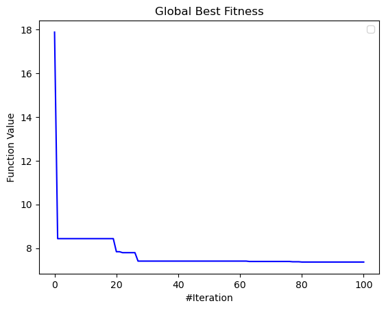
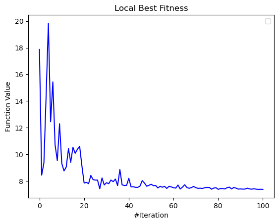
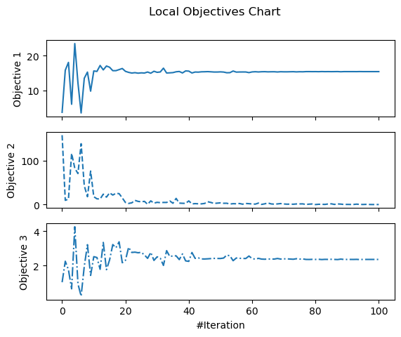
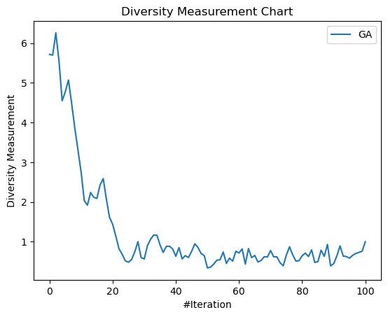
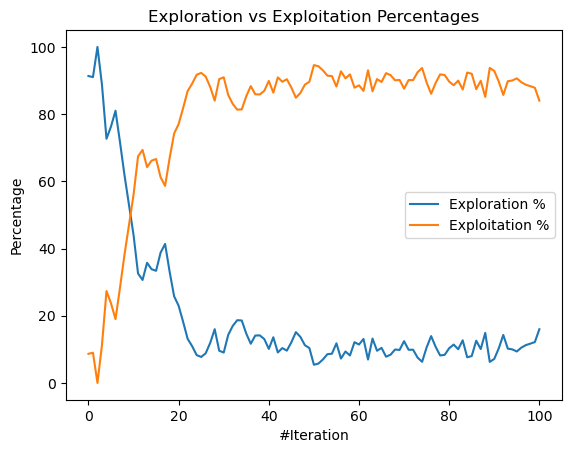

<p align="center"></p>

---


[](https://github.com/thieu1995/mealpy/releases)
[](https://pypi.python.org/pypi/mealpy) 
[](https://badge.fury.io/py/mealpy)


[](https://pepy.tech/project/mealpy)

[](https://mealpy.readthedocs.io/en/latest/?badge=latest)
[](http://isitmaintained.com/project/thieu1995/mealpy "Average time to resolve an issue")
[](http://isitmaintained.com/project/thieu1995/mealpy "Percentage of issues still open")

[](https://doi.org/10.5281/zenodo.3711948)
[](https://www.gnu.org/licenses/gpl-3.0)


MEALPY is the largest python library for most of the cutting-edge nature-inspired meta-heuristic algorithms (population-based). Population meta-heuristic algorithms (PMA) are the most popular algorithms in the field of 
approximate optimization.

* **Free software:** GNU General Public License (GPL) V3 license
* **Total algorithms**: 172 (102 original, 45 official variants, 25 developed variants)
* **Documentation:** https://mealpy.readthedocs.io/en/latest/
* **Python versions:** 3.7.x, 3.8.x, 3.9.x, 3.10.x
* **Dependencies:** numpy, scipy, pandas, matplotlib


# Goals

Our goals are to implement all of the classical as well as the state-of-the-art nature-inspired algorithms, create a simple interface that helps researchers access optimization algorithms as quickly as possible, and share knowledge of the optimization field with everyone without a fee. What you can do with mealpy:

- Analyse parameters of meta-heuristic algorithms.
- Perform Qualitative and Quantitative Analysis of algorithms.
- Analyse rate of convergence of algorithms.
- Test and Analyse the scalability and the robustness of algorithms.
- Save results in various formats (csv, json, pickle, png, pdf, jpeg)
- Export and import models


# Installation

### Install with pip
Install the [current PyPI release](https://pypi.python.org/pypi/mealpy):
```sh 
$ pip install mealpy==2.5.1
```

### Install from source
In case you want to install directly from the source code, use:
```sh 
$ git clone https://github.com/thieu1995/mealpy.git
$ cd mealpy
$ python setup.py install
```


# Usage

After installation, you can import Mealpy as any other Python module:

```sh
$ python
>>> import mealpy
>>> mealpy.__version__
```

Let's go through a basic and advanced example.


## Examples

### Simple Benchmark Function

```python 
from mealpy.bio_based import SMA
import numpy as np

def fitness_function(solution):
    return np.sum(solution**2)

problem = {
    "fit_func": fitness_function,
    "lb": [-100, ] * 30,
    "ub": [100, ] * 30,
    "minmax": "min",
    "log_to": None,
    "save_population": False,
}

## Run the algorithm
model = SMA.BaseSMA(epoch=100, pop_size=50, pr=0.03)
best_position, best_fitness = model.solve(problem)
print(f"Best solution: {best_position}, Best fitness: {best_fitness}")
```

### Constrained Benchmark Function
* [The Constrained Benchmark Function](https://github.com/thieu1995/mealpy/tree/master/examples/applications/run_constraint_functions.py)


### Multi-objective Benchmark Function
* [Multi-objective benchmark functions](https://github.com/thieu1995/mealpy/tree/master/examples/applications/run_multi_objective_functions.py)


### Custom Problem 

For our custom problem, we can create a class and inherit from Problem class, named the child class as "Squared". 
In the initialization method of *Squared* class we have to set the *lb*, *ub*, and *minmax* of the problem. (lb: is list of lowerbound, ub: is list of upperbound values, minmax is "min" or "max" problem). 

Afterwards we have to override the abstract method *fit_func()* which takes a parameter *solution*, the solution to be evaluated, and returns the function value. Now we should have something similar as is shown in code snippet bellow.
(*name* is additional parameter we want to add to this class, you can add anything you want).

```python 
import numpy as np
from mealpy.bio_based import BBO
from mealpy.utils.problem import Problem

# Our custom problem class
class Squared(Problem):
    def __init__(self, lb=(-5, -5, -5, -5, -5, -5), ub=(5, 5, 5, 5, 5, 5), minmax="min", name="Squared", **kwargs):
        super().__init__(lb, ub, minmax, **kwargs)
        self.name = name

    def fit_func(self, solution):
        return np.sum(solution ** 2)
```

Now, we define an algorithm, and pass an instance of our *Squared* class as the problem argument. 

```python
problem = Squared(lb=[-10] * 20, ub=[10] * 20, minmax="min")
model = BBO.BaseBBO(epoch=10, pop_size=50)
best_position, best_fitness = model.solve(problem)

print(best_position)
print(best_fitness)
print(model.get_parameters())
print(model.get_name())
print(model.get_attributes()["solution"])
print(model.problem.get_name())
print(model.problem.n_dims)
```


### Tuner class (GridSearchCV/ParameterSearch, Hyper-parameter tuning)

We build a dedicated class, Tuner, that can help you tune your algorithm's parameters.

```python
import numpy as np
from mealpy.bio_based import BBO
from mealpy.tuner import Tuner          # Remember this


def fitness(solution):
    return np.sum(solution**2)

problem = {
    "lb": [-100, ]*50,
    "ub": [100, ]*50,
    "minmax": "min",
    "fit_func": fitness,
    "name": "Squared Problem",
    "log_to": None,
}

paras_bbo_grid = {
    "epoch": [100],
    "pop_size": [50],
    "elites": [2, 3, 4, 5],
    "p_m": [0.01, 0.02, 0.05, 0.1, 0.15, 0.2]
}

if __name__ == "__main__":
    model = BBO.BaseBBO()

    tuner = Tuner(model, paras_bbo_grid)
    tuner.execute(problem=problem, n_trials=10, mode="parallel", n_workers=4)

    print(tuner.best_score)
    print(tuner.best_params)
    print(tuner.best_algorithm)
    print(tuner.best_algorithm.get_name())
    
    ## Save results to csv file 
    tuner.export_results(save_path="history/tuning", save_as="csv")
    
    ## Re-solve the best model on your problem 
    best_position, best_fitness = tuner.resolve()

    print(best_position, best_fitness)
    print(tuner.problem.get_name())
```


### Multitask class (Multitask solving)

We also build a dedicated class, Multitask, that can help you run several different scenarios. For example:

1. Run 1 algorithm with 1 problem, and multiple trials
2. Run 1 algorithm with multiple problems, and multiple trials
3. Run multiple algorithms with 1 problem, and multiple trials
4. Run multiple algorithms with multiple problems, and multiple trials


```python
#### Using multiple algorithm to solve multiple problems with multiple trials

## Import libraries
## For example, we want to solve F5, F10, F29 problem in CEC-2017
from opfunu.cec_based.cec2017 import F52017, F102017, F292017

from mealpy.bio_based import BBO
from mealpy.evolutionary_based import DE
from mealpy.multitask import Multitask          # Remember this


## You can define your own problems

f1 = F52017(30, f_bias=0)
f2 = F102017(30, f_bias=0)
f3 = F292017(30, f_bias=0)

p1 = {
    "lb": f1.lb.tolist(),
    "ub": f1.ub.tolist(),
    "minmax": "min",
    "fit_func": f1.evaluate,
    "name": "F5-CEC2017",
    "log_to": None,
}

p2 = {
    "lb": f2.lb.tolist(),
    "ub": f2.ub.tolist(),
    "minmax": "min",
    "fit_func": f2.evaluate,
    "name": "F10-CEC2017",
    "log_to": None,
}

p3 = {
    "lb": f3.lb.tolist(),
    "ub": f3.ub.tolist(),
    "minmax": "min",
    "fit_func": f3.evaluate,
    "name": "F29-CEC2017",
    "log_to": None,
}

## Define models

model1 = BBO.BaseBBO(epoch=10, pop_size=50)
model2 = BBO.OriginalBBO(epoch=10, pop_size=50)
model3 = DE.BaseDE(epoch=10, pop_size=50)


## Define and run Multitask

if __name__ == "__main__":
    multitask = Multitask(algorithms=(model1, model2, model3), problems=(p1, p2, p3))
    multitask.execute(n_trials=3, mode="parallel", n_workers=6, save_path="history", save_as="csv", save_convergence=True, verbose=True)
    
    ## Check the directory: history/, you will see list of .csv result files
```

For more usage examples please look at [examples](/examples) folder.

More advanced examples can also be found in the [Mealpy-examples repository](https://github.com/thieu1995/mealpy_examples).


### Get Visualize Figures


* [Tutorials](/examples/utils/visualize/all_charts.py)

* Global best fitness value and Local best fitness value after generations

<p align="center">
  
&nbsp; &nbsp; &nbsp; &nbsp;
  
</p>

* Global objectives chart and Local objectives chart

<p align="center">
  
&nbsp; &nbsp; &nbsp; &nbsp;
  
</p>

* Diversity of population chart and Exploration verse Exploitation chart

<p align="center">
  
&nbsp; &nbsp; &nbsp; &nbsp;
  
</p>

* Running time chart and Trajectory of some first agents chart

<p align="center">
  
&nbsp; &nbsp; &nbsp; &nbsp;
  
</p>


## Mealpy Application

### Mealpy + Neural Network (Replace the Gradient Descent Optimizer)

* Time-series Problem:
  * Traditional MLP
    code: [Link](https://github.com/thieu1995/mealpy/tree/master/examples/applications/keras/traditional-mlp-time-series.py)
  * Hybrid code (Mealpy +
    MLP): [Link](https://github.com/thieu1995/mealpy/tree/master/examples/applications/keras/mha-hybrid-mlp-time-series.py)
* Classification Problem:
  * Traditional MLP
    code: [Link](https://github.com/thieu1995/mealpy/blob/master/examples/applications/keras/traditional-mlp-classification.py)
  * Hybrid code (Mealpy +
    MLP): [Link](https://github.com/thieu1995/mealpy/blob/master/examples/applications/keras/mha-hybrid-mlp-classification.py)

### Mealpy + Neural Network (Optimize Neural Network Hyper-parameter)

Code: [Link](https://github.com/thieu1995/mealpy/blob/master/examples/applications/keras/mha-hyper-parameter-mlp-time-series.py)

### Other Applications

* Solving Knapsack Problem (Discrete
  problems): [Link](https://github.com/thieu1995/mealpy/blob/master/examples/applications/discrete-problems/knapsack-problem.py)

* Optimize SVM (SVC)
  model: [Link](https://github.com/thieu1995/mealpy/blob/master/examples/applications/sklearn/svm_classification.py)

* Optimize Linear Regression
  Model: [Link](https://github.com/thieu1995/mealpy/blob/master/examples/applications/pytorch/linear_regression.py)

* Travelling Salesman Problem: https://github.com/thieu1995/MHA-TSP 

* Feature selection problem: https://github.com/thieu1995/MHA-FS


## Tutorial Videos

All tutorial videos: [Link](https://mealpy.readthedocs.io/en/latest/pages/general/video_tutorials.html)

All code examples: [Link](https://github.com/thieu1995/mealpy/tree/master/examples)

All visualization examples: [Link](https://mealpy.readthedocs.io/en/latest/pages/visualization.html)


### Get helps (questions, problems)

* Official source code repo: https://github.com/thieu1995/mealpy
* Official document: https://mealpy.readthedocs.io/
* Download releases: https://pypi.org/project/mealpy/
* Issue tracker: https://github.com/thieu1995/mealpy/issues
* Notable changes log: https://github.com/thieu1995/mealpy/blob/master/ChangeLog.md
* Examples with different meapy version: https://github.com/thieu1995/mealpy/blob/master/EXAMPLES.md

* This project also related to our another projects which are "meta-heuristics" and "neural-network", check it here
    * https://github.com/thieu1995/opfunu
    * https://github.com/thieu1995/metaheuristics
    * https://github.com/aiir-team

**Want to have an instant assistant? Join our telegram community at [link](https://t.me/+fRVCJGuGJg1mNDg1)**
We share lots of information, questions, and answers there. You will get more support and knowledge there.
### Cite Us

If you are using mealpy in your project, we would appreciate citations:

```code 
@software{nguyen_van_thieu_2022_6684223,
  author       = {Nguyen Van Thieu and Seyedali Mirjalili},
  title        = {{MEALPY: a Framework of The State-of-The-Art Meta-Heuristic Algorithms in Python}},
  month        = jun,
  year         = 2022,
  publisher    = {Zenodo},
  version      = {v2.4.2},
  doi          = {10.5281/zenodo.6684223},
  url          = {https://doi.org/10.5281/zenodo.6684223}
}
```


# Documents

* Meta-heuristic Categories: (Based on this article: [link](https://doi.org/10.1016/j.procs.2020.09.075))
    + Evolutionary-based: Idea from Darwin's law of natural selection, evolutionary computing 
    + Swarm-based: Idea from movement, interaction of birds, organization of social ...
    + Physics-based: Idea from physics law such as Newton's law of universal gravitation, black hole, multiverse 
    + Human-based: Idea from human interaction such as queuing search, teaching learning, ... 
    + Biology-based: Idea from biology creature (or microorganism),...
    + System-based: Idea from eco-system, immune-system, network-system, ...
    + Math-based: Idea from mathematical form or mathematical law such as sin-cosin 
    + Music-based: Idea from music instrument

* Difficulty - Difficulty Level (Personal Opinion): Objective observation from author. Depend on the number of 
  parameters, number of equations, the original ideas, time spend for coding, source lines of code (SLOC).
    + Easy: A few paras, few equations, SLOC very short
    + Medium: more equations than Easy level, SLOC longer than Easy level
    + Hard: Lots of equations, SLOC longer than Medium level, the paper hard to read.
    + Hard* - Very hard: Lots of equations, SLOC too long, the paper is very hard to read.
    
** For newbie, we recommend to read the paper of algorithms which difficulty is "easy" or "medium" difficulty level.


| **Group**    | **Name**                                        | **Module** | **Class**        | **Year** | **Paras** | **Difficulty** |
|--------------|-------------------------------------------------|------------|------------------|----------|-----------|----------------|
| Evolutionary | Evolutionary Programming                        | EP         | OriginalEP       | 1964     | 3         | easy           |
| Evolutionary | -                                               | -          | LevyEP           | -        | 3         | easy           |
| Evolutionary | Evolution Strategies                            | ES         | OriginalES       | 1971     | 3         | easy           |
| Evolutionary | -                                               | -          | LevyES           | -        | 3         | easy           |
| Evolutionary | Memetic Algorithm                               | MA         | OriginalMA       | 1989     | 7         | easy           |
| Evolutionary | Genetic Algorithm                               | GA         | BaseGA           | 1992     | 4         | easy           |
| Evolutionary | -                                               | -          | SingleGA         | -        | 7         | easy           |
| Evolutionary | -                                               | -          | MultiGA          | -        | 7         | easy           |
| Evolutionary | -                                               | -          | EliteSingleGA    | -        | 10        | easy           |
| Evolutionary | -                                               | -          | EliteMultiGA     | -        | 10        | easy           |
| Evolutionary | Differential Evolution                          | DE         | BaseDE           | 1997     | 5         | easy           |
| Evolutionary | -                                               | -          | JADE             | 2009     | 6         | medium         |
| Evolutionary | -                                               | -          | SADE             | 2005     | 2         | medium         |
| Evolutionary | -                                               | -          | SHADE            | 2013     | 4         | medium         |
| Evolutionary | -                                               | -          | L_SHADE          | 2014     | 4         | medium         |
| Evolutionary | -                                               | -          | SAP_DE           | 2006     | 3         | medium         |
| Evolutionary | Flower Pollination Algorithm                    | FPA        | OriginalFPA      | 2014     | 4         | medium         |
| Evolutionary | Coral Reefs Optimization                        | CRO        | OriginalCRO      | 2014     | 11        | medium         |
| Evolutionary | -                                               | -          | OCRO             | 2019     | 12        | medium         |
| -            | -                                               | -          | -                | -        | -         | -              |
| Swarm        | Particle Swarm Optimization                     | PSO        | OriginalPSO      | 1995     | 6         | easy           |
| Swarm        | -                                               | -          | PPSO             | 2019     | 2         | medium         |
| Swarm        | -                                               | -          | HPSO_TVAC        | 2017     | 4         | medium         |
| Swarm        | -                                               | -          | C_PSO            | 2015     | 6         | medium         |
| Swarm        | -                                               | -          | CL_PSO           | 2006     | 6         | medium         |
| Swarm        | Bacterial Foraging Optimization                 | BFO        | OriginalBFO      | 2002     | 10        | hard           |
| Swarm        | -                                               | -          | ABFO             | 2019     | 8         | medium         |
| Swarm        | Bees Algorithm                                  | BeesA      | OriginalBeesA    | 2005     | 8         | medium         |
| Swarm        | -                                               | -          | ProbBeesA        | 2015     | 5         | medium         |
| Swarm        | Cat Swarm Optimization                          | CSO        | OriginalCSO      | 2006     | 11        | hard           |
| Swarm        | Artificial Bee Colony                           | ABC        | OriginalABC      | 2007     | 8         | medium         |
| Swarm        | Ant Colony Optimization                         | ACO-R      | OriginalACOR     | 2008     | 5         | easy           |
| Swarm        | Cuckoo Search Algorithm                         | CSA        | OriginalCSA      | 2009     | 3         | medium         |
| Swarm        | Firefly Algorithm                               | FFA        | OriginalFFA      | 2009     | 8         | easy           |
| Swarm        | Fireworks Algorithm                             | FA         | OriginalFA       | 2010     | 7         | medium         |
| Swarm        | Bat Algorithm                                   | BA         | OriginalBA       | 2010     | 6         | medium         |
| Swarm        | -                                               | -          | AdaptiveBA       | -        | 8         | medium         |
| Swarm        | -                                               | -          | ModifiedBA       | -        | 5         | medium         |
| Swarm        | Fruit-fly Optimization Algorithm                | FOA        | OriginalFOA      | 2012     | 2         | easy           |
| Swarm        | -                                               | -          | BaseFOA          | -        | 2         | easy           |
| Swarm        | -                                               | -          | WhaleFOA         | 2020     | 2         | medium         |
| Swarm        | Social Spider Optimization                      | SSpiderO   | OriginalSSpiderO | 2018     | 4         | hard*          |
| Swarm        | Grey Wolf Optimizer                             | GWO        | OriginalGWO      | 2014     | 2         | easy           |
| Swarm        | -                                               | -          | RW_GWO           | 2019     | 2         | easy           |
| Swarm        | Social Spider Algorithm                         | SSpiderA   | OriginalSSpiderA | 2015     | 5         | medium         |
| Swarm        | Ant Lion Optimizer                              | ALO        | OriginalALO      | 2015     | 2         | easy           |
| Swarm        | -                                               | -          | BaseALO          | -        | 2         | easy           |
| Swarm        | Moth Flame Optimization                         | MFO        | OriginalMFO      | 2015     | 2         | easy           |
| Swarm        | -                                               | -          | BaseMFO          | -        | 2         | easy           |
| Swarm        | Elephant Herding Optimization                   | EHO        | OriginalEHO      | 2015     | 5         | easy           |
| Swarm        | Jaya Algorithm                                  | JA         | OriginalJA       | 2016     | 2         | easy           |
| Swarm        | -                                               | -          | BaseJA           | -        | 2         | easy           |
| Swarm        | -                                               | -          | LevyJA           | 2021     | 2         | easy           |
| Swarm        | Whale Optimization Algorithm                    | WOA        | OriginalWOA      | 2016     | 2         | medium         |
| Swarm        | -                                               | -          | HI_WOA           | 2019     | 3         | medium         |
| Swarm        | Dragonfly Optimization                          | DO         | OriginalDO       | 2016     | 2         | medium         |
| Swarm        | Bird Swarm Algorithm                            | BSA        | OriginalBSA      | 2016     | 9         | medium         |
| Swarm        | Spotted Hyena Optimizer                         | SHO        | OriginalSHO      | 2017     | 4         | medium         |
| Swarm        | Salp Swarm Optimization                         | SSO        | OriginalSSO      | 2017     | 2         | easy           |
| Swarm        | Swarm Robotics Search And Rescue                | SRSR       | OriginalSRSR     | 2017     | 2         | hard*          |
| Swarm        | Grasshopper Optimisation Algorithm              | GOA        | OriginalGOA      | 2017     | 4         | easy           |
| Swarm        | Coyote Optimization Algorithm                   | COA        | OriginalCOA      | 2018     | 3         | medium         |
| Swarm        | Moth Search Algorithm                           | MSA        | OriginalMSA      | 2018     | 5         | easy           |
| Swarm        | Sea Lion Optimization                           | SLO        | OriginalSLO      | 2019     | 2         | medium         |
| Swarm        | -                                               | -          | ModifiedSLO      | -        | 2         | medium         |
| Swarm        | -                                               | -          | ImprovedSLO      | -        | 4         | medium         |
| Swarm        | Nake Mole-Rat Algorithm                         | NMRA       | OriginalNMRA     | 2019     | 3         | easy           |
| Swarm        | -                                               | -          | ImprovedNMRA     | -        | 4         | medium         |
| Swarm        | Pathfinder Algorithm                            | PFA        | OriginalPFA      | 2019     | 2         | medium         |
| Swarm        | Sailfish Optimizer                              | SFO        | OriginalSFO      | 2019     | 5         | easy           |
| Swarm        | -                                               | -          | ImprovedSFO      | -        | 3         | medium         |
| Swarm        | Harris Hawks Optimization                       | HHO        | OriginalHHO      | 2019     | 2         | medium         |
| Swarm        | Manta Ray Foraging Optimization                 | MRFO       | OriginalMRFO     | 2020     | 3         | medium         |
| Swarm        | Bald Eagle Search                               | BES        | OriginalBES      | 2020     | 7         | easy           |
| Swarm        | Sparrow Search Algorithm                        | SSA        | OriginalSSA      | 2020     | 5         | medium         |
| Swarm        | -                                               | -          | BaseSSA          | -        | 5         | medium         |
| Swarm        | Hunger Games Search                             | HGS        | OriginalHGS      | 2021     | 4         | medium         |
| Swarm        | Aquila Optimizer                                | AO         | OriginalAO       | 2021     | 2         | easy           |
| Swarm        | Hybrid Grey Wolf - Whale Optimization Algorithm | GWO        | GWO_WOA          | 2022     | 2         | easy           |
| Swarm        | Marine Predators Algorithm                      | MPA        | OriginalMPA      | 2020     | 2         | medium         |
| Swarm        | Honey Badger Algorithm                          | HBA        | OriginalHBA      | 2022     | 2         | easy           |
| Swarm        | Sand Cat Swarm Optimization                     | SCSO       | OriginalSCSO     | 2022     | 2         | easy           |
| Swarm        | Tuna Swarm Optimization                         | TSO        | OriginalTSO      | 2021     | 2         | medium         |
| Swarm        | African Vultures Optimization Algorithm         | AVOA       | OriginalAVOA     | 2022     | 7         | medium         |
| Swarm        | Artificial Gorilla Troops Optimization          | AGTO       | OriginalAGTO     | 2021     | 5         | medium         |
| Swarm        | Artificial Rabbits Optimization                 | ARO        | OriginalARO      | 2022     | 2         | easy           |
| -            | -                                               | -          | -                | -        | -         | -              |
| Physics      | Simulated Annealling                            | SA         | OriginalSA       | 1987     | 9         | medium         |
| Physics      | Wind Driven Optimization                        | WDO        | OriginalWDO      | 2013     | 7         | easy           |
| Physics      | Multi-Verse Optimizer                           | MVO        | OriginalMVO      | 2016     | 4         | easy           |
| Physics      | -                                               | -          | BaseMVO          | -        | 4         | easy           |
| Physics      | Tug of War Optimization                         | TWO        | OriginalTWO      | 2016     | 2         | easy           |
| Physics      | -                                               | -          | OppoTWO          | -        | 2         | medium         |
| Physics      | -                                               | -          | LevyTWO          | -        | 2         | medium         |
| Physics      | -                                               | -          | EnhancedTWO      | 2020     | 2         | medium         |
| Physics      | Electromagnetic Field Optimization              | EFO        | OriginalEFO      | 2016     | 6         | easy           |
| Physics      | -                                               | -          | BaseEFO          | -        | 6         | medium         |
| Physics      | Nuclear Reaction Optimization                   | NRO        | OriginalNRO      | 2019     | 2         | hard*          |
| Physics      | Henry Gas Solubility Optimization               | HGSO       | OriginalHGSO     | 2019     | 3         | medium         |
| Physics      | Atom Search Optimization                        | ASO        | OriginalASO      | 2019     | 4         | medium         |
| Physics      | Equilibrium Optimizer                           | EO         | OriginalEO       | 2019     | 2         | easy           |
| Physics      | -                                               | -          | ModifiedEO       | 2020     | 2         | medium         |
| Physics      | -                                               | -          | AdaptiveEO       | 2020     | 2         | medium         |
| Physics      | Archimedes Optimization Algorithm               | ArchOA     | OriginalArchOA   | 2021     | 8         | medium         |
| -            | -                                               | -          | -                | -        | -         | -              |
| Human        | Culture Algorithm                               | CA         | OriginalCA       | 1994     | 3         | easy           |
| Human        | Imperialist Competitive Algorithm               | ICA        | OriginalICA      | 2007     | 8         | hard*          |
| Human        | Teaching Learning-based Optimization            | TLO        | OriginalTLO      | 2011     | 2         | easy           |
| Human        | -                                               | -          | BaseTLO          | 2012     | 2         | easy           |
| Human        | -                                               | -          | ITLO             | 2013     | 3         | medium         |
| Human        | Brain Storm Optimization                        | BSO        | OriginalBSO      | 2011     | 8         | medium         |
| Human        | -                                               | -          | ImprovedBSO      | 2017     | 7         | medium         |
| Human        | Queuing Search Algorithm                        | QSA        | OriginalQSA      | 2019     | 2         | hard           |
| Human        | -                                               | -          | BaseQSA          | -        | 2         | hard           |
| Human        | -                                               | -          | OppoQSA          | -        | 2         | hard           |
| Human        | -                                               | -          | LevyQSA          | -        | 2         | hard           |
| Human        | -                                               | -          | ImprovedQSA      | 2021     | 2         | hard           |
| Human        | Search And Rescue Optimization                  | SARO       | OriginalSARO     | 2019     | 4         | medium         |
| Human        | -                                               | -          | BaseSARO         | -        | 4         | medium         |
| Human        | Life Choice-Based Optimization                  | LCO        | OriginalLCO      | 2019     | 3         | easy           |
| Human        | -                                               | -          | BaseLCO          | -        | 3         | easy           |
| Human        | -                                               | -          | ImprovedLCO      | -        | 2         | easy           |
| Human        | Social Ski-Driver Optimization                  | SSDO       | OriginalSSDO     | 2019     | 2         | easy           |
| Human        | Gaining Sharing Knowledge-based Algorithm       | GSKA       | OriginalGSKA     | 2019     | 6         | medium         |
| Human        | -                                               | -          | BaseGSKA         | -        | 4         | medium         |
| Human        | Coronavirus Herd Immunity Optimization          | CHIO       | OriginalCHIO     | 2020     | 4         | medium         |
| Human        | -                                               | -          | BaseCHIO         | -        | 4         | medium         |
| Human        | Forensic-Based Investigation Optimization       | FBIO       | OriginalFBIO     | 2020     | 2         | medium         |
| Human        | -                                               | -          | BaseFBIO         | -        | 2         | medium         |
| Human        | Battle Royale Optimization                      | BRO        | OriginalBRO      | 2020     | 3         | medium         |
| Human        | -                                               | -          | BaseBRO          | -        | 3         | medium         |
| Human        | Student Psychology Based Optimization           | SPBO       | OriginalSPBO     | 2020     | 2         | medium         |
| Human        | -                                               | -          | DevSPBO          |          | 2         | medium         |
| Human        | Dwarf Mongoose Optimization Algorithm           | DMOA       | OriginalDMOA     | 2022     | 4         | medium         |
| Human        | -                                               | -          | DevDMOA          | -        | 3         | medium         |
| -            | -                                               | -          | -                | -        | -         | -              |
| Bio          | Invasive Weed Optimization                      | IWO        | OriginalIWO      | 2006     | 7         | easy           |
| Bio          | Biogeography-Based Optimization                 | BBO        | OriginalBBO      | 2008     | 4         | easy           |
| Bio          | -                                               | -          | BaseBBO          | -        | 4         | easy           |
| Bio          | Virus Colony Search                             | VCS        | OriginalVCS      | 2016     | 4         | hard*          |
| Bio          | -                                               | -          | BaseVCS          | -        | 4         | hard*          |
| Bio          | Satin Bowerbird Optimizer                       | SBO        | OriginalSBO      | 2017     | 5         | easy           |
| Bio          | -                                               | -          | BaseSBO          | -        | 5         | easy           |
| Bio          | Earthworm Optimisation Algorithm                | EOA        | OriginalEOA      | 2018     | 8         | medium         |
| Bio          | Wildebeest Herd Optimization                    | WHO        | OriginalWHO      | 2019     | 12        | hard           |
| Bio          | Slime Mould Algorithm                           | SMA        | OriginalSMA      | 2020     | 3         | easy           |
| Bio          | -                                               | -          | BaseSMA          | -        | 3         | easy           |
| Bio          | Barnacles Mating Optimizer                      | BMO        | OriginalBMO      | 2018     | 3         | easy           |
| Bio          | Tunicate Swarm Algorithm                        | TSA        | OriginalTSA      | 2020     | 2         | easy           |
| Bio          | Symbiotic Organisms Search                      | SOS        | OriginalSOS      | 2014     | 2         | medium         |
| Bio          | Seagull Optimization Algorithm                  | SOA        | OriginalSOA      | 2019     | 3         | easy           |
| Bio          | -                                               | -          | DevSOA           | -        | 3         | easy           |
| -            | -                                               | -          | -                | -        | -         | -              |
| System       | Germinal Center Optimization                    | GCO        | OriginalGCO      | 2018     | 4         | medium         |
| System       | -                                               | -          | BaseGCO          | -        | 4         | medium         |
| System       | Water Cycle Algorithm                           | WCA        | OriginalWCA      | 2012     | 5         | medium         |
| System       | Artificial Ecosystem-based Optimization         | AEO        | OriginalAEO      | 2019     | 2         | easy           |
| System       | -                                               | -          | EnhancedAEO      | 2020     | 2         | medium         |
| System       | -                                               | -          | ModifiedAEO      | 2020     | 2         | medium         |
| System       | -                                               | -          | ImprovedAEO      | 2021     | 2         | medium         |
| System       | -                                               | -          | AdaptiveAEO      | -        | 2         | medium         |
| -            | -                                               | -          | -                | -        | -         | -              |
| Math         | Hill Climbing                                   | HC         | OriginalHC       | 1993     | 3         | easy           |
| Math         | -                                               | -          | SwarmHC          | -        | 3         | easy           |
| Math         | Cross-Entropy Method                            | CEM        | OriginalCEM      | 1997     | 4         | easy           |
| Math         | Sine Cosine Algorithm                           | SCA        | OriginalSCA      | 2016     | 2         | easy           |
| Math         | -                                               | -          | BaseSCA          | -        | 2         | easy           |
| Math         | Gradient-Based Optimizer                        | GBO        | OriginalGBO      | 2020     | 5         | medium         |
| Math         | Arithmetic Optimization Algorithm               | AOA        | OrginalAOA       | 2021     | 6         | easy           |
| Math         | Chaos Game Optimization                         | CGO        | OriginalCGO      | 2021     | 2         | easy           |
| Math         | Pareto-like Sequential Sampling                 | PSS        | OriginalPSS      | 2021     | 4         | medium         |
| Math         | weIghted meaN oF vectOrs                        | INFO       | OriginalINFO     | 2022     | 2         | medium         |
| Math         | RUNge Kutta optimizer                           | RUN        | OriginalRUN      | 2021     | 2         | hard           |
| Math         | Circle Search Algorithm                         | CircleSA   | OriginalCircleSA | 2022     | 3         | easy           |
| -            | -                                               | -          | -                | -        | -         | -              |
| Music        | Harmony Search                                  | HS         | OriginalHS       | 2001     | 4         | easy           |
| Music        | -                                               | -          | BaseHS           | -        | 4         | easy           |


### A

* **ABC - Artificial Bee Colony**
  * **OriginalABC**: Karaboga, D. (2005). An idea based on honey bee swarm for numerical optimization (Vol. 200, pp. 1-10). Technical report-tr06, Erciyes university, engineering faculty, computer engineering department.

* **ACOR - Ant Colony Optimization**. 
  * **OriginalACOR**: Socha, K., & Dorigo, M. (2008). Ant colony optimization for continuous domains. European journal of operational research, 185(3), 1155-1173.

* **ALO - Ant Lion Optimizer** 
  * **OriginalALO**: Mirjalili S (2015). “The Ant Lion Optimizer.” Advances in Engineering Software, 83, 80-98. doi: [10.1016/j.advengsoft.2015.01.010](https://doi.org/10.1016/j.advengsoft.2015.01.010)
  * **BaseALO**: The developed version

* **AEO - Artificial Ecosystem-based Optimization** 
  * **OriginalAEO**: Zhao, W., Wang, L., & Zhang, Z. (2019). Artificial ecosystem-based optimization: a novel nature-inspired meta-heuristic algorithm. Neural Computing and Applications, 1-43.
  * **AdaptiveAEO**: The adaptive version
  * **ImprovedAEO**: Rizk-Allah, R. M., & El-Fergany, A. A. (2020). Artificial ecosystem optimizer for parameters identification of proton exchange membrane fuel cells model. International Journal of Hydrogen Energy.
  * **EnhancedAEO**: Eid, A., Kamel, S., Korashy, A., & Khurshaid, T. (2020). An Enhanced Artificial Ecosystem-Based Optimization for Optimal Allocation of Multiple Distributed Generations. IEEE Access, 8, 178493-178513.
  * **ModifiedAEO**: Menesy, A. S., Sultan, H. M., Korashy, A., Banakhr, F. A., Ashmawy, M. G., & Kamel, S. (2020). Effective parameter extraction of different polymer electrolyte membrane fuel cell stack models using a modified artificial ecosystem optimization algorithm. IEEE Access, 8, 31892-31909.
  
* **ASO - Atom Search Optimization**   
  * **OriginalASO**: Zhao, W., Wang, L., & Zhang, Z. (2019). Atom search optimization and its application to solve a hydrogeologic parameter estimation problem. Knowledge-Based Systems, 163, 283-304.

* **ArchOA - Archimedes Optimization Algorithm**
  * **OriginalArchOA**: Hashim, F. A., Hussain, K., Houssein, E. H., Mabrouk, M. S., & Al-Atabany, W. (2021). Archimedes optimization algorithm: a new metaheuristic algorithm for solving optimization problems. Applied Intelligence, 51(3), 1531-1551.

* **AOA - Arithmetic Optimization Algorithm**
  * **OriginalAOA**: Abualigah, L., Diabat, A., Mirjalili, S., Abd Elaziz, M., & Gandomi, A. H. (2021). The arithmetic optimization algorithm. Computer methods in applied mechanics and engineering, 376, 113609.

* **AO - Aquila Optimizer**
  * **OriginalAO**: Abualigah, L., Yousri, D., Abd Elaziz, M., Ewees, A. A., Al-qaness, M. A., & Gandomi, A. H. (2021). Aquila Optimizer: A novel meta-heuristic optimization Algorithm. Computers & Industrial Engineering, 157, 107250.

* **AVOA - African Vultures Optimization Algorithm**
  * **OriginalAVOA**: Abdollahzadeh, B., Gharehchopogh, F. S., & Mirjalili, S. (2021). African vultures optimization algorithm: A new nature-inspired metaheuristic algorithm for global optimization problems. Computers & Industrial Engineering, 158, 107408.

* **AGTO - Artificial Gorilla Troops Optimization**
  * **OriginalAGTO**: Abdollahzadeh, B., Soleimanian Gharehchopogh, F., & Mirjalili, S. (2021). Artificial gorilla troops optimizer: a new nature‐inspired metaheuristic algorithm for global optimization problems. International Journal of Intelligent Systems, 36(10), 5887-5958.

* **ARO - Artificial Rabbits Optimization**:
  * **OriginalARO**: Wang, L., Cao, Q., Zhang, Z., Mirjalili, S., & Zhao, W. (2022). Artificial rabbits optimization: A new bio-inspired meta-heuristic algorithm for solving engineering optimization problems. Engineering Applications of Artificial Intelligence, 114, 105082.


### B


* **BFO - Bacterial Foraging Optimization** 
  * **OriginalBFO**: Passino, K. M. (2002). Biomimicry of bacterial foraging for distributed optimization and control. IEEE control systems magazine, 22(3), 52-67.
  * **ABFO**: Nguyen, T., Nguyen, B. M., & Nguyen, G. (2019, April). Building resource auto-scaler with functional-link neural network and adaptive bacterial foraging optimization. In International Conference on Theory and Applications of Models of Computation (pp. 501-517). Springer, Cham.

* **BeesA - Bees Algorithm** 
  * **OriginalBeesA**: Pham, D. T., Ghanbarzadeh, A., Koc, E., Otri, S., Rahim, S., & Zaidi, M. (2005). The bees algorithm. Technical Note, Manufacturing Engineering Centre, Cardiff University, UK.
  * **ProbBeesA**: The probabilitic version of: Pham, D. T., Ghanbarzadeh, A., Koç, E., Otri, S., Rahim, S., & Zaidi, M. (2006). The bees algorithm—a novel tool for complex optimisation problems. In Intelligent production machines and systems (pp. 454-459). Elsevier Science Ltd.
  
* **BBO - Biogeography-Based Optimization** 
  * **OriginalBBO**: Simon, D. (2008). Biogeography-based optimization. IEEE transactions on evolutionary computation, 12(6), 702-713.
  * **BaseBBO**: The developed version
  
* **BA - Bat Algorithm** 
  * **OriginalBA**: Yang, X. S. (2010). A new metaheuristic bat-inspired algorithm. In Nature inspired cooperative strategies for optimization (NICSO 2010) (pp. 65-74). Springer, Berlin, Heidelberg.
  * **AdaptiveBA**: Wang, X., Wang, W. and Wang, Y., 2013, July. An adaptive bat algorithm. In International Conference on Intelligent Computing(pp. 216-223). Springer, Berlin, Heidelberg.
  * **ModifiedBA**: Dong, H., Li, T., Ding, R. and Sun, J., 2018. A novel hybrid genetic algorithm with granular information for feature selection and optimization. Applied Soft Computing, 65, pp.33-46.

* **BSO - Brain Storm Optimization** 
  * **OriginalBSO**: . Shi, Y. (2011, June). Brain storm optimization algorithm. In International conference in swarm intelligence (pp. 303-309). Springer, Berlin, Heidelberg.
  * **ImprovedBSO**: El-Abd, M., 2017. Global-best brain storm optimization algorithm. Swarm and evolutionary computation, 37, pp.27-44.

* **BSA - Bird Swarm Algorithm** 
  * **OriginalBSA**: Meng, X. B., Gao, X. Z., Lu, L., Liu, Y., & Zhang, H. (2016). A new bio-inspired optimisation algorithm:Bird Swarm Algorithm. Journal of Experimental & Theoretical Artificial Intelligence, 28(4), 673-687.

* **BMO - Barnacles Mating Optimizer**:
  * **OriginalBMO**: Sulaiman, M. H., Mustaffa, Z., Saari, M. M., Daniyal, H., Daud, M. R., Razali, S., & Mohamed, A. I. (2018, June). Barnacles mating optimizer: a bio-inspired algorithm for solving optimization problems. In 2018 19th IEEE/ACIS International Conference on Software Engineering, Artificial Intelligence, Networking and Parallel/Distributed Computing (SNPD) (pp. 265-270). IEEE.

* **BES - Bald Eagle Search** 
  * **OriginalBES**: Alsattar, H. A., Zaidan, A. A., & Zaidan, B. B. (2019). Novel meta-heuristic bald eagle search optimisation algorithm. Artificial Intelligence Review, 1-28.
  
* **BRO - Battle Royale Optimization**
  * **OriginalBRO**: Rahkar Farshi, T. (2020). Battle royale optimization algorithm. Neural Computing and Applications, 1-19.
  * **BaseBRO**: The developed version

### C

* **CA - Culture Algorithm** 
  * **OriginalCA**: Reynolds, R.G., 1994, February. An introduction to cultural algorithms. In Proceedings of the third annual conference on evolutionary programming (Vol. 24, pp. 131-139). River Edge, NJ: World Scientific.

* **CEM - Cross Entropy Method**
  * **OriginalCEM**: Rubinstein, R. (1999). The cross-entropy method for combinatorial and continuous optimization. Methodology and computing in applied probability, 1(2), 127-190.
  
* **CSO - Cat Swarm Optimization** 
  * **OriginalCSO**: Chu, S. C., Tsai, P. W., & Pan, J. S. (2006, August). Cat swarm optimization. In Pacific Rim international conference on artificial intelligence (pp. 854-858). Springer, Berlin, Heidelberg.

* **CSA - Cuckoo Search Algorithm** 
  * **OriginalCSA**: Yang, X. S., & Deb, S. (2009, December). Cuckoo search via Lévy flights. In 2009 World congress on nature & biologically inspired computing (NaBIC) (pp. 210-214). Ieee.

* **CRO - Coral Reefs Optimization** 
  * **OriginalCRO**: Salcedo-Sanz, S., Del Ser, J., Landa-Torres, I., Gil-López, S., & Portilla-Figueras, J. A. (2014). The coral reefs optimization algorithm: a novel metaheuristic for efficiently solving optimization problems. The Scientific World Journal, 2014.
  * **OCRO**: Nguyen, T., Nguyen, T., Nguyen, B. M., & Nguyen, G. (2019). Efficient time-series forecasting using neural network and opposition-based coral reefs optimization. International Journal of Computational Intelligence Systems, 12(2), 1144-1161.

* **COA - Coyote Optimization Algorithm**
  * **OriginalCOA**: Pierezan, J., & Coelho, L. D. S. (2018, July). Coyote optimization algorithm: a new metaheuristic for global optimization problems. In 2018 IEEE congress on evolutionary computation (CEC) (pp. 1-8). IEEE.

* **CHIO - Coronavirus Herd Immunity Optimization**
  * **OriginalCHIO**: Al-Betar, M. A., Alyasseri, Z. A. A., Awadallah, M. A., & Abu Doush, I. (2021). Coronavirus herd immunity optimizer (CHIO). Neural Computing and Applications, 33(10), 5011-5042.
  * **BaseCHIO**: The developed version

* **CGO - Chaos Game Optimization** 
  * **OriginalCGO**: Talatahari, S., & Azizi, M. (2021). Chaos Game Optimization: a novel metaheuristic algorithm. Artificial Intelligence Review, 54(2), 917-1004.

* **CSA - Circle Search Algorithm**
  * **OriginalCSA**: Qais, M. H., Hasanien, H. M., Turky, R. A., Alghuwainem, S., Tostado-Véliz, M., & Jurado, F. (2022). Circle Search Algorithm: A Geometry-Based Metaheuristic Optimization Algorithm. Mathematics, 10(10), 1626.

### D

* **DE - Differential Evolution** 
  * **BaseDE**: Storn, R., & Price, K. (1997). Differential evolution–a simple and efficient heuristic for global optimization over continuous spaces. Journal of global optimization, 11(4), 341-359.
  * **JADE**: Zhang, J., & Sanderson, A. C. (2009). JADE: adaptive differential evolution with optional external archive. IEEE Transactions on evolutionary computation, 13(5), 945-958.
  * **SADE**: Qin, A. K., & Suganthan, P. N. (2005, September). Self-adaptive differential evolution algorithm for numerical optimization. In 2005 IEEE congress on evolutionary computation (Vol. 2, pp. 1785-1791). IEEE.
  * **SHADE**: Tanabe, R., & Fukunaga, A. (2013, June). Success-history based parameter adaptation for differential evolution. In 2013 IEEE congress on evolutionary computation (pp. 71-78). IEEE.
  * **L_SHADE**: Tanabe, R., & Fukunaga, A. S. (2014, July). Improving the search performance of SHADE using linear population size reduction. In 2014 IEEE congress on evolutionary computation (CEC) (pp. 1658-1665). IEEE.
  * **SAP_DE**: Teo, J. (2006). Exploring dynamic self-adaptive populations in differential evolution. Soft Computing, 10(8), 673-686.
  
* **DSA - Differential Search Algorithm (not done)** 
  * **BaseDSA**: Civicioglu, P. (2012). Transforming geocentric cartesian coordinates to geodetic coordinates by using differential search algorithm. Computers & Geosciences, 46, 229-247.
  
* **DO - Dragonfly Optimization** 
  * **OriginalDO**: Mirjalili, S. (2016). Dragonfly algorithm: a new meta-heuristic optimization technique for solving single-objective, discrete, and multi-objective problems. Neural Computing and Applications, 27(4), 1053-1073.

* **DMOA - Dwarf Mongoose Optimization Algorithm**
  * **OriginalDMOA**: Agushaka, J. O., Ezugwu, A. E., & Abualigah, L. (2022). Dwarf mongoose optimization algorithm. Computer methods in applied mechanics and engineering, 391, 114570.
  * **DevDMOA**: The developed version

### E

* **ES - Evolution Strategies** . 
  * **OriginalES**: Schwefel, H. P. (1984). Evolution strategies: A family of non-linear optimization techniques based on imitating some principles of organic evolution. Annals of Operations Research, 1(2), 165-167.
  * **LevyES**: Zhang, S., & Salari, E. (2005). Competitive learning vector quantization with evolution strategies for image compression. Optical Engineering, 44(2), 027006.

* **EP - Evolutionary programming** . 
  * **OriginalEP**: Fogel, L. J. (1994). Evolutionary programming in perspective: The top-down view. Computational intelligence: Imitating life.
  * **LevyEP**: Lee, C.Y. and Yao, X., 2001, May. Evolutionary algorithms with adaptive lévy mutations. In Proceedings of the 2001 congress on evolutionary computation (IEEE Cat. No. 01TH8546) (Vol. 1, pp. 568-575). IEEE.

* **EHO - Elephant Herding Optimization** . 
  * **OriginalEHO**: Wang, G. G., Deb, S., & Coelho, L. D. S. (2015, December). Elephant herding optimization. In 2015 3rd International Symposium on Computational and Business Intelligence (ISCBI) (pp. 1-5). IEEE.

* **EFO - Electromagnetic Field Optimization** . 
  * **OriginalEFO**:Abedinpourshotorban, H., Shamsuddin, S. M., Beheshti, Z., & Jawawi, D. N. (2016). Electromagnetic field optimization: A physics-inspired metaheuristic optimization algorithm. Swarm and Evolutionary Computation, 26, 8-22.
  * **BaseEFO**: The developed version

* **EOA - Earthworm Optimisation Algorithm** . 
  * **OriginalEOA**: Wang, G. G., Deb, S., & dos Santos Coelho, L. (2018). Earthworm optimisation algorithm: a bio-inspired metaheuristic algorithm for global optimisation problems. IJBIC, 12(1), 1-22.

* **EO - Equilibrium Optimizer** . 
  * **OriginalEO**: Faramarzi, A., Heidarinejad, M., Stephens, B., & Mirjalili, S. (2019). Equilibrium optimizer: A novel optimization algorithm. Knowledge-Based Systems.
  * **ModifiedEO**: Gupta, S., Deep, K., & Mirjalili, S. (2020). An efficient equilibrium optimizer with mutation strategy for numerical optimization. Applied Soft Computing, 96, 106542.
  * **AdaptiveEO**: Wunnava, A., Naik, M. K., Panda, R., Jena, B., & Abraham, A. (2020). A novel interdependence based multilevel thresholding technique using adaptive equilibrium optimizer. Engineering Applications of Artificial Intelligence, 94, 103836.

### F

* **FFA - Firefly Algorithm** 
  * **OriginalFFA**: Łukasik, S., & Żak, S. (2009, October). Firefly algorithm for continuous constrained optimization tasks. In International conference on computational collective intelligence (pp. 97-106). Springer, Berlin, Heidelberg.
  
* **FA - Fireworks algorithm** 
  * **OriginalFA**: Tan, Y., & Zhu, Y. (2010, June). Fireworks algorithm for optimization. In International conference in swarm intelligence (pp. 355-364). Springer, Berlin, Heidelberg.

* **FPA - Flower Pollination Algorithm** 
  * **OriginalFPA**: Yang, X. S. (2012, September). Flower pollination algorithm for global optimization. In International conference on unconventional computing and natural computation (pp. 240-249). Springer, Berlin, Heidelberg.

* **FOA - Fruit-fly Optimization Algorithm**
  * **OriginalFOA**: Pan, W. T. (2012). A new fruit fly optimization algorithm: taking the financial distress model as an example. Knowledge-Based Systems, 26, 69-74.
  * **BaseFOA**: The developed version
  * **WhaleFOA**: Fan, Y., Wang, P., Heidari, A. A., Wang, M., Zhao, X., Chen, H., & Li, C. (2020). Boosted hunting-based fruit fly optimization and advances in real-world problems. Expert Systems with Applications, 159, 113502.

* **FBIO - Forensic-Based Investigation Optimization** 
  * **OriginalFBIO**: Chou, J.S. and Nguyen, N.M., 2020. FBI inspired meta-optimization. Applied Soft Computing, p.106339.
  * **BaseFBIO**: Fathy, A., Rezk, H. and Alanazi, T.M., 2021. Recent approach of forensic-based investigation algorithm for optimizing fractional order PID-based MPPT with proton exchange membrane fuel cell.IEEE Access,9, pp.18974-18992.

* **FHO - Fire Hawk Optimization**
  * **OriginalFHO**: Azizi, M., Talatahari, S., & Gandomi, A. H. (2022). Fire Hawk Optimizer: a novel metaheuristic algorithm. Artificial Intelligence Review, 1-77.

### G

* **GA - Genetic Algorithm** 
  * **BaseGA**: Holland, J. H. (1992). Genetic algorithms. Scientific american, 267(1), 66-73.
  * **SingleGA**: De Falco, I., Della Cioppa, A. and Tarantino, E., 2002. Mutation-based genetic algorithm: performance evaluation. Applied Soft Computing, 1(4), pp.285-299.
  * **MultiGA**: De Jong, K.A. and Spears, W.M., 1992. A formal analysis of the role of multi-point crossover in genetic algorithms. Annals of mathematics and Artificial intelligence, 5(1), pp.1-26.
  * **EliteSingleGA**: Elite version of Single-point mutation GA
  * **EliteMultiGA**: Elite version of Multiple-point mutation GA

* **GWO - Grey Wolf Optimizer** 
  * **OriginalGWO**: Mirjalili, S., Mirjalili, S. M., & Lewis, A. (2014). Grey wolf optimizer. Advances in engineering software, 69, 46-61.
  * **RW_GWO**: Gupta, S., & Deep, K. (2019). A novel random walk grey wolf optimizer. Swarm and evolutionary computation, 44, 101-112.
  * **GWO_WOA**: Obadina, O. O., Thaha, M. A., Althoefer, K., & Shaheed, M. H. (2022). Dynamic characterization of a master–slave robotic manipulator using a hybrid grey wolf–whale optimization algorithm. Journal of Vibration and Control, 28(15-16), 1992-2003.

* **GOA - Grasshopper Optimisation Algorithm** 
  * **OriginalGOA**: Saremi, S., Mirjalili, S., & Lewis, A. (2017). Grasshopper optimisation algorithm: theory and application. Advances in Engineering Software, 105, 30-47.

* **GCO - Germinal Center Optimization** 
  * **OriginalGCO**: Villaseñor, C., Arana-Daniel, N., Alanis, A. Y., López-Franco, C., & Hernandez-Vargas, E. A. (2018). Germinal center optimization algorithm. International Journal of Computational Intelligence Systems, 12(1), 13-27.
  * **BaseGCO**: The developed version

* **GSKA - Gaining Sharing Knowledge-based Algorithm** 
  * **OriginalGSKA**: Mohamed, A. W., Hadi, A. A., & Mohamed, A. K. (2019). Gaining-sharing knowledge based algorithm for solving optimization problems: a novel nature-inspired algorithm. International Journal of Machine Learning and Cybernetics, 1-29.
  * **BaseGSKA**: Mohamed, A.W., Hadi, A.A., Mohamed, A.K. and Awad, N.H., 2020, July. Evaluating the performance of adaptive GainingSharing knowledge based algorithm on CEC 2020 benchmark problems. In 2020 IEEE Congress on Evolutionary Computation (CEC) (pp. 1-8). IEEE.

* **GBO - Gradient-Based Optimizer**
  * **OriginalGBO**: Ahmadianfar, I., Bozorg-Haddad, O., & Chu, X. (2020). Gradient-based optimizer: A new metaheuristic optimization algorithm. Information Sciences, 540, 131-159.

### H

* **HC - Hill Climbing** . 
  * **OriginalHC**: Talbi, E. G., & Muntean, T. (1993, January). Hill-climbing, simulated annealing and genetic algorithms: a comparative study and application to the mapping problem. In [1993] Proceedings of the Twenty-sixth Hawaii International Conference on System Sciences (Vol. 2, pp. 565-573). IEEE.
  * **SwarmHC**: The developed version based on swarm-based idea (Original is single-solution based method)

* **HS - Harmony Search** . 
  * **OriginalHS**: Geem, Z. W., Kim, J. H., & Loganathan, G. V. (2001). A new heuristic optimization algorithm:harmony search. simulation, 76(2), 60-68.
  * **BaseHS**: The developed version

* **HHO - Harris Hawks Optimization** . 
  * **OriginalHHO**: Heidari, A. A., Mirjalili, S., Faris, H., Aljarah, I., Mafarja, M., & Chen, H. (2019). Harris hawks optimization: Algorithm and applications. Future Generation Computer Systems, 97, 849-872.

* **HGSO - Henry Gas Solubility Optimization** . 
  * **OriginalHGSO**: Hashim, F. A., Houssein, E. H., Mabrouk, M. S., Al-Atabany, W., & Mirjalili, S. (2019). Henry gas solubility optimization: A novel physics-based algorithm. Future Generation Computer Systems, 101, 646-667.

* **HGS - Hunger Games Search** . 
  * **OriginalHGS**: Yang, Y., Chen, H., Heidari, A. A., & Gandomi, A. H. (2021). Hunger games search:Visions, conception, implementation, deep analysis, perspectives, and towards performance shifts. Expert Systems with Applications, 177, 114864.
  
* **HHOA - Horse Herd Optimization Algorithm (not done)** . 
  * **BaseHHOA**: MiarNaeimi, F., Azizyan, G., & Rashki, M. (2021). Horse herd optimization algorithm: A nature-inspired algorithm for high-dimensional optimization problems. Knowledge-Based Systems, 213, 106711.
  
* **HBA - Honey Badger Algorithm**:
  * **OriginalHBA**: Hashim, F. A., Houssein, E. H., Hussain, K., Mabrouk, M. S., & Al-Atabany, W. (2022). Honey Badger Algorithm: New metaheuristic algorithm for solving optimization problems. Mathematics and Computers in Simulation, 192, 84-110.


### I

* **IWO - Invasive Weed Optimization** . 
  * **OriginalIWO**: Mehrabian, A. R., & Lucas, C. (2006). A novel numerical optimization algorithm inspired from weed colonization. Ecological informatics, 1(4), 355-366.

* **ICA - Imperialist Competitive Algorithm** 
  * **OriginalICA**: Atashpaz-Gargari, E., & Lucas, C. (2007, September). Imperialist competitive algorithm: an algorithm for optimization inspired by imperialistic competition. In 2007 IEEE congress on evolutionary computation (pp. 4661-4667). Ieee.

* **INFO - weIghted meaN oF vectOrs**:
  * **OriginalINFO**: Ahmadianfar, I., Heidari, A. A., Gandomi, A. H., Chu, X., & Chen, H. (2021). RUN beyond the metaphor: An efficient     optimization algorithm based on Runge Kutta method. Expert Systems with Applications, 181, 115079.

### J

* **JA - Jaya Algorithm** 
  * **OriginalJA**: Rao, R. (2016). Jaya: A simple and new optimization algorithm for solving constrained and unconstrained optimization problems. International Journal of Industrial Engineering Computations, 7(1), 19-34.
  * **BaseJA**: The developed version
  * **LevyJA**: Iacca, G., dos Santos Junior, V. C., & de Melo, V. V. (2021). An improved Jaya optimization algorithm with Levy flight. Expert Systems with Applications, 165, 113902.

### K

### L

* **LCO - Life Choice-based Optimization** 
  * **OriginalLCO**: Khatri, A., Gaba, A., Rana, K. P. S., & Kumar, V. (2019). A novel life choice-based optimizer. Soft Computing, 1-21.
  * **BaseLCO**: The developed version
  * **ImprovedLCO**: The improved version using Gaussian distribution and Mutation Mechanism


### M

* **MA - Memetic Algorithm**
  * **OriginalMA**: Moscato, P. (1989). On evolution, search, optimization, genetic algorithms and martial arts: Towards memetic algorithms. Caltech concurrent computation program, C3P Report, 826, 1989.

* **MFO - Moth Flame Optimization** 
  * **OriginalMFO**: Mirjalili, S. (2015). Moth-flame optimization algorithm: A novel nature-inspired heuristic paradigm. Knowledge-based systems, 89, 228-249.
  * **BaseMFO**: The developed version

* **MVO - Multi-Verse Optimizer** 
  * **OriginalMVO**: Mirjalili, S., Mirjalili, S. M., & Hatamlou, A. (2016). Multi-verse optimizer: a nature-inspired algorithm for global optimization. Neural Computing and Applications, 27(2), 495-513.
  * **BaseMVO**: The developed version

* **MSA - Moth Search Algorithm** 
  * **OriginalMSA**: Wang, G. G. (2018). Moth search algorithm: a bio-inspired metaheuristic algorithm for global optimization problems. Memetic Computing, 10(2), 151-164.
  
* **MRFO - Manta Ray Foraging Optimization** 
  * **OriginalMRFO**: Zhao, W., Zhang, Z., & Wang, L. (2020). Manta ray foraging optimization: An effective bio-inspired optimizer for engineering applications. Engineering Applications of Artificial Intelligence, 87, 103300.

* **MPA - Marine Predators Algorithm**:
  * **OriginalMPA**: Faramarzi, A., Heidarinejad, M., Mirjalili, S., & Gandomi, A. H. (2020). Marine Predators Algorithm: A nature-inspired metaheuristic. Expert systems with applications, 152, 113377.


### N


* **NRO - Nuclear Reaction Optimization** 
  * **OriginalNRO**: Wei, Z., Huang, C., Wang, X., Han, T., & Li, Y. (2019). Nuclear Reaction Optimization: A novel and powerful physics-based algorithm for global optimization. IEEE Access. 

* **NMRA - Nake Mole-Rat Algorithm**
  * **OriginalNMRA**: Salgotra, R., & Singh, U. (2019). The naked mole-rat algorithm. Neural Computing and Applications, 31(12), 8837-8857.
  * **ImprovedNMRA**: Singh, P., Mittal, N., Singh, U. and Salgotra, R., 2021. Naked mole-rat algorithm with improved exploration and exploitation capabilities to determine 2D and 3D coordinates of sensor nodes in WSNs. Arabian Journal for Science and Engineering, 46(2), pp.1155-1178.


### O

### P

* **PSO - Particle Swarm Optimization** 
  * **OriginalPSO**: Eberhart, R., & Kennedy, J. (1995, October). A new optimizer using particle swarm theory. In MHS'95. Proceedings of the Sixth International Symposium on Micro Machine and Human Science (pp. 39-43). Ieee.
  * **PPSO**: Ghasemi, M., Akbari, E., Rahimnejad, A., Razavi, S. E., Ghavidel, S., & Li, L. (2019). Phasor particle swarm optimization: a simple and efficient variant of PSO. Soft Computing, 23(19), 9701-9718.
  * **HPSO_TVAC**: Ghasemi, M., Aghaei, J., & Hadipour, M. (2017). New self-organising hierarchical PSO with jumping time-varying acceleration coefficients. Electronics Letters, 53(20), 1360-1362.
  * **C_PSO**: Liu, B., Wang, L., Jin, Y. H., Tang, F., & Huang, D. X. (2005). Improved particle swarm optimization combined with chaos. Chaos, Solitons & Fractals, 25(5), 1261-1271.
  * **CL_PSO**: Liang, J. J., Qin, A. K., Suganthan, P. N., & Baskar, S. (2006). Comprehensive learning particle swarm optimizer for global optimization of multimodal functions. IEEE transactions on evolutionary computation, 10(3), 281-295.

* **PFA - Pathfinder Algorithm** 
  * **OriginalPFA**: Yapici, H., & Cetinkaya, N. (2019). A new meta-heuristic optimizer: Pathfinder algorithm. Applied Soft Computing, 78, 545-568.

* **PSS - Pareto-like Sequential Sampling**
  * **OriginalPSS**: Shaqfa, M., & Beyer, K. (2021). Pareto-like sequential sampling heuristic for global optimisation. Soft Computing, 25(14), 9077-9096.


### Q

* **QSA - Queuing Search Algorithm** 
  * **OriginalQSA**: Zhang, J., Xiao, M., Gao, L., & Pan, Q. (2018). Queuing search algorithm: A novel metaheuristic algorithm for solving engineering optimization problems. Applied Mathematical Modelling, 63, 464-490.
  * **BaseQSA**: The developed version
  * **OppoQSA**: Zheng, X. and Nguyen, H., 2022. A novel artificial intelligent model for predicting water treatment efficiency of various biochar systems based on artificial neural network and queuing search algorithm. Chemosphere, 287, p.132251.
  * **LevyQSA**: Abderazek, H., Hamza, F., Yildiz, A.R., Gao, L. and Sait, S.M., 2021. A comparative analysis of the queuing search algorithm, the sine-cosine algorithm, the ant lion algorithm to determine the optimal weight design problem of a spur gear drive system. Materials Testing, 63(5), pp.442-447.
  * **ImprovedQSA**: Nguyen, B.M., Hoang, B., Nguyen, T. and Nguyen, G., 2021. nQSV-Net: a novel queuing search variant for global space search and workload modeling. Journal of Ambient Intelligence and Humanized Computing, 12(1), pp.27-46.

### R

* **RUN - RUNge Kutta optimizer**:
  * **OriginalRUN**: Ahmadianfar, I., Heidari, A. A., Gandomi, A. H., Chu, X., & Chen, H. (2021). RUN beyond the metaphor: An efficient optimization algorithm based on Runge Kutta method. Expert Systems with Applications, 181, 115079.

### S

* **SA - Simulated Annealling** 
  * **OriginalSA**: . Van Laarhoven, P. J., & Aarts, E. H. (1987). Simulated annealing. In Simulated annealing: Theory and applications (pp. 7-15). Springer, Dordrecht.

* **SSpiderO - Social Spider Optimization** 
  * **OriginalSSpiderO**: Cuevas, E., Cienfuegos, M., ZaldíVar, D., & Pérez-Cisneros, M. (2013). A swarm optimization algorithm inspired in the behavior of the social-spider. Expert Systems with Applications, 40(16), 6374-6384.

* **SOS - Symbiotic Organisms Search**:
  * **OriginalSOS**: Cheng, M. Y., & Prayogo, D. (2014). Symbiotic organisms search: a new metaheuristic optimization algorithm. Computers & Structures, 139, 98-112.

* **SSpiderA - Social Spider Algorithm** 
  * **OriginalSSpiderA**: James, J. Q., & Li, V. O. (2015). A social spider algorithm for global optimization. Applied Soft Computing, 30, 614-627.

* **SCA - Sine Cosine Algorithm** 
  * **OriginalSCA**: Mirjalili, S. (2016). SCA: a sine cosine algorithm for solving optimization problems. Knowledge-Based Systems, 96, 120-133.
  * **BaseSCA**: Attia, A.F., El Sehiemy, R.A. and Hasanien, H.M., 2018. Optimal power flow solution in power systems using a novel Sine-Cosine algorithm. International Journal of Electrical Power & Energy Systems, 99, pp.331-343.

* **SRSR - Swarm Robotics Search And Rescue** 
  * **OriginalSRSR**: Bakhshipour, M., Ghadi, M. J., & Namdari, F. (2017). Swarm robotics search & rescue: A novel artificial intelligence-inspired optimization approach. Applied Soft Computing, 57, 708-726.

* **SBO - Satin Bowerbird Optimizer** 
  * **OriginalSBO**: Moosavi, S. H. S., & Bardsiri, V. K. (2017). Satin bowerbird optimizer: a new optimization algorithm to optimize ANFIS for software development effort estimation. Engineering Applications of Artificial Intelligence, 60, 1-15.
  * **BaseSBO**: The developed version

* **SHO - Spotted Hyena Optimizer**
  * **OriginalSHO**: Dhiman, G., & Kumar, V. (2017). Spotted hyena optimizer: a novel bio-inspired based metaheuristic technique for engineering applications. Advances in Engineering Software, 114, 48-70.

* **SSO - Salp Swarm Optimization**
  * **OriginalSSO**: Mirjalili, S., Gandomi, A. H., Mirjalili, S. Z., Saremi, S., Faris, H., & Mirjalili, S. M. (2017). Salp Swarm Algorithm: A bio-inspired optimizer for engineering design problems. Advances in Engineering Software, 114, 163-191.

* **SFO - Sailfish Optimizer** 
  * **OriginalSFO**: Shadravan, S., Naji, H. R., & Bardsiri, V. K. (2019). The Sailfish Optimizer: A novel nature-inspired metaheuristic algorithm for solving constrained engineering optimization problems. Engineering Applications of Artificial Intelligence, 80, 20-34.
  * **ImprovedSFO**: Li, L.L., Shen, Q., Tseng, M.L. and Luo, S., 2021. Power system hybrid dynamic economic emission dispatch with wind energy based on improved sailfish algorithm. Journal of Cleaner Production, 316, p.128318.

* **SARO - Search And Rescue Optimization** 
  * **OriginalSARO**: Shabani, A., Asgarian, B., Gharebaghi, S. A., Salido, M. A., & Giret, A. (2019). A New Optimization Algorithm Based on Search and Rescue Operations. Mathematical Problems in Engineering, 2019.
  * **BaseSARO**: The developed version using Levy-flight

* **SSDO - Social Ski-Driver Optimization** 
  * **OriginalSSDO**: Tharwat, A., & Gabel, T. (2019). Parameters optimization of support vector machines for imbalanced data using social ski driver algorithm. Neural Computing and Applications, 1-14.

* **SLO - Sea Lion Optimization**
  * **OriginalSLO**: Masadeh, R., Mahafzah, B. A., & Sharieh, A. (2019). Sea Lion Optimization Algorithm. Sea, 10(5).
  * **ImprovedSLO**: The developed version
  * **ModifiedSLO**: Masadeh, R., Alsharman, N., Sharieh, A., Mahafzah, B.A. and Abdulrahman, A., 2021. Task scheduling on cloud computing based on sea lion optimization algorithm. International Journal of Web Information Systems.

* **Seagull Optimization Algorithm**
  * **OriginalSOA**: Dhiman, G., & Kumar, V. (2019). Seagull optimization algorithm: Theory and its applications for large-scale industrial engineering problems. Knowledge-based systems, 165, 169-196.
  * **DevSOA**: The developed version

* **SMA - Slime Mould Algorithm**
  * **OriginalSMA**: Li, S., Chen, H., Wang, M., Heidari, A. A., & Mirjalili, S. (2020). Slime mould algorithm: A new method for stochastic optimization. Future Generation Computer Systems.
  * **BaseSMA**: The developed version

* **SSA - Sparrow Search Algorithm** 
  * **OriginalSSA**: Jiankai Xue & Bo Shen (2020) A novel swarm intelligence optimization approach: sparrow search algorithm, Systems Science & Control Engineering, 8:1, 22-34, DOI: 10.1080/21642583.2019.1708830
  * **BaseSSA**: The developed version

* **SPBO - Student Psychology Based Optimization**
  * **OriginalSPBO**: Das, B., Mukherjee, V., & Das, D. (2020). Student psychology based optimization algorithm: A new population based optimization algorithm for solving optimization problems. Advances in Engineering software, 146, 102804.
  * **DevSPBO**: The developed version

* **SCSO - Sand Cat Swarm Optimization**
  * **OriginalSCSO**: Seyyedabbasi, A., & Kiani, F. (2022). Sand Cat swarm optimization: a nature-inspired algorithm to solve global optimization problems. Engineering with Computers, 1-25.

### T

* **TLO - Teaching Learning Optimization** 
  * **OriginalTLO**: Rao, R. V., Savsani, V. J., & Vakharia, D. P. (2011). Teaching–learning-based optimization: a novel method for constrained mechanical design optimization problems. Computer-Aided Design, 43(3), 303-315.
  * **BaseTLO**: Rao, R., & Patel, V. (2012). An elitist teaching-learning-based optimization algorithm for solving complex constrained optimization problems. International Journal of Industrial Engineering Computations, 3(4), 535-560.
  * **ImprovedTLO**: Rao, R. V., & Patel, V. (2013). An improved teaching-learning-based optimization algorithm for solving unconstrained optimization problems. Scientia Iranica, 20(3), 710-720.

* **TWO - Tug of War Optimization** 
  * **OriginalTWO**: Kaveh, A., & Zolghadr, A. (2016). A novel meta-heuristic algorithm: tug of war optimization. Iran University of Science & Technology, 6(4), 469-492.
  * **OppoTWO**: Kaveh, A., Almasi, P. and Khodagholi, A., 2022. Optimum Design of Castellated Beams Using Four Recently Developed Meta-heuristic Algorithms. Iranian Journal of Science and Technology, Transactions of Civil Engineering, pp.1-13.
  * **LevyTWO**: The developed version using Levy-flight
  * **ImprovedTWO**: Nguyen, T., Hoang, B., Nguyen, G., & Nguyen, B. M. (2020). A new workload prediction model using extreme learning machine and enhanced tug of war optimization. Procedia Computer Science, 170, 362-369.

* **TSA - Tunicate Swarm Algorithm**
  * **OriginalTSA**: Kaur, S., Awasthi, L. K., Sangal, A. L., & Dhiman, G. (2020). Tunicate Swarm Algorithm: A new bio-inspired based metaheuristic paradigm for global optimization. Engineering Applications of Artificial Intelligence, 90, 103541.

* **TSO - Tuna Swarm Optimization**
  * **OriginalTSO**: Xie, L., Han, T., Zhou, H., Zhang, Z. R., Han, B., & Tang, A. (2021). Tuna swarm optimization: a novel swarm-based metaheuristic algorithm for global optimization. Computational intelligence and Neuroscience, 2021.


### U

### V

* **VCS - Virus Colony Search** 
  * **OriginalVCS**: Li, M. D., Zhao, H., Weng, X. W., & Han, T. (2016). A novel nature-inspired algorithm for optimization: Virus colony search. Advances in Engineering Software, 92, 65-88.
  * **BaseVCS**: The developed version

### W

* **WCA - Water Cycle Algorithm** 
  * **OriginalWCA**: Eskandar, H., Sadollah, A., Bahreininejad, A., & Hamdi, M. (2012). Water cycle algorithm–A novel metaheuristic optimization method for solving constrained engineering optimization problems. Computers & Structures, 110, 151-166.
  
* **WOA - Whale Optimization Algorithm** 
  * **OriginalWOA**: Mirjalili, S., & Lewis, A. (2016). The whale optimization algorithm. Advances in engineering software, 95, 51-67.
  * **HI_WOA**: Tang, C., Sun, W., Wu, W., & Xue, M. (2019, July). A hybrid improved whale optimization algorithm. In 2019 IEEE 15th International Conference on Control and Automation (ICCA) (pp. 362-367). IEEE.

* **WHO - Wildebeest Herd Optimization** 
  * **OriginalWHO**: Amali, D., & Dinakaran, M. (2019). Wildebeest herd optimization: A new global optimization algorithm inspired by wildebeest herding behaviour. Journal of Intelligent & Fuzzy Systems, (Preprint), 1-14.

* **WDO - Wind Driven Optimization** 
  * **OriginalWDO**: Bayraktar, Z., Komurcu, M., & Werner, D. H. (2010, July). Wind Driven Optimization (WDO): A novel nature-inspired optimization algorithm and its application to electromagnetics. In 2010 IEEE antennas and propagation society international symposium (pp. 1-4). IEEE.


### X

### Y

### Z
