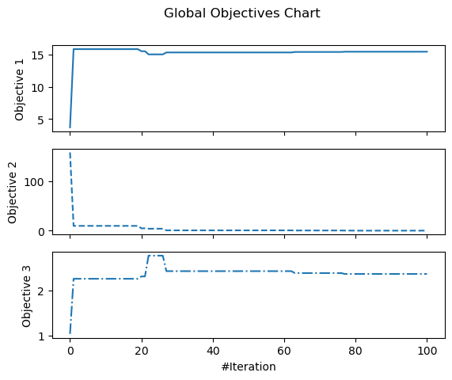
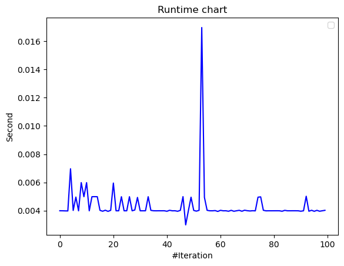
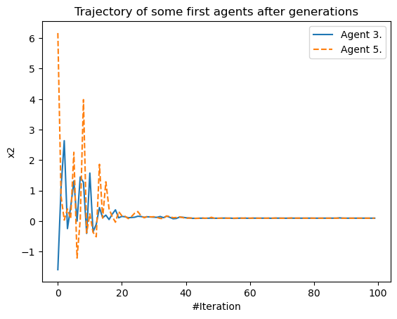

# Meta-Heuristic Algorithms using Python (MEALPY)
[](https://github.com/thieu1995/mealpy/releases)
[](https://pypi.python.org/pypi/mealpy) 
[](https://badge.fury.io/py/mealpy)
[](https://doi.org/10.5281/zenodo.3711948)
[](https://mealpy.readthedocs.io/en/latest/?badge=latest)
[](https://pepy.tech/project/mealpy)
[](https://www.gnu.org/licenses/gpl-3.0)


## Quick Notification

* Check out repo https://github.com/thieu1995/MHA-TSP to see how to use MEALPY to solve Travelling Salesman Problem.
* check out repo https://github.com/thieu1995/MHA-FS to see how to solve feature selection problem using MEALPY.


## Introduction
* MEALPY is a largest python module for the most of cutting-edge nature-inspired meta-heuristic 
  algorithms and is distributed under GNU General Public License (GPL) V3 license.

* Current version: 2.4.2, Total algorithms: Total algorithms: 84 original, 24 official variants, 38 developed variants, 9 dummies.
* Different versions of mealpy in terms of passing hyper-parameters. So please careful check your version before
  using this library. (All releases can be found here: [Link](https://pypi.org/project/mealpy/#history))
  * mealpy < 1.0.5
  * 1.1.0 < mealpy < 1.2.2
  * 2.0.0 <= mealpy <= 2.1.2
  * mealpy == 2.2.0 
  * mealpy == 2.3.0 
  * 2.4.0 <= mealpy <= 2.4.2 (From this version, algorithms can solve discrete problem)

* The goals of this framework are:
    * Sharing knowledge of meta-heuristic fields to everyone without a fee
    * Helping other researchers in all field access to optimization algorithms as quickly as possible
    * Implement the classical as well as the state-of-the-art meta-heuristics (The whole history of meta-heuristics)
    
* What you can do with this library:
    * Analyse parameters of algorithms.
    * Perform Qualitative Analysis of algorithms.
    * Perform Quantitative Analysis of algorithms.
    * Analyse rate of convergence of algorithms.
    * Test the scalability of algorithms.
    * Analyse the stability of algorithms.
    * Analyse the robustness of algorithms.

* And please give me some credits if you use this library, [link](https://gist.github.com/thieu1995/2dcebc754bf0038d0c12b26ec9d591aa) to my first-author papers.

```code 
@software{thieu_nguyen_2020_3711949,
  author       = {Nguyen Van Thieu},
  title        = {A collection of the state-of-the-art MEta-heuristics ALgorithms in PYthon: Mealpy},
  month        = march,
  year         = 2020,
  publisher    = {Zenodo},
  doi          = {10.5281/zenodo.3711948},
  url          = {https://doi.org/10.5281/zenodo.3711948}
}
```

## Installation

### User installation
Install the [current PyPI release](https://pypi.python.org/pypi/mealpy):
```code 
    pip install mealpy==2.4.2
```

### Examples

* Simple Benchmark Function

```python 

from mealpy.bio_based import SMA
import numpy as np

def fitness_function(solution):
    return np.sum(solution**2)

problem_dict1 = {
    "fit_func": fitness_function,
    "lb": [-100, ] * 30,
    "ub": [100, ] * 30,
    "minmax": "min",
    "log_to": None,
    "save_population": False,
}

## Run the algorithm
model = SMA.BaseSMA(problem_dict1, epoch=100, pop_size=50, pr=0.03)
best_position, best_fitness = model.solve()
print(f"Best solution: {best_position}, Best fitness: {best_fitness}")

```

* [The Constrained Benchmark Function](https://github.com/thieu1995/mealpy/tree/master/examples/applications/run_constraint_functions.py)

* [Multi-objective benchmark functions](https://github.com/thieu1995/mealpy/tree/master/examples/applications/run_multi_objective_functions.py)

* [Get all visualize figures](https://github.com/thieu1995/mealpy/tree/master/examples/utils/visualize/all_charts.py)

* Global best fitness value and Local best fitness value after generations

<p align="center">
  
&nbsp; &nbsp; &nbsp; &nbsp;
  
</p>

* Global objectives chart and Local objectives chart

<p align="center">
  
&nbsp; &nbsp; &nbsp; &nbsp;
  
</p>

* Diversity of population chart and Exploration verse Exploitation chart

<p align="center">
  
&nbsp; &nbsp; &nbsp; &nbsp;
  
</p>

* Running time chart and Trajectory of some first agents chart

<p align="center">
  
&nbsp; &nbsp; &nbsp; &nbsp;
  
</p>

### Tutorial Videos

All tutorial videos: [Link](https://mealpy.readthedocs.io/en/latest/pages/general/video_tutorials.html)

All code examples: [Link](https://github.com/thieu1995/mealpy/tree/master/examples)

All visualization examples: [Link](https://mealpy.readthedocs.io/en/latest/pages/visualization.html)


## Mealpy Application

### Mealpy + Neural Network (Replace the Gradient Descent Optimizer)

* Time-series Problem:
  * Traditional MLP
    code: [Link](https://github.com/thieu1995/mealpy/tree/master/examples/applications/keras/traditional-mlp-time-series.py)
  * Hybrid code (Mealpy +
    MLP): [Link](https://github.com/thieu1995/mealpy/tree/master/examples/applications/keras/mha-hybrid-mlp-time-series.py)
* Classification Problem:
  * Traditional MLP
    code: [Link](https://github.com/thieu1995/mealpy/blob/master/examples/applications/keras/traditional-mlp-classification.py)
  * Hybrid code (Mealpy +
    MLP): [Link](https://github.com/thieu1995/mealpy/blob/master/examples/applications/keras/mha-hybrid-mlp-classification.py)

### Mealpy + Neural Network (Optimize Neural Network Hyper-parameter)

Code: [Link](https://github.com/thieu1995/mealpy/blob/master/examples/applications/keras/mha-hyper-parameter-mlp-time-series.py)

### Other Applications

* Solving Knapsack Problem (Discrete
  problems): [Link](https://github.com/thieu1995/mealpy/blob/master/examples/applications/discrete-problems/knapsack-problem.py)

* Optimize SVM (SVC)
  model: [Link](https://github.com/thieu1995/mealpy/blob/master/examples/applications/sklearn/svm_classification.py)

* Optimize Linear Regression
  Model: [Link](https://github.com/thieu1995/mealpy/blob/master/examples/applications/pytorch/linear_regression.py)


### Important links

* Official source code repo: https://github.com/thieu1995/mealpy
* Official document: https://mealpy.readthedocs.io/
* Download releases: https://pypi.org/project/mealpy/
* Issue tracker: https://github.com/thieu1995/mealpy/issues
* Notable changes log: https://github.com/thieu1995/mealpy/blob/master/ChangeLog.md
* Examples with different meapy version: https://github.com/thieu1995/mealpy/blob/master/EXAMPLES.md
* Explain the DUMMY optimizer group: https://github.com/thieu1995/mealpy/blob/master/assets/DUMMY.md

* This project also related to my another projects which are "meta-heuristics" and "neural-network", check it here
    * https://github.com/thieu1995/opfunu
    * https://github.com/thieu1995/metaheuristics
    * https://github.com/aiir-team

### Documents
* Meta-heuristic Categories: (Based on this article: [link](https://doi.org/10.1016/j.procs.2020.09.075))
    + Evolutionary-based: Idea from Darwin's law of natural selection, evolutionary computing 
    + Swarm-based: Idea from movement, interaction of birds, organization of social ...
    + Physics-based: Idea from physics law such as Newton's law of universal gravitation, black hole, multiverse 
    + Human-based: Idea from human interaction such as queuing search, teaching learning, ... 
    + Biology-based: Idea from biology creature (or microorganism),...
    + System-based: Idea from eco-system, immune-system, network-system, ...
    + Math-based: Idea from mathematical form or mathematical law such as sin-cosin 
    + Music-based: Idea from music instrument


* Paras: The number of parameters in the algorithm (Not counting the fixed parameters in the original paper)
    + Almost algorithms have 2 paras (epoch, population_size) and plus some paras depend on each algorithm.
    + Some algorithms belong to "good" performance and have only 2 paras meaning the algorithms are outstanding
    
* Difficulty - Difficulty Level (Personal Opinion): Objective observation from author. Depend on the number of 
  parameters, number of equations, the original ideas, time spend for coding, source lines of code (SLOC).
    + Easy: A few paras, few equations, SLOC very short
    + Medium: more equations than Easy level, SLOC longer than Easy level
    + Hard: Lots of equations, SLOC longer than Medium level, the paper hard to read.
    + Hard* - Very hard: Lots of equations, SLOC too long, the paper is very hard to read.
    
** For newbie, I recommend to read the paper of algorithms which difficulty is "easy" or "medium" difficulty level.


| **Group**    | **Name**                                  | **Module** | **Class**      | **Year** | **Paras** | **Difficulty** |
|:------------:|:-----------------------------------------:|:----------:|:--------------:|:--------:|:---------:|:--------------:|
| Evolutionary | Evolutionary Programming                  | EP         | BaseEP         | 1964     | 3         | easy           |
| Evolutionary | Evolution Strategies                      | ES         | BaseES         | 1971     | 3         | easy           |
| Evolutionary | Memetic Algorithm                         | MA         | BaseMA         | 1989     | 7         | easy           |
| Evolutionary | Genetic Algorithm                         | GA         | BaseGA         | 1992     | 4         | easy           |
| Evolutionary | Differential Evolution                    | DE         | BaseDE         | 1997     | 5         | easy           |
| Evolutionary |                                           |            | JADE           | 2009     | 6         | medium         |
| Evolutionary |                                           |            | SADE           | 2005     | 2         | medium         |
| Evolutionary |                                           |            | SHADE          | 2013     | 4         | medium         |
| Evolutionary |                                           |            | L_SHADE        | 2014     | 4         | medium         |
| Evolutionary |                                           |            | SAP_DE         | 2006     | 3         | medium         |
| Evolutionary | Flower Pollination Algorithm              | FPA        | BaseFPA        | 2014     | 4         | easy           |
| Evolutionary | Coral Reefs Optimization                  | CRO        | BaseCRO        | 2014     | 11        | medium         |
| Evolutionary |                                           |            | OCRO           | 2019     | 12        | medium         |
| 0            | 0                                         | 0          | 0              | 0        | 0         | 0              |
| Swarm        | Particle Swarm Optimization               | PSO        | BasePSO        | 1995     | 6         | easy           |
| Swarm        |                                           |            | PPSO           | 2019     | 2         | medium         |
| Swarm        |                                           |            | HPSO_TVAC      | 2017     | 4         | medium         |
| Swarm        |                                           |            | C_PSO          | 2015     | 6         | medium         |
| Swarm        |                                           |            | CL_PSO         | 2006     | 6         | medium         |
| Swarm        | Bacterial Foraging Optimization           | BFO        | OriginalBFO    | 2002     | 10        | hard           |
| Swarm        |                                           |            | ABFO           | 2019     | 8         | medium         |
| Swarm        | Bees Algorithm                            | BeesA      | BaseBeesA      | 2005     | 8         | medium         |
| Swarm        |                                           |            | ProbBeesA      | 2015     | 5         | medium         |
| Swarm        | Cat Swarm Optimization                    | CSO        | BaseCSO        | 2006     | 11        | hard           |
| Swarm        | Artificial Bee Colony                     | ABC        | BaseABC        | 2007     | 8         | medium         |
| Swarm        | Ant Colony Optimization                   | ACO-R      | BaseACOR       | 2008     | 5         | easy           |
| Swarm        | Cuckoo Search Algorithm                   | CSA        | BaseCSA        | 2009     | 3         | medium         |
| Swarm        | Firefly Algorithm                         | FFA        | BaseFFA        | 2009     | 8         | easy           |
| Swarm        | Fireworks Algorithm                       | FA         | BaseFA         | 2010     | 7         | medium         |
| Swarm        | Bat Algorithm                             | BA         | OriginalBA     | 2010     | 6         | medium         |
| Swarm        | Fruit-fly Optimization Algorithm          | FOA        | OriginalFOA    | 2012     | 2         | easy           |
| Swarm        |                                           |            | WhaleFOA       | 2020     | 2         | medium         |
| Swarm        | Social Spider Optimization                | SSpiderO   | BaseSSpiderO   | 2018     | 4         | hard*          |
| Swarm        | Grey Wolf Optimizer                       | GWO        | BaseGWO        | 2014     | 2         | easy           |
| Swarm        |                                           |            | RW_GWO         | 2019     | 2         | easy           |
| Swarm        | Social Spider Algorithm                   | SSpiderA   | BaseSSpiderA   | 2015     | 5         | medium         |
| Swarm        | Ant Lion Optimizer                        | ALO        | OriginalALO    | 2015     | 2         | easy           |
| Swarm        | Moth Flame Optimization                   | MFO        | OriginalMFO    | 2015     | 2         | easy           |
| Swarm        | Elephant Herding Optimization             | EHO        | BaseEHO        | 2015     | 5         | easy           |
| Swarm        | Jaya Algorithm                            | JA         | OriginalJA     | 2016     | 2         | easy           |
| Swarm        |                                           |            | LevyJA         | 2021     | 2         | easy           |
| Swarm        | Whale Optimization Algorithm              | WOA        | BaseWOA        | 2016     | 2         | medium         |
| Swarm        |                                           |            | HI_WOA         | 2019     | 3         | medium         |
| Swarm        | Dragonfly Optimization                    | DO         | BaseDO         | 2016     | 2         | medium         |
| Swarm        | Bird Swarm Algorithm                      | BSA        | BaseBSA        | 2016     | 9         | medium         |
| Swarm        | Spotted Hyena Optimizer                   | SHO        | BaseSHO        | 2017     | 6         | medium         |
| Swarm        | Salp Swarm Optimization                   | SSO        | BaseSSO        | 2017     | 2         | easy           |
| Swarm        | Swarm Robotics Search And Rescue          | SRSR       | BaseSRSR       | 2017     | 2         | hard*          |
| Swarm        | Grasshopper Optimisation Algorithm        | GOA        | BaseGOA        | 2017     | 4         | easy           |
| Swarm        | Coyote Optimization Algorithm             | COA        | BaseCOA        | 2018     | 3         | medium         |
| Swarm        | Moth Search Algorithm                     | MSA        | BaseMSA        | 2018     | 5         | easy           |
| Swarm        | Sea Lion Optimization                     | SLO        | BaseSLO        | 2019     | 2         | medium         |
| Swarm        | Nake Mole-Rat Algorithm                   | NMRA       | BaseNMRA       | 2019     | 3         | easy           |
| Swarm        | Pathfinder Algorithm                      | PFA        | BasePFA        | 2019     | 2         | medium         |
| Swarm        | Sailfish Optimizer                        | SFO        | BaseSFO        | 2019     | 5         | easy           |
| Swarm        | Harris Hawks Optimization                 | HHO        | BaseHHO        | 2019     | 2         | medium         |
| Swarm        | Manta Ray Foraging Optimization           | MRFO       | BaseMRFO       | 2020     | 3         | medium         |
| Swarm        | Bald Eagle Search                         | BES        | BaseBES        | 2020     | 7         | easy           |
| Swarm        | Sparrow Search Algorithm                  | SSA        | OriginalSSA    | 2020     | 5         | medium         |
| Swarm        | Hunger Games Search                       | HGS        | OriginalHGS    | 2021     | 4         | medium         |
| Swarm        | Aquila Optimizer                          | AO         | OriginalAO     | 2021     | 2         | easy           |
| 0            | 0                                         | 0          | 0              | 0        | 0         | 0              |
| Physics      | Simulated Annealling                      | SA         | BaseSA         | 1987     | 9         | medium         |
| Physics      | Wind Driven Optimization                  | WDO        | BaseWDO        | 2013     | 7         | easy           |
| Physics      | Multi-Verse Optimizer                     | MVO        | OriginalMVO    | 2016     | 4         | easy           |
| Physics      | Tug of War Optimization                   | TWO        | BaseTWO        | 2016     | 2         | easy           |
| Physics      |                                           |            | EnhancedTWO    | 2020     | 2         | medium         |
| Physics      | Electromagnetic Field Optimization        | EFO        | OriginalEFO    | 2016     | 6         | easy           |
| Physics      | Nuclear Reaction Optimization             | NRO        | BaseNRO        | 2019     | 2         | hard*          |
| Physics      | Henry Gas Solubility Optimization         | HGSO       | BaseHGSO       | 2019     | 3         | medium         |
| Physics      | Atom Search Optimization                  | ASO        | BaseASO        | 2019     | 4         | medium         |
| Physics      | Equilibrium Optimizer                     | EO         | BaseEO         | 2019     | 2         | easy           |
| Physics      |                                           |            | ModifiedEO     | 2020     | 2         | medium         |
| Physics      |                                           |            | AdaptiveEO     | 2020     | 2         | medium         |
| Physics      | Archimedes Optimization Algorithm         | ArchOA     | OriginalArchOA | 2021     | 8         | medium         |
| 0            | 0                                         | 0          | 0              | 0        | 0         | 0              |
| Human        | Culture Algorithm                         | CA         | OriginalCA     | 1994     | 3         | easy           |
| Human        | Imperialist Competitive Algorithm         | ICA        | BaseICA        | 2007     | 8         | hard*          |
| Human        | Teaching Learning-based Optimization      | TLO        | OriginalTLO    | 2011     | 2         | easy           |
| Human        |                                           |            | ITLO           | 2013     | 3         | medium         |
| Human        | Brain Storm Optimization                  | BSO        | BaseBSO        | 2011     | 8         | medium         |
| Human        | Queuing Search Algorithm                  | QSA        | OriginalQSA    | 2019     | 2         | hard           |
| Human        |                                           |            | ImprovedQSA    | 2021     | 2         | hard           |
| Human        | Search And Rescue Optimization            | SARO       | OriginalSARO   | 2019     | 4         | medium         |
| Human        | Life Choice-Based Optimization            | LCO        | OriginalLCO    | 2019     | 3         | easy           |
| Human        | Social Ski-Driver Optimization            | SSDO       | BaseSSDO       | 2019     | 2         | easy           |
| Human        | Gaining Sharing Knowledge-based Algorithm | GSKA       | OriginalGSKA   | 2019     | 6         | easy           |
| Human        | Coronavirus Herd Immunity Optimization    | CHIO       | OriginalCHIO   | 2020     | 4         | medium         |
| Human        | Forensic-Based Investigation Optimization | FBIO       | OriginalFBIO   | 2020     | 2         | medium         |
| Human        | Battle Royale Optimization                | BRO        | OriginalBRO    | 2020     | 3         | medium         |
| 0            | 0                                         | 0          | 0              | 0        | 0         | 0              |
| Bio          | Invasive Weed Optimization                | IWO        | OriginalIWO    | 2006     | 7         | easy           |
| Bio          | Biogeography-Based Optimization           | BBO        | OriginalBBO    | 2008     | 4         | easy           |
| Bio          | Virus Colony Search                       | VCS        | OriginalVCS    | 2016     | 4         | hard*          |
| Bio          | Satin Bowerbird Optimizer                 | SBO        | OriginalSBO    | 2017     | 5         | easy           |
| Bio          | Earthworm Optimisation Algorithm          | EOA        | BaseEOA        | 2018     | 8         | medium         |
| Bio          | Wildebeest Herd Optimization              | WHO        | BaseWHO        | 2019     | 12        | medium         |
| Bio          | Slime Mould Algorithm                     | SMA        | OriginalSMA    | 2020     | 3         | easy           |
| 0            | 0                                         | 0          | 0              | 0        | 0         | 0              |
| System       | Germinal Center Optimization              | GCO        | OriginalGCO    | 2018     | 4         | medium         |
| System       | Water Cycle Algorithm                     | WCA        | BaseWCA        | 2012     | 5         | medium         |
| System       | Artificial Ecosystem-based Optimization   | AEO        | OriginalAEO    | 2019     | 2         | easy           |
| System       |                                           |            | EnhancedAEO    | 2020     | 2         | medium         |
| System       |                                           |            | ModifiedAEO    | 2020     | 2         | medium         |
| System       |                                           |            | IAEO           | 2021     | 2         | medium         |
| 0            | 0                                         | 0          | 0              | 0        | 0         | 0              |
| Math         | Hill Climbing                             | HC         | OriginalHC     | 1993     | 3         | easy           |
| Math         | Cross-Entropy Method                      | CEM        | BaseCEM        | 1997     | 4         | easy           |
| Math         | Sine Cosine Algorithm                     | SCA        | OriginalSCA    | 2016     | 2         | easy           |
| Math         | Gradient-Based Optimizer                  | GBO        | OriginalGBO    | 2020     | 4         | medium         |
| Math         | Arithmetic Optimization Algorithm         | AOA        | OrginalAOA     | 2021     | 6         | easy           |
| Math         | Chaos Game Optimization                   | CGO        | OriginalCGO    | 2021     | 2         | easy           |
| Math         | Pareto-like Sequential Sampling           | PSS        | OriginalPSS    | 2021     | 4         | medium         |
| 0            | 0                                         | 0          | 0              | 0        | 0         | 0              |
| Music        | Harmony Search                            | HS         | OriginalHS     | 2001     | 4         | easy           |


### A

* **ABC - Artificial Bee Colony**
  * **BaseABC**: Karaboga, D. (2005). An idea based on honey bee swarm for numerical optimization (Vol. 200, pp. 1-10). Technical report-tr06, Erciyes university, engineering faculty, computer engineering department.

* **ACOR - Ant Colony Optimization**. 
  * **BaseACOR**: Socha, K., & Dorigo, M. (2008). Ant colony optimization for continuous domains. European journal of operational research, 185(3), 1155-1173.

* **ALO - Ant Lion Optimizer** 
  * **OriginalALO**: Mirjalili S (2015). “The Ant Lion Optimizer.” Advances in Engineering Software, 83, 80-98. doi: [10.1016/j.advengsoft.2015.01.010](https://doi.org/10.1016/j.advengsoft.2015.01.010)
  * **BaseALO**: My changed version

* **AEO - Artificial Ecosystem-based Optimization** 
  * **OriginalAEO**: Zhao, W., Wang, L., & Zhang, Z. (2019). Artificial ecosystem-based optimization: a novel nature-inspired meta-heuristic algorithm. Neural Computing and Applications, 1-43.
  * **AdaptiveAEO**: My adaptive version
  * **IAEO**: Rizk-Allah, R. M., & El-Fergany, A. A. (2020). Artificial ecosystem optimizer for parameters identification of proton exchange membrane fuel cells model. International Journal of Hydrogen Energy.
  * **EnhancedAEO**: Eid, A., Kamel, S., Korashy, A., & Khurshaid, T. (2020). An Enhanced Artificial Ecosystem-Based Optimization for Optimal Allocation of Multiple Distributed Generations. IEEE Access, 8, 178493-178513.
  * **ModifiedAEO**: Menesy, A. S., Sultan, H. M., Korashy, A., Banakhr, F. A., Ashmawy, M. G., & Kamel, S. (2020). Effective parameter extraction of different polymer electrolyte membrane fuel cell stack models using a modified artificial ecosystem optimization algorithm. IEEE Access, 8, 31892-31909.
  
* **ASO - Atom Search Optimization**   
  * **BaseASO**: Zhao, W., Wang, L., & Zhang, Z. (2019). Atom search optimization and its application to solve a hydrogeologic parameter estimation problem. Knowledge-Based Systems, 163, 283-304.

* **ArchOA - Archimedes Optimization Algorithm**
  * **OriginalArchOA**: Hashim, F. A., Hussain, K., Houssein, E. H., Mabrouk, M. S., & Al-Atabany, W. (2021). Archimedes optimization algorithm: a new metaheuristic algorithm for solving optimization problems. Applied Intelligence, 51(3), 1531-1551.

* **AOA - Arithmetic Optimization Algorithm**
  * **OriginalAOA**: Abualigah, L., Diabat, A., Mirjalili, S., Abd Elaziz, M., & Gandomi, A. H. (2021). The arithmetic optimization algorithm. Computer methods in applied mechanics and engineering, 376, 113609.

* **AO - Aquila Optimizer**
  * **OriginalAO**: Abualigah, L., Yousri, D., Abd Elaziz, M., Ewees, A. A., Al-qaness, M. A., & Gandomi, A. H. (2021). Aquila Optimizer: A novel meta-heuristic optimization Algorithm. Computers & Industrial Engineering, 157, 107250.

### B


* **BFO - Bacterial Foraging Optimization** 
  * **OriginalBFO**: Passino, K. M. (2002). Biomimicry of bacterial foraging for distributed optimization and control. IEEE control systems magazine, 22(3), 52-67.
  * **ABFO**: Nguyen, T., Nguyen, B. M., & Nguyen, G. (2019, April). Building resource auto-scaler with functional-link neural network and adaptive bacterial foraging optimization. In International Conference on Theory and Applications of Models of Computation (pp. 501-517). Springer, Cham.

* **BeesA - Bees Algorithm** 
  * **BaseBeesA**: Pham, D. T., Ghanbarzadeh, A., Koc, E., Otri, S., Rahim, S., & Zaidi, M. (2005). The bees algorithm. Technical Note, Manufacturing Engineering Centre, Cardiff University, UK.
  * **ProbBeesA**: The probabilitic version of: Pham, D. T., Ghanbarzadeh, A., Koç, E., Otri, S., Rahim, S., & Zaidi, M. (2006). The bees algorithm—a novel tool for complex optimisation problems. In Intelligent production machines and systems (pp. 454-459). Elsevier Science Ltd.
  
* **BBO - Biogeography-Based Optimization** 
  * **OriginalBBO**: Simon, D. (2008). Biogeography-based optimization. IEEE transactions on evolutionary computation, 12(6), 702-713.
  * **BaseBBO**: My changed version 
  
* **BA - Bat Algorithm** 
  * **OriginalBA**: Yang, X. S. (2010). A new metaheuristic bat-inspired algorithm. In Nature inspired cooperative strategies for optimization (NICSO 2010) (pp. 65-74). Springer, Berlin, Heidelberg.
  * **BaseBA**: The original version with parameters A and r changing after each iteration
  * **ModifiedBA**: My modified version

* **BSO - Brain Storm Optimization** 
  * **BaseBSO**: . Shi, Y. (2011, June). Brain storm optimization algorithm. In International conference in swarm intelligence (pp. 303-309). Springer, Berlin, Heidelberg.
  * **ImprovedBSO**: My improved version using levy-flight

* **BSA - Bird Swarm Algorithm** 
  * **BaseBSA**: Meng, X. B., Gao, X. Z., Lu, L., Liu, Y., & Zhang, H. (2016). A new bio-inspired optimisation algorithm:Bird Swarm Algorithm. Journal of Experimental & Theoretical Artificial Intelligence, 28(4), 673-687.
  
* **BES - Bald Eagle Search** 
  * **BaseBES**: Alsattar, H. A., Zaidan, A. A., & Zaidan, B. B. (2019). Novel meta-heuristic bald eagle search optimisation algorithm. Artificial Intelligence Review, 1-28.
  
* **BRO - Battle Royale Optimization**
  * **OriginalBRO**: Rahkar Farshi, T. (2020). Battle royale optimization algorithm. Neural Computing and Applications, 1-19.
  * **BaseBRO**: My changed version

### C

* **CA - Culture Algorithm** 
  * **OriginalCA**: Reynolds, R.G., 1994, February. An introduction to cultural algorithms. In Proceedings of the third annual conference on evolutionary programming (Vol. 24, pp. 131-139). River Edge, NJ: World Scientific.

* **CEM - Cross Entropy Method**
  * **BaseCEM**: Rubinstein, R. (1999). The cross-entropy method for combinatorial and continuous optimization. Methodology and computing in applied probability, 1(2), 127-190.
  
* **CSO - Cat Swarm Optimization** 
  * **BaseCSO**: Chu, S. C., Tsai, P. W., & Pan, J. S. (2006, August). Cat swarm optimization. In Pacific Rim international conference on artificial intelligence (pp. 854-858). Springer, Berlin, Heidelberg.

* **CSA - Cuckoo Search Algorithm** 
  * **BaseCSA**: Yang, X. S., & Deb, S. (2009, December). Cuckoo search via Lévy flights. In 2009 World congress on nature & biologically inspired computing (NaBIC) (pp. 210-214). Ieee.

* **CRO - Coral Reefs Optimization** 
  * **BaseCRO**: Salcedo-Sanz, S., Del Ser, J., Landa-Torres, I., Gil-López, S., & Portilla-Figueras, J. A. (2014). The coral reefs optimization algorithm: a novel metaheuristic for efficiently solving optimization problems. The Scientific World Journal, 2014.
  * **OCRO**: Nguyen, T., Nguyen, T., Nguyen, B. M., & Nguyen, G. (2019). Efficient time-series forecasting using neural network and opposition-based coral reefs optimization. International Journal of Computational Intelligence Systems, 12(2), 1144-1161.

* **COA - Coyote Optimization Algorithm**
  * **BaseCOA**: Pierezan, J., & Coelho, L. D. S. (2018, July). Coyote optimization algorithm: a new metaheuristic for global optimization problems. In 2018 IEEE congress on evolutionary computation (CEC) (pp. 1-8). IEEE.

* **CHIO - Coronavirus Herd Immunity Optimization**
  * **OriginalCHIO**: Al-Betar, M. A., Alyasseri, Z. A. A., Awadallah, M. A., & Abu Doush, I. (2021). Coronavirus herd immunity optimizer (CHIO). Neural Computing and Applications, 33(10), 5011-5042.
  * **BaseCHIO**: My changed version

* **CGO - Chaos Game Optimization** 
  * **OriginalCGO**: Talatahari, S., & Azizi, M. (2021). Chaos Game Optimization: a novel metaheuristic algorithm. Artificial Intelligence Review, 54(2), 917-1004.

### D

* **DE - Differential Evolution** 
  * **BaseDE**: Storn, R., & Price, K. (1997). Differential evolution–a simple and efficient heuristic for global optimization over continuous spaces. Journal of global optimization, 11(4), 341-359.
  * **JADE**: Zhang, J., & Sanderson, A. C. (2009). JADE: adaptive differential evolution with optional external archive. IEEE Transactions on evolutionary computation, 13(5), 945-958.
  * **SADE**: Qin, A. K., & Suganthan, P. N. (2005, September). Self-adaptive differential evolution algorithm for numerical optimization. In 2005 IEEE congress on evolutionary computation (Vol. 2, pp. 1785-1791). IEEE.
  * **SHADE**: Tanabe, R., & Fukunaga, A. (2013, June). Success-history based parameter adaptation for differential evolution. In 2013 IEEE congress on evolutionary computation (pp. 71-78). IEEE.
  * **L_SHADE**: Tanabe, R., & Fukunaga, A. S. (2014, July). Improving the search performance of SHADE using linear population size reduction. In 2014 IEEE congress on evolutionary computation (CEC) (pp. 1658-1665). IEEE.
  * **SAP_DE**: Teo, J. (2006). Exploring dynamic self-adaptive populations in differential evolution. Soft Computing, 10(8), 673-686.
  
* **DSA - Differential Search Algorithm (not done)** 
  * **BaseDSA**: Civicioglu, P. (2012). Transforming geocentric cartesian coordinates to geodetic coordinates by using differential search algorithm. Computers & Geosciences, 46, 229-247.
  
* **DO - Dragonfly Optimization** 
  * **BaseDO**: Mirjalili, S. (2016). Dragonfly algorithm: a new meta-heuristic optimization technique for solving single-objective, discrete, and multi-objective problems. Neural Computing and Applications, 27(4), 1053-1073.


### E

* **ES - Evolution Strategies** . 
  * **BaseES**: Schwefel, H. P. (1984). Evolution strategies: A family of non-linear optimization techniques based on imitating some principles of organic evolution. Annals of Operations Research, 1(2), 165-167.
  * **LevyES**: My changed version using Levy-flight

* **EP - Evolutionary programming** . 
  * **BaseEP**: Fogel, L. J. (1994). Evolutionary programming in perspective: The top-down view. Computational intelligence: Imitating life.
  * **LevyEP**: My changed version using Levy-flight

* **EHO - Elephant Herding Optimization** . 
  * **BaseEHO**: Wang, G. G., Deb, S., & Coelho, L. D. S. (2015, December). Elephant herding optimization. In 2015 3rd International Symposium on Computational and Business Intelligence (ISCBI) (pp. 1-5). IEEE.

* **EFO - Electromagnetic Field Optimization** . 
  * **OriginalEFO**:Abedinpourshotorban, H., Shamsuddin, S. M., Beheshti, Z., & Jawawi, D. N. (2016). Electromagnetic field optimization: A physics-inspired metaheuristic optimization algorithm. Swarm and Evolutionary Computation, 26, 8-22.
  * **BaseEFO**: My changed version 

* **EOA - Earthworm Optimisation Algorithm** . 
  * **BaseEOA**:(My changed version) Wang, G. G., Deb, S., & dos Santos Coelho, L. (2018). Earthworm optimisation algorithm: a bio-inspired metaheuristic algorithm for global optimisation problems. IJBIC, 12(1), 1-22.

* **EO - Equilibrium Optimizer** . 
  * **BaseEO**: Faramarzi, A., Heidarinejad, M., Stephens, B., & Mirjalili, S. (2019). Equilibrium optimizer: A novel optimization algorithm. Knowledge-Based Systems.
  * **ModifiedEO**: Gupta, S., Deep, K., & Mirjalili, S. (2020). An efficient equilibrium optimizer with mutation strategy for numerical optimization. Applied Soft Computing, 96, 106542.
  * **AdaptiveEO**: Wunnava, A., Naik, M. K., Panda, R., Jena, B., & Abraham, A. (2020). A novel interdependence based multilevel thresholding technique using adaptive equilibrium optimizer. Engineering Applications of Artificial Intelligence, 94, 103836.

### F

* **FFA - Firefly Algorithm** 
  * **BaseFFA**: Łukasik, S., & Żak, S. (2009, October). Firefly algorithm for continuous constrained optimization tasks. In International conference on computational collective intelligence (pp. 97-106). Springer, Berlin, Heidelberg.
  
* **FA - Fireworks algorithm** 
  * **BaseFA**: Tan, Y., & Zhu, Y. (2010, June). Fireworks algorithm for optimization. In International conference in swarm intelligence (pp. 355-364). Springer, Berlin, Heidelberg.

* **FPA - Flower Pollination Algorithm** 
  * **BaseFPA**: Yang, X. S. (2012, September). Flower pollination algorithm for global optimization. In International conference on unconventional computing and natural computation (pp. 240-249). Springer, Berlin, Heidelberg.

* **FBIO - Forensic-Based Investigation Optimization** 
  * **OriginalFBIO**: Chou, J.S. and Nguyen, N.M., 2020. FBI inspired meta-optimization. Applied Soft Computing, p.106339.
  * **BaseFBIO**: My changed version

* **FOA - Fruit-fly Optimization Algorithm**
  * **OriginalFOA**: Pan, W. T. (2012). A new fruit fly optimization algorithm: taking the financial distress model as an example. Knowledge-Based Systems, 26, 69-74.
  * **BaseFOA**: My changed version
  * **WhaleFOA**: Fan, Y., Wang, P., Heidari, A. A., Wang, M., Zhao, X., Chen, H., & Li, C. (2020). Boosted hunting-based fruit fly optimization and advances in real-world problems. Expert Systems with Applications, 159, 113502.


### G

* **GA - Genetic Algorithm** 
  * **BaseGA**: Holland, J. H. (1992). Genetic algorithms. Scientific american, 267(1), 66-73.

* **GWO - Grey Wolf Optimizer** 
  * **BaseGWO**: Mirjalili, S., Mirjalili, S. M., & Lewis, A. (2014). Grey wolf optimizer. Advances in engineering software, 69, 46-61.
  * **RW_GWO**: Gupta, S., & Deep, K. (2019). A novel random walk grey wolf optimizer. Swarm and evolutionary computation, 44, 101-112.

* **GOA - Grasshopper Optimisation Algorithm** 
  * **BaseGOA**: Saremi, S., Mirjalili, S., & Lewis, A. (2017). Grasshopper optimisation algorithm: theory and application. Advances in Engineering Software, 105, 30-47.

* **GCO - Germinal Center Optimization** 
  * **OriginalGCO**: Villaseñor, C., Arana-Daniel, N., Alanis, A. Y., López-Franco, C., & Hernandez-Vargas, E. A. (2018). Germinal center optimization algorithm. International Journal of Computational Intelligence Systems, 12(1), 13-27.
  * **BaseGCO**: My changed version

* **GSKA - Gaining Sharing Knowledge-based Algorithm** 
  * **OriginalGSKA**: Mohamed, A. W., Hadi, A. A., & Mohamed, A. K. (2019). Gaining-sharing knowledge based algorithm for solving optimization problems: a novel nature-inspired algorithm. International Journal of Machine Learning and Cybernetics, 1-29.
  * **BaseGSKA**: My changed version

* **GBO - Gradient-Based Optimizer**
  * **OriginalGBO**: Ahmadianfar, I., Bozorg-Haddad, O., & Chu, X. (2020). Gradient-based optimizer: A new metaheuristic optimization algorithm. Information Sciences, 540, 131-159.

### H

* **HC - Hill Climbing** . 
  * **OriginalHC**: Talbi, E. G., & Muntean, T. (1993, January). Hill-climbing, simulated annealing and genetic algorithms: a comparative study and application to the mapping problem. In [1993] Proceedings of the Twenty-sixth Hawaii International Conference on System Sciences (Vol. 2, pp. 565-573). IEEE.
  * **BaseHC** My changed version based on swarm-based idea (Original is single-solution based method)

* **HS - Harmony Search** . 
  * **OriginalHS**: Geem, Z. W., Kim, J. H., & Loganathan, G. V. (2001). A new heuristic optimization algorithm:harmony search. simulation, 76(2), 60-68.
  * **BaseHS**: My changed version

* **HHO - Harris Hawks Optimization** . 
  * **BaseHHO**: Heidari, A. A., Mirjalili, S., Faris, H., Aljarah, I., Mafarja, M., & Chen, H. (2019). Harris hawks optimization: Algorithm and applications. Future Generation Computer Systems, 97, 849-872.

* **HGSO - Henry Gas Solubility Optimization** . 
  * **BaseHGSO**: Hashim, F. A., Houssein, E. H., Mabrouk, M. S., Al-Atabany, W., & Mirjalili, S. (2019). Henry gas solubility optimization: A novel physics-based algorithm. Future Generation Computer Systems, 101, 646-667.

* **HGS - Hunger Games Search** . 
  * **OriginalHGS**: Yang, Y., Chen, H., Heidari, A. A., & Gandomi, A. H. (2021). Hunger games search:Visions, conception, implementation, deep analysis, perspectives, and towards performance shifts. Expert Systems with Applications, 177, 114864.
  
* **HHOA - Horse Herd Optimization Algorithm (not done)** . 
  * **BaseHHOA**: MiarNaeimi, F., Azizyan, G., & Rashki, M. (2021). Horse herd optimization algorithm: A nature-inspired algorithm for high-dimensional optimization problems. Knowledge-Based Systems, 213, 106711.
  

### I

* **IWO - Invasive Weed Optimization** . 
  * **OriginalIWO**: Mehrabian, A. R., & Lucas, C. (2006). A novel numerical optimization algorithm inspired from weed colonization. Ecological informatics, 1(4), 355-366.

* **ICA - Imperialist Competitive Algorithm** 
  * **BaseICA**: Atashpaz-Gargari, E., & Lucas, C. (2007, September). Imperialist competitive algorithm: an algorithm for optimization inspired by imperialistic competition. In 2007 IEEE congress on evolutionary computation (pp. 4661-4667). Ieee.

### J

* **JA - Jaya Algorithm** 
  * **OriginalJA**: Rao, R. (2016). Jaya: A simple and new optimization algorithm for solving constrained and unconstrained optimization problems. International Journal of Industrial Engineering Computations, 7(1), 19-34.
  * **BaseJA**: My changed version
  * **LevyJA**: Iacca, G., dos Santos Junior, V. C., & de Melo, V. V. (2021). An improved Jaya optimization algorithm with Levy flight. Expert Systems with Applications, 165, 113902.

### K

### L

* **LCO - Life Choice-based Optimization** 
  * **OriginalLCO**: Khatri, A., Gaba, A., Rana, K. P. S., & Kumar, V. (2019). A novel life choice-based optimizer. Soft Computing, 1-21.
  * **BaseLCO**: My changed version
  * **ImprovedLCO**: My improved version using Gaussian distribution and Mutation Mechanism


### M

* **MA - Memetic Algorithm**
  * **BaseMA**: Moscato, P. (1989). On evolution, search, optimization, genetic algorithms and martial arts: Towards memetic algorithms. Caltech concurrent computation program, C3P Report, 826, 1989.

* **MFO - Moth Flame Optimization** 
  * **OriginalMFO**: Mirjalili, S. (2015). Moth-flame optimization algorithm: A novel nature-inspired heuristic paradigm. Knowledge-based systems, 89, 228-249.
  * **BaseMFO**: My changed version

* **MVO - Multi-Verse Optimizer** 
  * **OriginalMVO**: Mirjalili, S., Mirjalili, S. M., & Hatamlou, A. (2016). Multi-verse optimizer: a nature-inspired algorithm for global optimization. Neural Computing and Applications, 27(2), 495-513.
  * **BaseMVO**: My changed version  

* **MSA - Moth Search Algorithm** 
  * **BaseMSA**: Wang, G. G. (2018). Moth search algorithm: a bio-inspired metaheuristic algorithm for global optimization problems. Memetic Computing, 10(2), 151-164.
  
* **MRFO - Manta Ray Foraging Optimization** 
  * **BaseMRFO**: Zhao, W., Zhang, Z., & Wang, L. (2020). Manta ray foraging optimization: An effective bio-inspired optimizer for engineering applications. Engineering Applications of Artificial Intelligence, 87, 103300.


### N


* **NRO - Nuclear Reaction Optimization** 
  * **BaseNRO**: Wei, Z., Huang, C., Wang, X., Han, T., & Li, Y. (2019). Nuclear Reaction Optimization: A novel and powerful physics-based algorithm for global optimization. IEEE Access. 

* **NMRA - Nake Mole-Rat Algorithm**
  * **BaseNMRA**: Salgotra, R., & Singh, U. (2019). The naked mole-rat algorithm. Neural Computing and Applications, 31(12), 8837-8857.
  * **ImprovedNMRA**: My version using mutation probability, levy-flight and crossover operator


### O

### P

* **PSO - Particle Swarm Optimization** 
  * **BasePSO**: Eberhart, R., & Kennedy, J. (1995, October). A new optimizer using particle swarm theory. In MHS'95. Proceedings of the Sixth International Symposium on Micro Machine and Human Science (pp. 39-43). Ieee.
  * **PPSO**: Ghasemi, M., Akbari, E., Rahimnejad, A., Razavi, S. E., Ghavidel, S., & Li, L. (2019). Phasor particle swarm optimization: a simple and efficient variant of PSO. Soft Computing, 23(19), 9701-9718.
  * **HPSO_TVAC**: Ghasemi, M., Aghaei, J., & Hadipour, M. (2017). New self-organising hierarchical PSO with jumping time-varying acceleration coefficients. Electronics Letters, 53(20), 1360-1362.
  * **C_PSO**: Liu, B., Wang, L., Jin, Y. H., Tang, F., & Huang, D. X. (2005). Improved particle swarm optimization combined with chaos. Chaos, Solitons & Fractals, 25(5), 1261-1271.
  * **CL_PSO**: Liang, J. J., Qin, A. K., Suganthan, P. N., & Baskar, S. (2006). Comprehensive learning particle swarm optimizer for global optimization of multimodal functions. IEEE transactions on evolutionary computation, 10(3), 281-295.

* **PFA - Pathfinder Algorithm** 
  * **BasePFA**: Yapici, H., & Cetinkaya, N. (2019). A new meta-heuristic optimizer: Pathfinder algorithm. Applied Soft Computing, 78, 545-568.

* **PSS - Pareto-like Sequential Sampling**
  * **OriginalPSS**: Shaqfa, M., & Beyer, K. (2021). Pareto-like sequential sampling heuristic for global optimisation. Soft Computing, 25(14), 9077-9096.


### Q

* **QSA - Queuing Search Algorithm** 
  * **OriginalQSA**: Zhang, J., Xiao, M., Gao, L., & Pan, Q. (2018). Queuing search algorithm: A novel metaheuristic algorithm for solving engineering optimization problems. Applied Mathematical Modelling, 63, 464-490.
  * **BaseQSA**: My changed version
  * **OppoQSA**: My version using opposition-based learning
  * **LevyQSA**: My version using Levy-flight
  * **ImprovedQSA**: My version using Levy-flight and Opposition-based learning

### R


### S

* **SA - Simulated Annealling** 
  * **BaseSA**: . Van Laarhoven, P. J., & Aarts, E. H. (1987). Simulated annealing. In Simulated annealing: Theory and applications (pp. 7-15). Springer, Dordrecht.

* **SSpiderO - Social Spider Optimization** 
  * **BaseSSpiderO**: Cuevas, E., Cienfuegos, M., ZaldíVar, D., & Pérez-Cisneros, M. (2013). A swarm optimization algorithm inspired in the behavior of the social-spider. Expert Systems with Applications, 40(16), 6374-6384.

* **SSpiderA - Social Spider Algorithm** 
  * **BaseSSpiderA**: James, J. Q., & Li, V. O. (2015). A social spider algorithm for global optimization. Applied Soft Computing, 30, 614-627.

* **SCA - Sine Cosine Algorithm** 
  * **OriginalSCA**: Mirjalili, S. (2016). SCA: a sine cosine algorithm for solving optimization problems. Knowledge-Based Systems, 96, 120-133.
  * **BaseSCA**: My changed version

* **SRSR - Swarm Robotics Search And Rescue** 
  * **BaseSRSR**: Bakhshipour, M., Ghadi, M. J., & Namdari, F. (2017). Swarm robotics search & rescue: A novel artificial intelligence-inspired optimization approach. Applied Soft Computing, 57, 708-726.

* **SBO - Satin Bowerbird Optimizer** 
  * **OriginalSBO**: Moosavi, S. H. S., & Bardsiri, V. K. (2017). Satin bowerbird optimizer: a new optimization algorithm to optimize ANFIS for software development effort estimation. Engineering Applications of Artificial Intelligence, 60, 1-15.
  * **BaseSBO**: My changed version

* **SHO - Spotted Hyena Optimizer**
  * **BaseSHO**: Dhiman, G., & Kumar, V. (2017). Spotted hyena optimizer: a novel bio-inspired based metaheuristic technique for engineering applications. Advances in Engineering Software, 114, 48-70.

* **SSO - Salp Swarm Optimization**
  * **BaseSSO**: Mirjalili, S., Gandomi, A. H., Mirjalili, S. Z., Saremi, S., Faris, H., & Mirjalili, S. M. (2017). Salp Swarm Algorithm: A bio-inspired optimizer for engineering design problems. Advances in Engineering Software, 114, 163-191.

* **SFO - Sailfish Optimizer** 
  * **BaseSFO**: Shadravan, S., Naji, H. R., & Bardsiri, V. K. (2019). The Sailfish Optimizer: A novel nature-inspired metaheuristic algorithm for solving constrained engineering optimization problems. Engineering Applications of Artificial Intelligence, 80, 20-34.
  * **ImprovedSFO**: My improved version 

* **SARO - Search And Rescue Optimization** 
  * **OriginalSARO**: Shabani, A., Asgarian, B., Gharebaghi, S. A., Salido, M. A., & Giret, A. (2019). A New Optimization Algorithm Based on Search and Rescue Operations. Mathematical Problems in Engineering, 2019.
  * **BaseSARO**: My changed version using Levy-flight  

* **SSDO - Social Ski-Driver Optimization** 
  * **BaseSSDO**: Tharwat, A., & Gabel, T. (2019). Parameters optimization of support vector machines for imbalanced data using social ski driver algorithm. Neural Computing and Applications, 1-14.

* **SLO - Sea Lion Optimization**
  * **BaseSLO**: Masadeh, R., Mahafzah, B. A., & Sharieh, A. (2019). Sea Lion Optimization Algorithm. Sea, 10(5).
  * **ISLO**: My improved version
  * **ModifiedSLO**: My modifed version using Levy-flight

* **SMA - Slime Mould Algorithm**
  * **OriginalSMA**: Li, S., Chen, H., Wang, M., Heidari, A. A., & Mirjalili, S. (2020). Slime mould algorithm: A new method for stochastic optimization. Future Generation Computer Systems.
  * **BaseSMA**: My changed version

* **SSA - Sparrow Search Algorithm** 
  * **OriginalSSA**: Jiankai Xue & Bo Shen (2020) A novel swarm intelligence optimization approach: sparrow search algorithm, Systems Science & Control Engineering, 8:1, 22-34, DOI: 10.1080/21642583.2019.1708830
  * **BaseSSA**: My changed version

### T

* **TLO - Teaching Learning Optimization** 
  * **OriginalTLO**: Rao, R. V., Savsani, V. J., & Vakharia, D. P. (2011). Teaching–learning-based optimization: a novel method for constrained mechanical design optimization problems. Computer-Aided Design, 43(3), 303-315.
  * **BaseTLO**: Rao, R., & Patel, V. (2012). An elitist teaching-learning-based optimization algorithm for solving complex constrained optimization problems. International Journal of Industrial Engineering Computations, 3(4), 535-560.
  * **ITLO**: Rao, R. V., & Patel, V. (2013). An improved teaching-learning-based optimization algorithm for solving unconstrained optimization problems. Scientia Iranica, 20(3), 710-720.

* **TWO - Tug of War Optimization** 
  * **BaseTWO**: Kaveh, A., & Zolghadr, A. (2016). A novel meta-heuristic algorithm: tug of war optimization. Iran University of Science & Technology, 6(4), 469-492.
  * **OppoTWO**: Nguyen, T., Hoang, B., Nguyen, G., & Nguyen, B. M. (2020). A new workload prediction model using extreme learning machine and enhanced tug of war optimization. Procedia Computer Science, 170, 362-369.
  * **LevyTWO**: My version using Levy-flight
  * **ImprovedTWO**: My version using both Levy-flight and opposition-based learning

### U

### V

* **VCS - Virus Colony Search** 
  * **OriginalVCS**: Li, M. D., Zhao, H., Weng, X. W., & Han, T. (2016). A novel nature-inspired algorithm for optimization: Virus colony search. Advances in Engineering Software, 92, 65-88.
  * **BaseVCS**: My changed version

### W

* **WCA - Water Cycle Algorithm** 
  * **BaseWCA**: Eskandar, H., Sadollah, A., Bahreininejad, A., & Hamdi, M. (2012). Water cycle algorithm–A novel metaheuristic optimization method for solving constrained engineering optimization problems. Computers & Structures, 110, 151-166.
  
* **WOA - Whale Optimization Algorithm** 
  * **BaseWOA**: Mirjalili, S., & Lewis, A. (2016). The whale optimization algorithm. Advances in engineering software, 95, 51-67.
  * **HI_WOA**: Tang, C., Sun, W., Wu, W., & Xue, M. (2019, July). A hybrid improved whale optimization algorithm. In 2019 IEEE 15th International Conference on Control and Automation (ICCA) (pp. 362-367). IEEE.

* **WHO - Wildebeest Herd Optimization** 
  * **BaseWHO**: Amali, D., & Dinakaran, M. (2019). Wildebeest herd optimization: A new global optimization algorithm inspired by wildebeest herding behaviour. Journal of Intelligent & Fuzzy Systems, (Preprint), 1-14.

* **WDO - Wind Driven Optimization** 
  * **BaseWDO**: Bayraktar, Z., Komurcu, M., & Werner, D. H. (2010, July). Wind Driven Optimization (WDO): A novel nature-inspired optimization algorithm and its application to electromagnetics. In 2010 IEEE antennas and propagation society international symposium (pp. 1-4). IEEE.


### X

### Y

### Z


# Dummy Algorithms


* **AAA - Artificial Algae Algorithm** . 
  * **OriginalAAA**: Uymaz, S. A., Tezel, G., & Yel, E. (2015). Artificial algae algorithm (AAA) for nonlinear global optimization. Applied Soft Computing, 31, 153-171.
  * **BaseAAA**: My trial version

* **BWO - Black Widow Optimization** . 
  * **OriginalBWO**: Hayyolalam, V., & Kazem, A. A. P. (2020). Black Widow Optimization Algorithm: A novel meta-heuristic approach for solving engineering optimization problems. Engineering Applications of Artificial Intelligence, 87, 103249.
  * **BaseBWO**: My trial version

* **BOA - Butterfly Optimization Algorithm**. 
  * **OriginalBOA**: Arora, S., & Singh, S. (2019). Butterfly optimization algorithm: a novel approach for global optimization. Soft Computing, 23(3), 715-734.
  * **BaseBOA**: My trial version
  * **AdaptiveBOA**: Singh, B., & Anand, P. (2018). A novel adaptive butterfly optimization algorithm. International Journal of Computational Materials Science and Engineering, 7(04), 1850026.

* **BMO - Blue Monkey Optimization** . 
  * **OriginalBMO**: Blue Monkey Optimization: (2019) The Blue Monkey: A New Nature Inspired Metaheuristic Optimization Algorithm. DOI: http://dx.doi.org/10.21533/pen.v7i3.621
  * **BaseBMO**: My trial version

* **EPO - Emperor Penguin Optimizer** . 
  * **OriginalEPO**: Dhiman, G., & Kumar, V. (2018). Emperor penguin optimizer: A bio-inspired algorithm for engineering problems. Knowledge-Based Systems, 159, 20-50.
  * **BaseEPO**: My trial version

* **PIO - Pigeon-Inspired Optimization** . 
  * **None**: Duan, H., & Qiao, P. (2014). Pigeon-inspired optimization: a new swarm intelligence optimizer for air robot path planning. International journal of intelligent computing and cybernetics.
  * **BasePIO**: My trial version, since the Original version not working.
  * **LevyPIO**: My trial version using Levy-flight

* **RHO - Rhino Herd Optimization** . 
  * **OriginalRHO**: Wang, G. G., Gao, X. Z., Zenger, K., & Coelho, L. D. S. (2018, December). A novel metaheuristic algorithm inspired by rhino herd behavior. In Proceedings of The 9th EUROSIM Congress on Modelling and Simulation, EUROSIM 2016, The 57th SIMS Conference on Simulation and Modelling SIMS 2016 (No. 142, pp. 1026-1033). Linköping University Electronic Press.
  * **BaseRHO**: My developed version
  * **LevyRHO**: My developed using Levy-flight

* **SOA - Sandpiper Optimization Algorithm** . 
  * **OriginalSOA**: Kaur, A., Jain, S., & Goel, S. (2020). Sandpiper optimization algorithm: a novel approach for solving real-life engineering problems. Applied Intelligence, 50(2), 582-619.
  * **BaseSOA**: My trial version

* **STOA - Sooty Tern Optimization Algorithm**. Sooty Tern Optimization Algorithm: Dhiman, G., & Kaur, A. (2019). STOA: A bio-inspired based optimization algorithm for industrial engineering problems. Engineering Applications of Artificial Intelligence, 82, 148-174.

* **RRO - Raven Roosting Optimizaiton**. 
  * **OriginalRRO**: Brabazon, A., Cui, W., & O’Neill, M. (2016). The raven roosting optimisation algorithm. Soft Computing, 20(2), 525-545.
  * **IRRO**: Torabi, S., & Safi-Esfahani, F. (2018). Improved raven roosting optimization algorithm (IRRO). Swarm and Evolutionary Computation, 40, 144-154.
  * **BaseRRO**: My developed version

